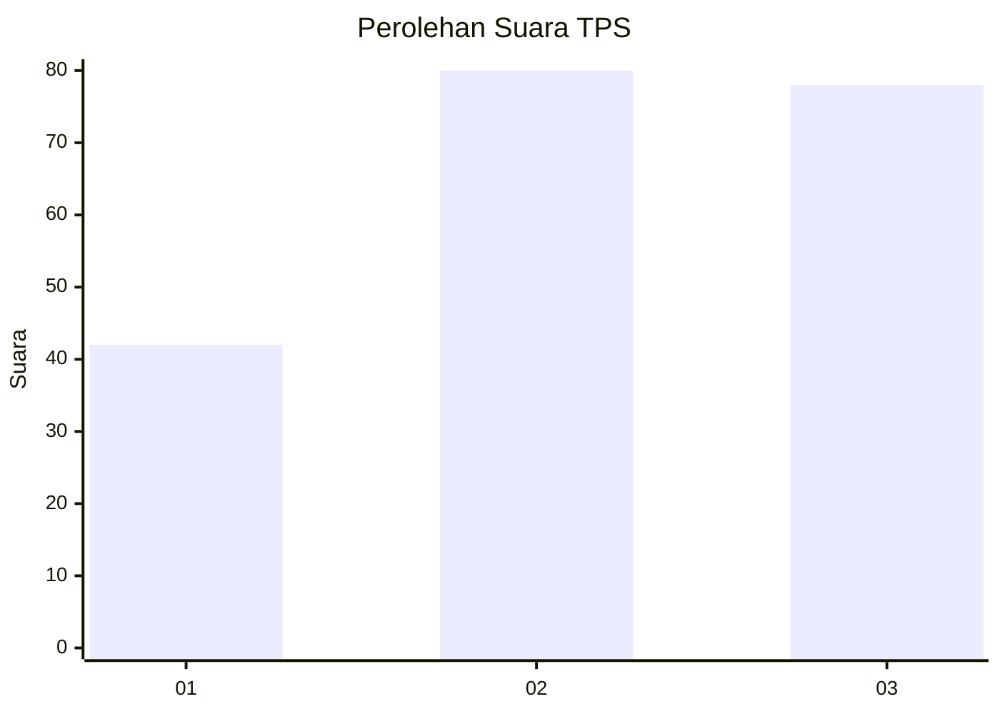
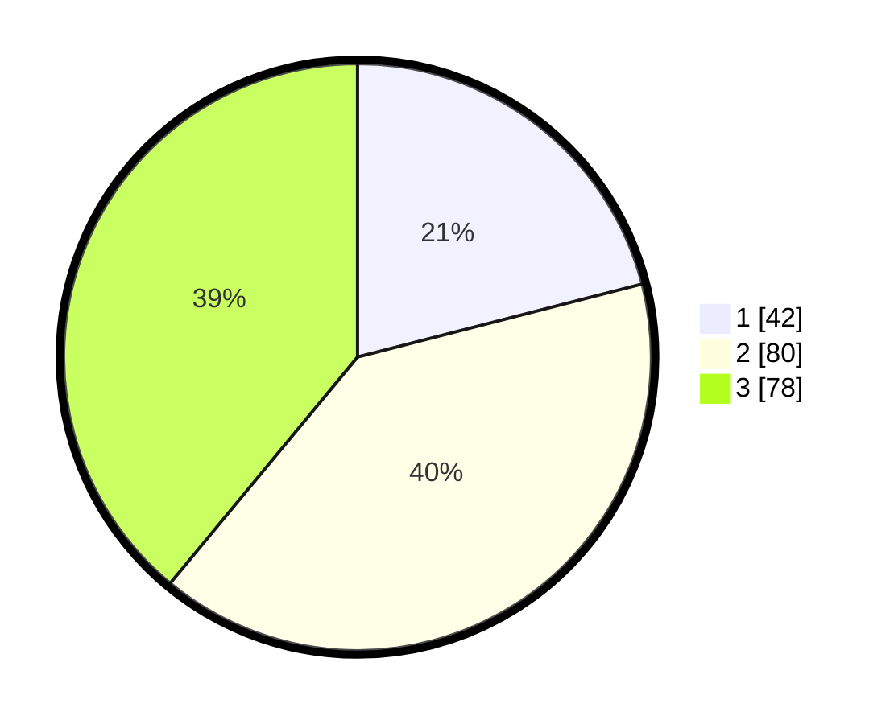

# Hasil

## Grafik

## Tabel

| No. | Nama Paslon    | Suara | Suara (raw) | Persentase |
|:--- |:-------------- | -----:| -----------:| ----------:|
| 1   | ANIES MUHAIMIN | 42    | [42][p-1]   | 21,00      |
| 2   | PRABOWO GIBRAN | 80    | [80][p-2]   | 40,00      |
| 3   | GANJAR MAHFUD  | 78    | [78][p-3]   | 39,00      |

[p-1]: https://github.com/gigit-pemilu/pemilu-2024/blob/main/pilpres/hitung-suara/sub/35-jawa-timur/sub/09-jember/sub/03-sumberbaru/sub/2010-karangbayat/sub/036-tps/sub/paslon-1.txt
[p-2]: https://github.com/gigit-pemilu/pemilu-2024/blob/main/pilpres/hitung-suara/sub/35-jawa-timur/sub/09-jember/sub/03-sumberbaru/sub/2010-karangbayat/sub/036-tps/sub/paslon-2.txt
[p-3]: https://github.com/gigit-pemilu/pemilu-2024/blob/main/pilpres/hitung-suara/sub/35-jawa-timur/sub/09-jember/sub/03-sumberbaru/sub/2010-karangbayat/sub/036-tps/sub/paslon-3.txt

## Foto C Plano

https://sirekap-obj-formc.kpu.go.id/6771/pemilu/ppwp/35/09/03/20/10/3509032010036-20240215-064612--d2cec83e-0c7d-4528-89c2-095029de9a8b.jpg

https://sirekap-obj-formc.kpu.go.id/6771/pemilu/ppwp/35/09/03/20/10/3509032010036-20240215-064805--029f74e1-62c3-4e5a-baee-0aa1846c1aa6.jpg

https://sirekap-obj-formc.kpu.go.id/6771/pemilu/ppwp/35/09/03/20/10/3509032010036-20240215-065002--2b4cd73b-ee07-43ce-becd-bff7c17956de.jpg

## Metadata

| Key        | Value               |
| ---------- | ------------------- |
| Time Stamp | 2024-02-25 16:00:00 |

