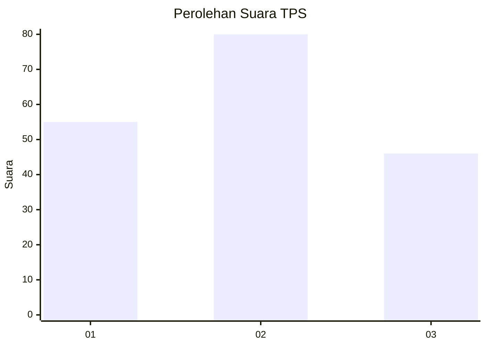
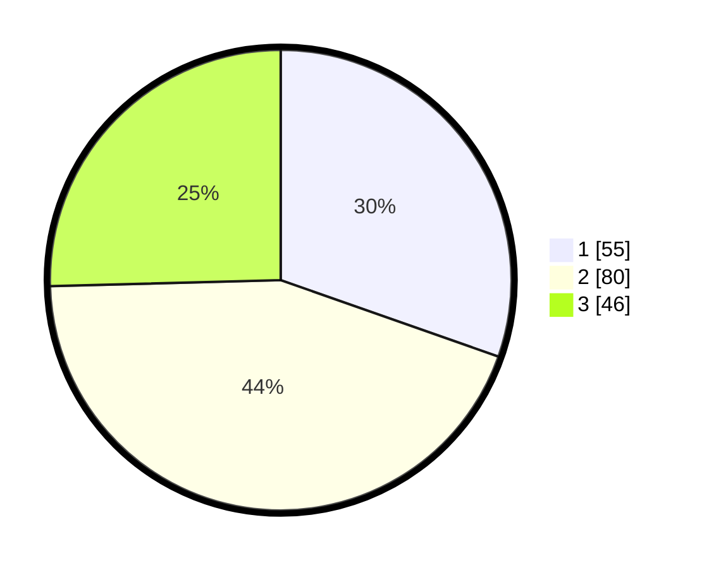

# Hasil

## Grafik

## Tabel

| No. | Nama Paslon    | Suara | Suara (raw) | Persentase |
|:--- |:-------------- | -----:| -----------:| ----------:|
| 1   | ANIES MUHAIMIN | 55    | [55][p-1]   | 30,39      |
| 2   | PRABOWO GIBRAN | 80    | [80][p-2]   | 44,20      |
| 3   | GANJAR MAHFUD  | 46    | [46][p-3]   | 25,41      |

[p-1]: https://github.com/gigit-pemilu/pemilu-2024-35-jawa-timur/blob/main/pilpres/hitung-suara/sub/35-jawa-timur/sub/09-jember/sub/03-sumberbaru/sub/2010-karangbayat/sub/037-tps/sub/paslon-1.txt
[p-2]: https://github.com/gigit-pemilu/pemilu-2024-35-jawa-timur/blob/main/pilpres/hitung-suara/sub/35-jawa-timur/sub/09-jember/sub/03-sumberbaru/sub/2010-karangbayat/sub/037-tps/sub/paslon-2.txt
[p-3]: https://github.com/gigit-pemilu/pemilu-2024-35-jawa-timur/blob/main/pilpres/hitung-suara/sub/35-jawa-timur/sub/09-jember/sub/03-sumberbaru/sub/2010-karangbayat/sub/037-tps/sub/paslon-3.txt

## Foto C Plano

https://sirekap-obj-formc.kpu.go.id/8d7b/pemilu/ppwp/35/09/03/20/10/3509032010037-20240215-094524--90e7697f-ca52-42ce-9a96-ca2e13fa9022.jpg

https://sirekap-obj-formc.kpu.go.id/8d7b/pemilu/ppwp/35/09/03/20/10/3509032010037-20240215-094617--b3cba305-04b1-4013-ac2d-bbb84a0d468e.jpg

https://sirekap-obj-formc.kpu.go.id/8d7b/pemilu/ppwp/35/09/03/20/10/3509032010037-20240215-094707--8a1845cd-cdf6-4030-b730-09304196a5c0.jpg

## Metadata

| Key        | Value               |
| ---------- | ------------------- |
| Time Stamp | 2024-02-15 12:00:28 |

