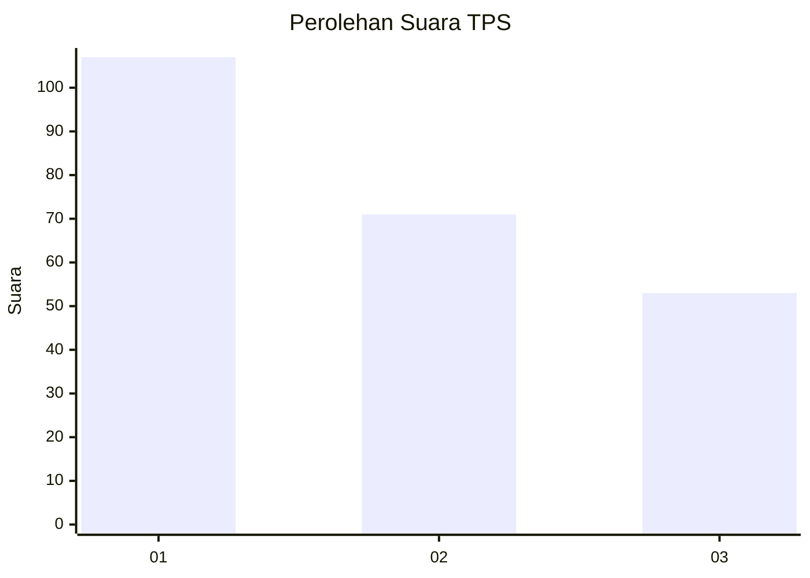
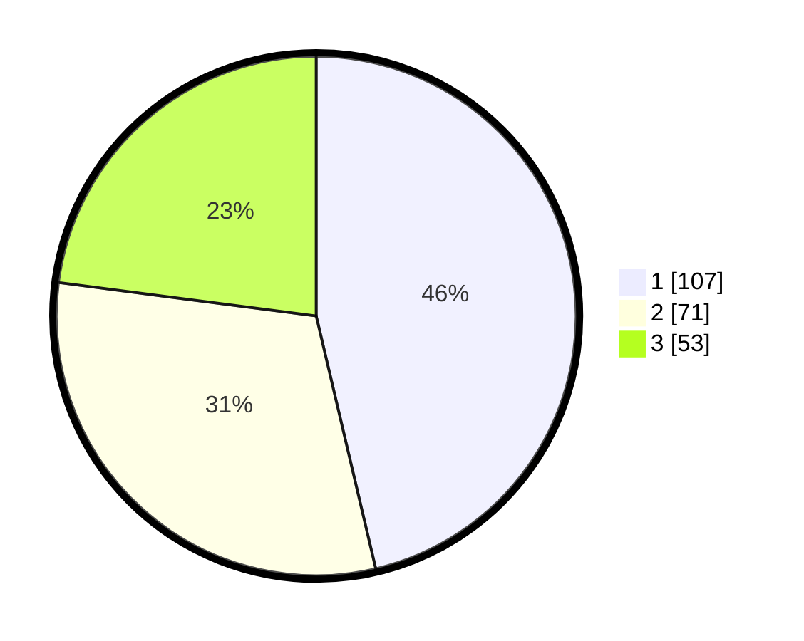

# Hasil

## Grafik

## Tabel

| No. | Nama Paslon    | Suara | Suara (raw) | Persentase |
|:--- |:-------------- | -----:| -----------:| ----------:|
| 1   | ANIES MUHAIMIN | 107   | [107][p-1]  | 46,32      |
| 2   | PRABOWO GIBRAN | 71    | [71][p-2]   | 30,74      |
| 3   | GANJAR MAHFUD  | 53    | [53][p-3]   | 22,94      |

[p-1]: https://github.com/gigit-pemilu/pemilu-2024/blob/main/pilpres/hitung-suara/sub/35-jawa-timur/sub/09-jember/sub/03-sumberbaru/sub/2010-karangbayat/sub/038-tps/sub/paslon-1.txt
[p-2]: https://github.com/gigit-pemilu/pemilu-2024/blob/main/pilpres/hitung-suara/sub/35-jawa-timur/sub/09-jember/sub/03-sumberbaru/sub/2010-karangbayat/sub/038-tps/sub/paslon-2.txt
[p-3]: https://github.com/gigit-pemilu/pemilu-2024/blob/main/pilpres/hitung-suara/sub/35-jawa-timur/sub/09-jember/sub/03-sumberbaru/sub/2010-karangbayat/sub/038-tps/sub/paslon-3.txt

## Foto C Plano

https://sirekap-obj-formc.kpu.go.id/94fe/pemilu/ppwp/35/09/03/20/10/3509032010038-20240214-192359--e1e58493-28d9-4d6e-90f1-3dff1f33e3e3.jpg

https://sirekap-obj-formc.kpu.go.id/94fe/pemilu/ppwp/35/09/03/20/10/3509032010038-20240214-192721--40a506c5-07ca-4923-be39-4c8650b62b28.jpg

https://sirekap-obj-formc.kpu.go.id/94fe/pemilu/ppwp/35/09/03/20/10/3509032010038-20240214-194348--c13d8dff-5660-4b65-a415-4e4ef6d963d3.jpg

## Metadata

| Key        | Value               |
| ---------- | ------------------- |
| Time Stamp | 2024-02-14 21:46:01 |

