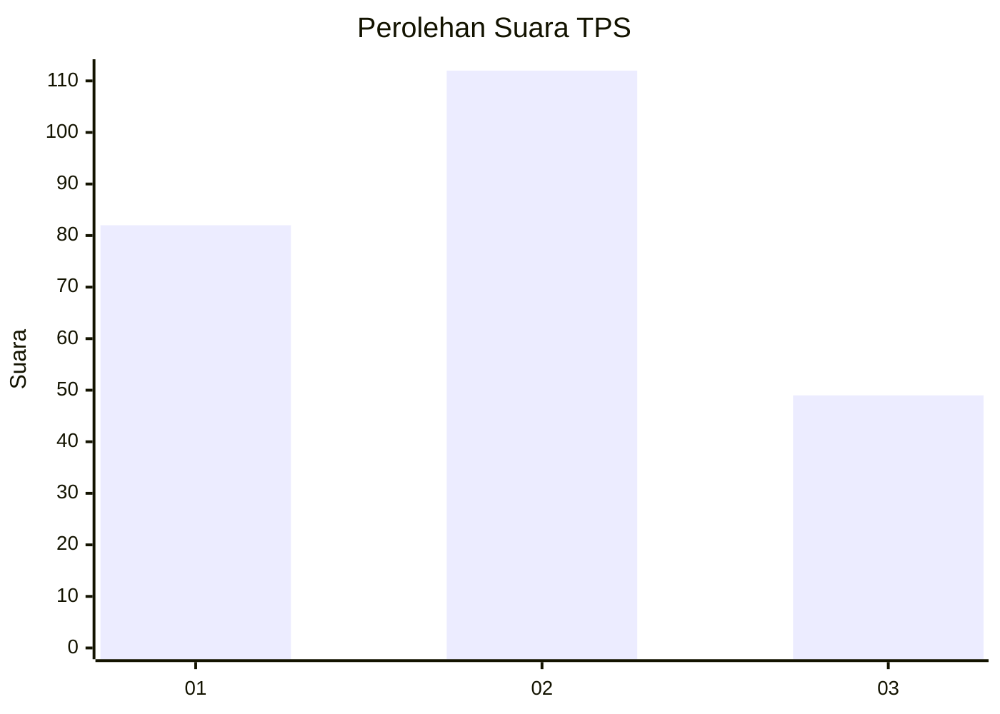
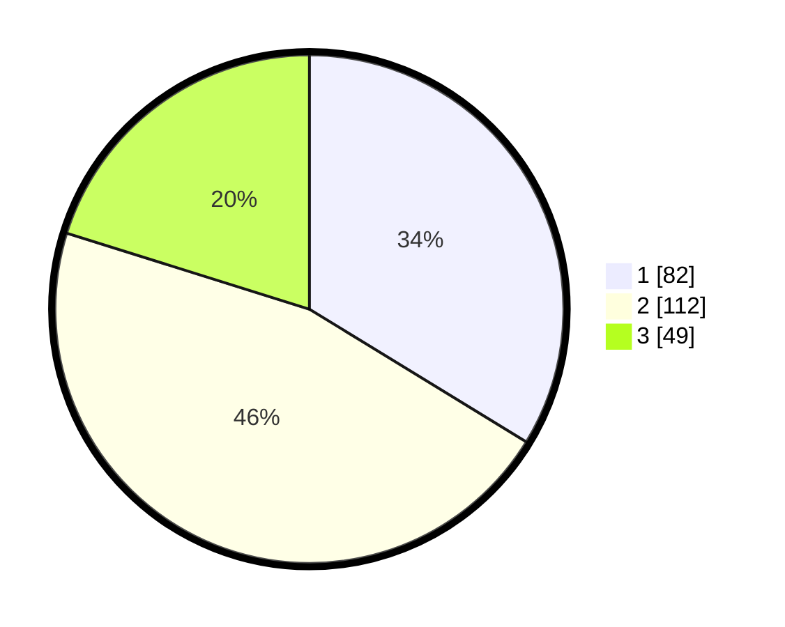

# Hasil

## Grafik

## Tabel

| No. | Nama Paslon    | Suara | Suara (raw) | Persentase |
|:--- |:-------------- | -----:| -----------:| ----------:|
| 1   | ANIES MUHAIMIN | 82    | [82][p-1]   | 33,74      |
| 2   | PRABOWO GIBRAN | 112   | [112][p-2]  | 46,09      |
| 3   | GANJAR MAHFUD  | 49    | [49][p-3]   | 20,16      |

[p-1]: https://github.com/gigit-pemilu/pemilu-2024-35-jawa-timur/blob/main/pilpres/hitung-suara/sub/35-jawa-timur/sub/09-jember/sub/03-sumberbaru/sub/2010-karangbayat/sub/040-tps/sub/paslon-1.txt
[p-2]: https://github.com/gigit-pemilu/pemilu-2024-35-jawa-timur/blob/main/pilpres/hitung-suara/sub/35-jawa-timur/sub/09-jember/sub/03-sumberbaru/sub/2010-karangbayat/sub/040-tps/sub/paslon-2.txt
[p-3]: https://github.com/gigit-pemilu/pemilu-2024-35-jawa-timur/blob/main/pilpres/hitung-suara/sub/35-jawa-timur/sub/09-jember/sub/03-sumberbaru/sub/2010-karangbayat/sub/040-tps/sub/paslon-3.txt

## Foto C Plano

https://sirekap-obj-formc.kpu.go.id/a605/pemilu/ppwp/35/09/03/20/10/3509032010040-20240214-225906--15b5d95d-9d22-41c2-adce-7ca23434dec7.jpg

https://sirekap-obj-formc.kpu.go.id/a605/pemilu/ppwp/35/09/03/20/10/3509032010040-20240214-210728--fc71249b-25ff-479e-be06-134fb7e97878.jpg

https://sirekap-obj-formc.kpu.go.id/a605/pemilu/ppwp/35/09/03/20/10/3509032010040-20240214-201634--9776fc51-bdb7-441a-8d57-210e048f5939.jpg

## Metadata

| Key        | Value               |
| ---------- | ------------------- |
| Time Stamp | 2024-02-15 00:41:44 |

