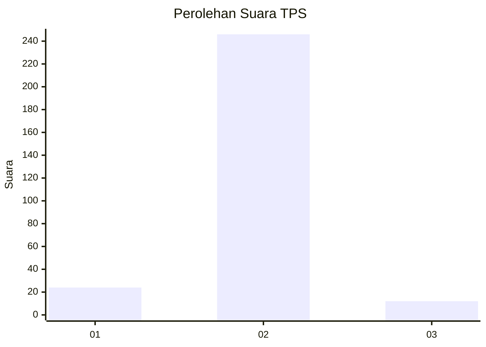
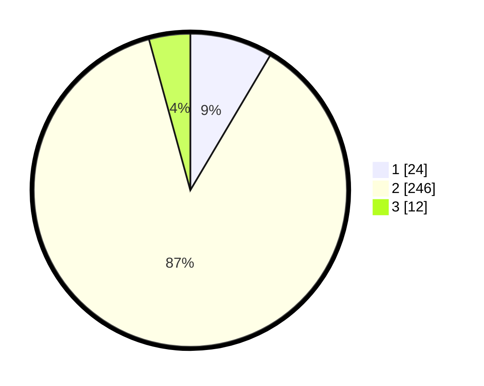

# Hasil

## Grafik

## Tabel

| No. | Nama Paslon    | Suara | Suara (raw) | Persentase |
|:--- |:-------------- | -----:| -----------:| ----------:|
| 1   | ANIES MUHAIMIN | 24    | [24][p-1]   | 8,51       |
| 2   | PRABOWO GIBRAN | 246   | [246][p-2]  | 87,23      |
| 3   | GANJAR MAHFUD  | 12    | [12][p-3]   | 4,26       |

[p-1]: https://github.com/gigit-pemilu/pemilu-2024/blob/main/pilpres/hitung-suara/sub/35-jawa-timur/sub/09-jember/sub/03-sumberbaru/sub/2010-karangbayat/sub/043-tps/sub/paslon-1.txt
[p-2]: https://github.com/gigit-pemilu/pemilu-2024/blob/main/pilpres/hitung-suara/sub/35-jawa-timur/sub/09-jember/sub/03-sumberbaru/sub/2010-karangbayat/sub/043-tps/sub/paslon-2.txt
[p-3]: https://github.com/gigit-pemilu/pemilu-2024/blob/main/pilpres/hitung-suara/sub/35-jawa-timur/sub/09-jember/sub/03-sumberbaru/sub/2010-karangbayat/sub/043-tps/sub/paslon-3.txt

## Foto C Plano

https://sirekap-obj-formc.kpu.go.id/decd/pemilu/ppwp/35/09/03/20/10/3509032010043-20240215-101749--2aafa585-742e-4d98-be61-5718c4332f4b.jpg

https://sirekap-obj-formc.kpu.go.id/decd/pemilu/ppwp/35/09/03/20/10/3509032010043-20240215-101728--5f104c5a-7434-4da2-8b06-1d8cda0f6d0c.jpg

https://sirekap-obj-formc.kpu.go.id/decd/pemilu/ppwp/35/09/03/20/10/3509032010043-20240215-101850--a7a1b8a3-6fe2-4489-8ec9-07cc6fc4b454.jpg

## Metadata

| Key        | Value               |
| ---------- | ------------------- |
| Time Stamp | 2024-02-15 15:00:29 |

