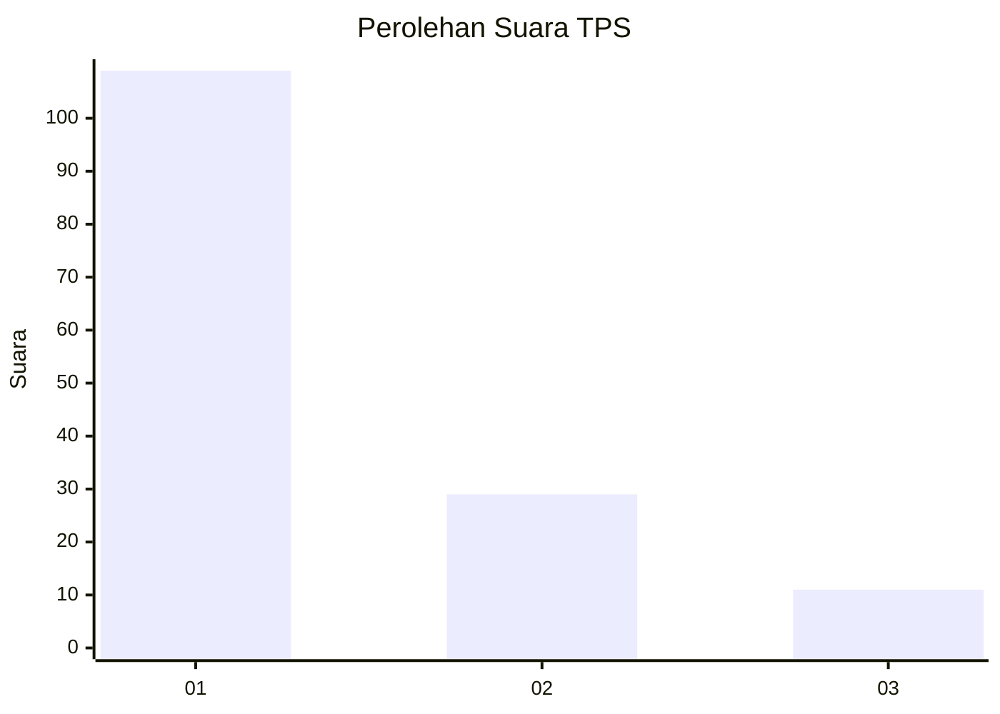
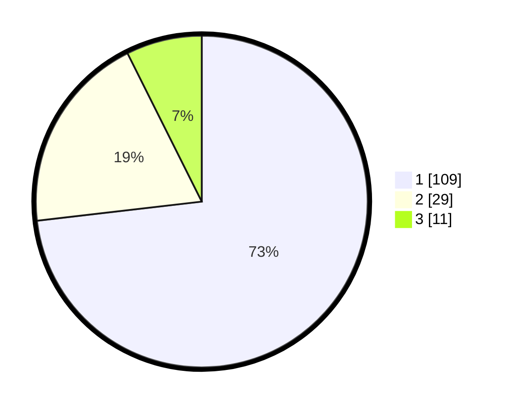

# Hasil

## Grafik

## Tabel

| No. | Nama Paslon    | Suara | Suara (raw) | Persentase |
|:--- |:-------------- | -----:| -----------:| ----------:|
| 1   | ANIES MUHAIMIN | 109   | [109][p-1]  | 73,15      |
| 2   | PRABOWO GIBRAN | 29    | [29][p-2]   | 19,46      |
| 3   | GANJAR MAHFUD  | 11    | [11][p-3]   | 7,38       |

[p-1]: https://github.com/gigit-pemilu/pemilu-2024/blob/main/pilpres/hitung-suara/sub/35-jawa-timur/sub/09-jember/sub/03-sumberbaru/sub/2010-karangbayat/sub/044-tps/sub/paslon-1.txt
[p-2]: https://github.com/gigit-pemilu/pemilu-2024/blob/main/pilpres/hitung-suara/sub/35-jawa-timur/sub/09-jember/sub/03-sumberbaru/sub/2010-karangbayat/sub/044-tps/sub/paslon-2.txt
[p-3]: https://github.com/gigit-pemilu/pemilu-2024/blob/main/pilpres/hitung-suara/sub/35-jawa-timur/sub/09-jember/sub/03-sumberbaru/sub/2010-karangbayat/sub/044-tps/sub/paslon-3.txt

## Foto C Plano

https://sirekap-obj-formc.kpu.go.id/f1f7/pemilu/ppwp/35/09/03/20/10/3509032010044-20240214-201702--e4992ad9-cafb-4c67-94d6-e8f2291c2102.jpg

https://sirekap-obj-formc.kpu.go.id/f1f7/pemilu/ppwp/35/09/03/20/10/3509032010044-20240214-201717--fb7bb73c-1001-4f04-a52b-79b91d256742.jpg

https://sirekap-obj-formc.kpu.go.id/f1f7/pemilu/ppwp/35/09/03/20/10/3509032010044-20240214-201728--225135e5-5d59-4e85-ba08-5aff19c5f0a3.jpg

## Metadata

| Key        | Value               |
| ---------- | ------------------- |
| Time Stamp | 2024-02-15 12:00:28 |

