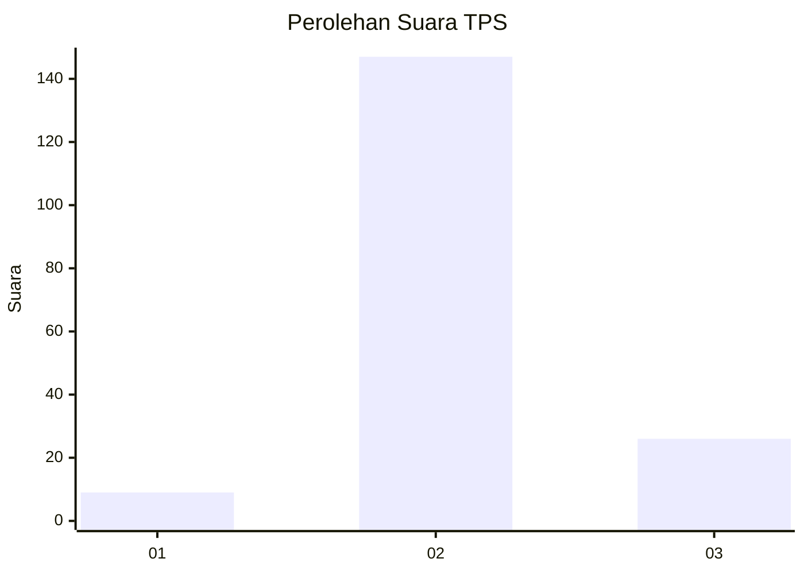
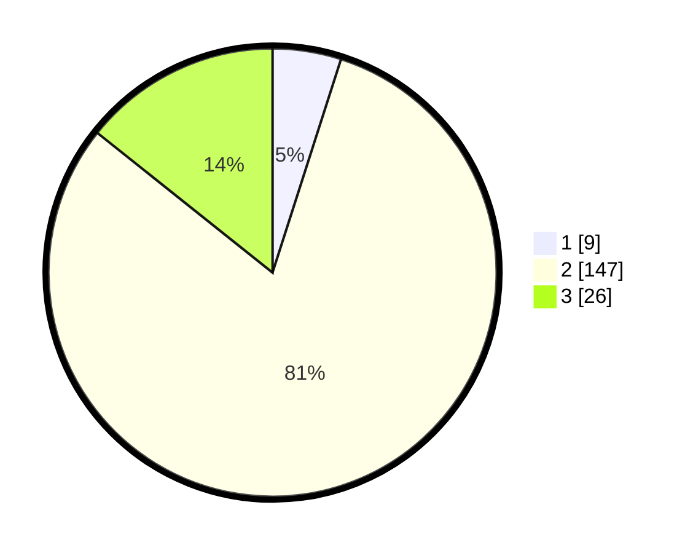

# Hasil

## Grafik

## Tabel

| No. | Nama Paslon    | Suara | Suara (raw) | Persentase |
|:--- |:-------------- | -----:| -----------:| ----------:|
| 1   | ANIES MUHAIMIN | 9     | [9][p-1]    | 4,95       |
| 2   | PRABOWO GIBRAN | 147   | [147][p-2]  | 80,77      |
| 3   | GANJAR MAHFUD  | 26    | [26][p-3]   | 14,29      |

[p-1]: https://github.com/gigit-pemilu/pemilu-2024-35-jawa-timur/blob/main/pilpres/hitung-suara/sub/35-jawa-timur/sub/09-jember/sub/04-gumukmas/sub/2001-kepanjen/sub/002-tps/sub/paslon-1.txt
[p-2]: https://github.com/gigit-pemilu/pemilu-2024-35-jawa-timur/blob/main/pilpres/hitung-suara/sub/35-jawa-timur/sub/09-jember/sub/04-gumukmas/sub/2001-kepanjen/sub/002-tps/sub/paslon-2.txt
[p-3]: https://github.com/gigit-pemilu/pemilu-2024-35-jawa-timur/blob/main/pilpres/hitung-suara/sub/35-jawa-timur/sub/09-jember/sub/04-gumukmas/sub/2001-kepanjen/sub/002-tps/sub/paslon-3.txt

## Foto C Plano

https://sirekap-obj-formc.kpu.go.id/bfb9/pemilu/ppwp/35/09/04/20/01/3509042001002-20240220-084453--d9309cd5-f39a-48e1-ade9-3d824825c6a5.jpg

https://sirekap-obj-formc.kpu.go.id/bfb9/pemilu/ppwp/35/09/04/20/01/3509042001002-20240220-084521--12e416fc-19c2-4247-9885-c8c27d1f82ca.jpg

https://sirekap-obj-formc.kpu.go.id/bfb9/pemilu/ppwp/35/09/04/20/01/3509042001002-20240220-084552--91d97739-3adf-497a-880d-66de29468408.jpg

## Metadata

| Key        | Value               |
| ---------- | ------------------- |
| Time Stamp | 2024-02-24 22:31:28 |

