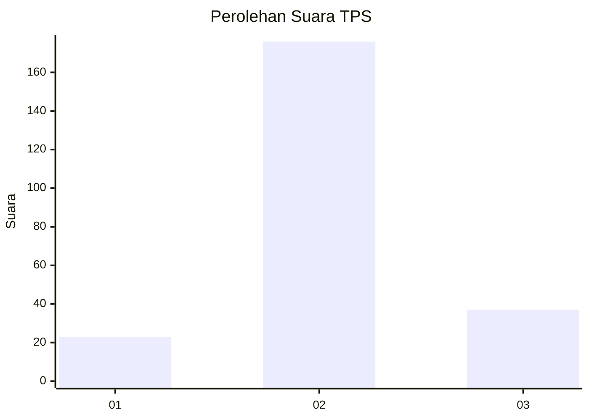
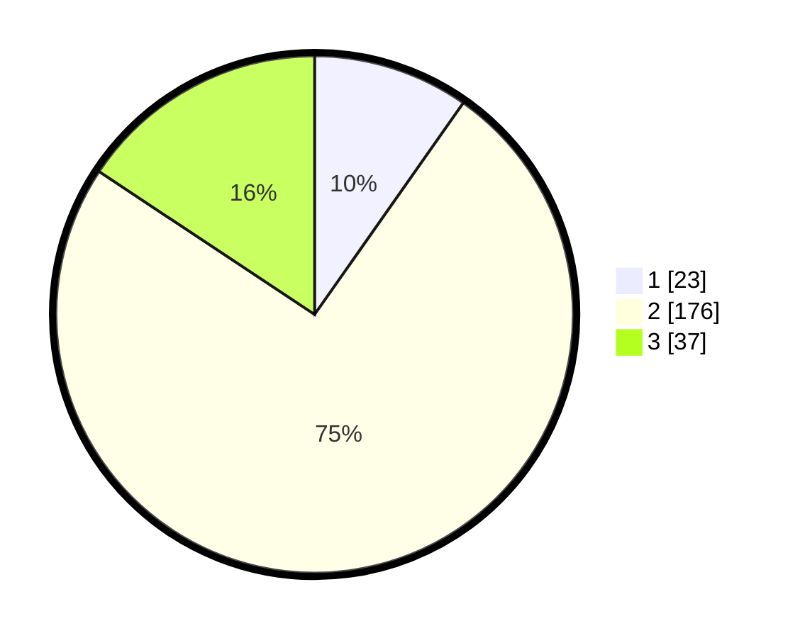

# Hasil

## Grafik

## Tabel

| No. | Nama Paslon    | Suara | Suara (raw) | Persentase |
|:--- |:-------------- | -----:| -----------:| ----------:|
| 1   | ANIES MUHAIMIN | 23    | [23][p-1]   | 9,75       |
| 2   | PRABOWO GIBRAN | 176   | [176][p-2]  | 74,58      |
| 3   | GANJAR MAHFUD  | 37    | [37][p-3]   | 15,68      |

[p-1]: https://github.com/gigit-pemilu/pemilu-2024-35-jawa-timur/blob/main/pilpres/hitung-suara/sub/35-jawa-timur/sub/09-jember/sub/04-gumukmas/sub/2002-mayangan/sub/016-tps/sub/paslon-1.txt
[p-2]: https://github.com/gigit-pemilu/pemilu-2024-35-jawa-timur/blob/main/pilpres/hitung-suara/sub/35-jawa-timur/sub/09-jember/sub/04-gumukmas/sub/2002-mayangan/sub/016-tps/sub/paslon-2.txt
[p-3]: https://github.com/gigit-pemilu/pemilu-2024-35-jawa-timur/blob/main/pilpres/hitung-suara/sub/35-jawa-timur/sub/09-jember/sub/04-gumukmas/sub/2002-mayangan/sub/016-tps/sub/paslon-3.txt

## Foto C Plano

https://sirekap-obj-formc.kpu.go.id/2263/pemilu/ppwp/35/09/04/20/02/3509042002016-20240215-034020--8a47023a-14ba-4e75-aab2-abac1956231b.jpg

https://sirekap-obj-formc.kpu.go.id/2263/pemilu/ppwp/35/09/04/20/02/3509042002016-20240215-034203--c4cd2add-9ebd-46e4-abba-a3fdc10415cc.jpg

https://sirekap-obj-formc.kpu.go.id/2263/pemilu/ppwp/35/09/04/20/02/3509042002016-20240215-034323--3bd610c7-40f1-46b0-89d8-a0d1ecf56409.jpg

## Metadata

| Key        | Value               |
| ---------- | ------------------- |
| Time Stamp | 2024-02-15 15:00:29 |

