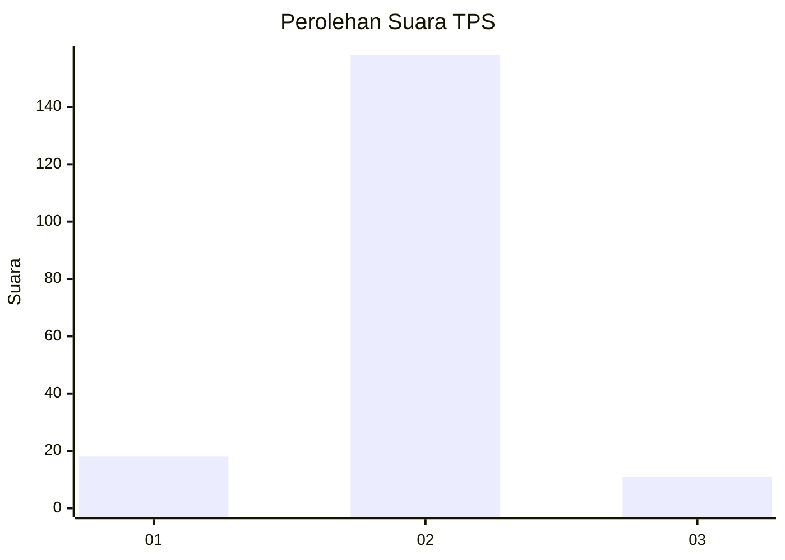
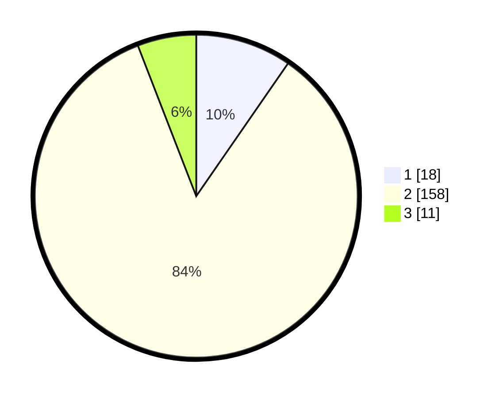

# Hasil

## Grafik

## Tabel

| No. | Nama Paslon    | Suara | Suara (raw) | Persentase |
|:--- |:-------------- | -----:| -----------:| ----------:|
| 1   | ANIES MUHAIMIN | 18    | [18][p-1]   | 9,63       |
| 2   | PRABOWO GIBRAN | 158   | [158][p-2]  | 84,49      |
| 3   | GANJAR MAHFUD  | 11    | [11][p-3]   | 5,88       |

[p-1]: https://github.com/gigit-pemilu/pemilu-2024/blob/main/pilpres/hitung-suara/sub/35-jawa-timur/sub/09-jember/sub/04-gumukmas/sub/2002-mayangan/sub/024-tps/sub/paslon-1.txt
[p-2]: https://github.com/gigit-pemilu/pemilu-2024/blob/main/pilpres/hitung-suara/sub/35-jawa-timur/sub/09-jember/sub/04-gumukmas/sub/2002-mayangan/sub/024-tps/sub/paslon-2.txt
[p-3]: https://github.com/gigit-pemilu/pemilu-2024/blob/main/pilpres/hitung-suara/sub/35-jawa-timur/sub/09-jember/sub/04-gumukmas/sub/2002-mayangan/sub/024-tps/sub/paslon-3.txt

## Foto C Plano

https://sirekap-obj-formc.kpu.go.id/b9bb/pemilu/ppwp/35/09/04/20/02/3509042002024-20240215-020229--463118ba-c322-4616-b2be-c59ad1e8146d.jpg

https://sirekap-obj-formc.kpu.go.id/b9bb/pemilu/ppwp/35/09/04/20/02/3509042002024-20240215-020256--7eb8b613-fe17-4c19-9651-18072fb74401.jpg

https://sirekap-obj-formc.kpu.go.id/b9bb/pemilu/ppwp/35/09/04/20/02/3509042002024-20240215-020329--1838b4bd-982f-4bac-96e9-90f98e5b9aa7.jpg

## Metadata

| Key        | Value               |
| ---------- | ------------------- |
| Time Stamp | 2024-02-15 20:30:46 |

