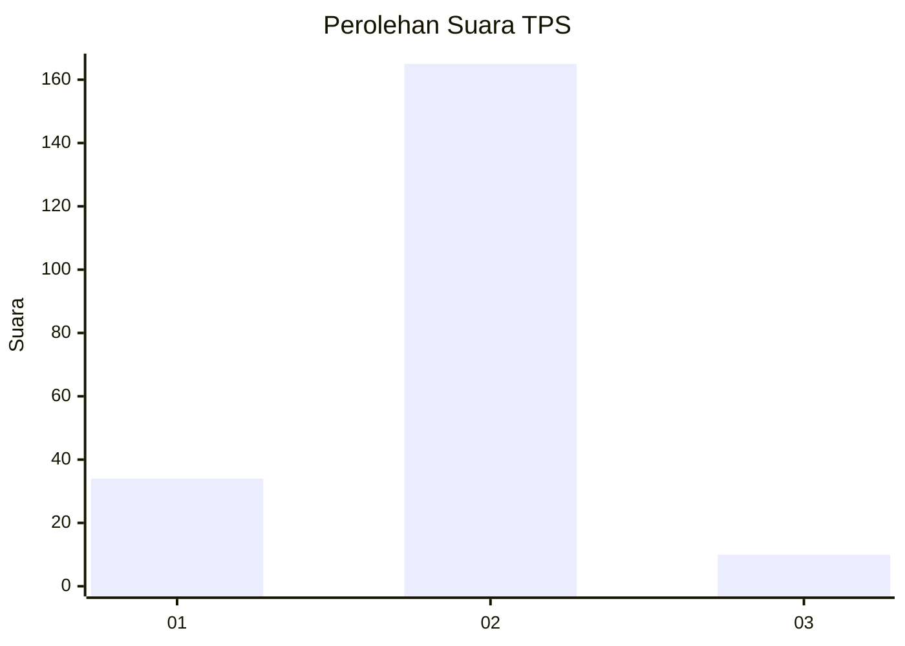
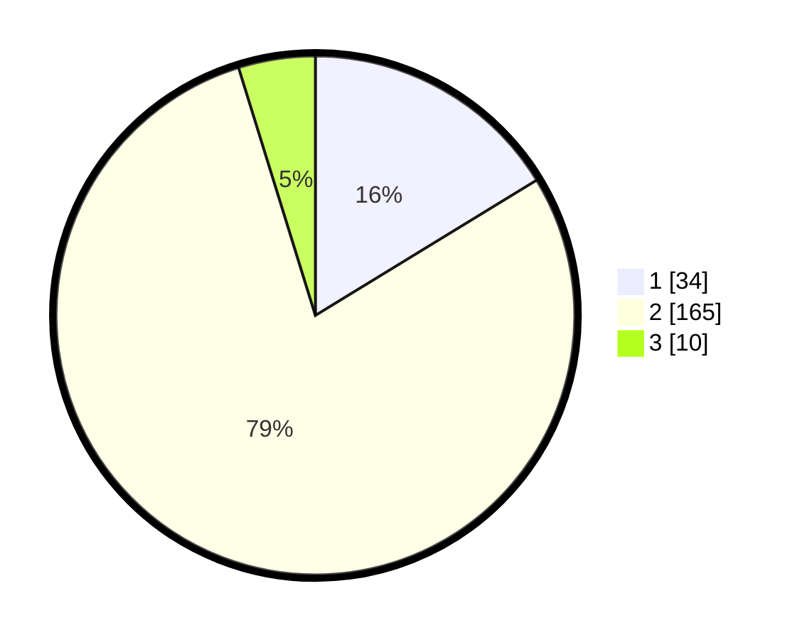

# Hasil

## Grafik

## Tabel

| No. | Nama Paslon    | Suara | Suara (raw) | Persentase |
|:--- |:-------------- | -----:| -----------:| ----------:|
| 1   | ANIES MUHAIMIN | 34    | [34][p-1]   | 16,27      |
| 2   | PRABOWO GIBRAN | 165   | [165][p-2]  | 78,95      |
| 3   | GANJAR MAHFUD  | 10    | [10][p-3]   | 4,78       |

[p-1]: https://github.com/gigit-pemilu/pemilu-2024-35-jawa-timur/blob/main/pilpres/hitung-suara/sub/35-jawa-timur/sub/09-jember/sub/04-gumukmas/sub/2002-mayangan/sub/029-tps/sub/paslon-1.txt
[p-2]: https://github.com/gigit-pemilu/pemilu-2024-35-jawa-timur/blob/main/pilpres/hitung-suara/sub/35-jawa-timur/sub/09-jember/sub/04-gumukmas/sub/2002-mayangan/sub/029-tps/sub/paslon-2.txt
[p-3]: https://github.com/gigit-pemilu/pemilu-2024-35-jawa-timur/blob/main/pilpres/hitung-suara/sub/35-jawa-timur/sub/09-jember/sub/04-gumukmas/sub/2002-mayangan/sub/029-tps/sub/paslon-3.txt

## Foto C Plano

https://sirekap-obj-formc.kpu.go.id/2074/pemilu/ppwp/35/09/04/20/02/3509042002029-20240214-225841--bbd1733d-5f38-454f-9526-c5a93069bda0.jpg

https://sirekap-obj-formc.kpu.go.id/2074/pemilu/ppwp/35/09/04/20/02/3509042002029-20240214-225956--a8f8dd7e-621f-4ffb-9ad8-b6a984627a69.jpg

https://sirekap-obj-formc.kpu.go.id/2074/pemilu/ppwp/35/09/04/20/02/3509042002029-20240214-230131--bfcf9e6c-7d5a-4330-8420-f3cbc4f51a74.jpg

## Metadata

| Key        | Value               |
| ---------- | ------------------- |
| Time Stamp | 2024-02-15 20:30:46 |

