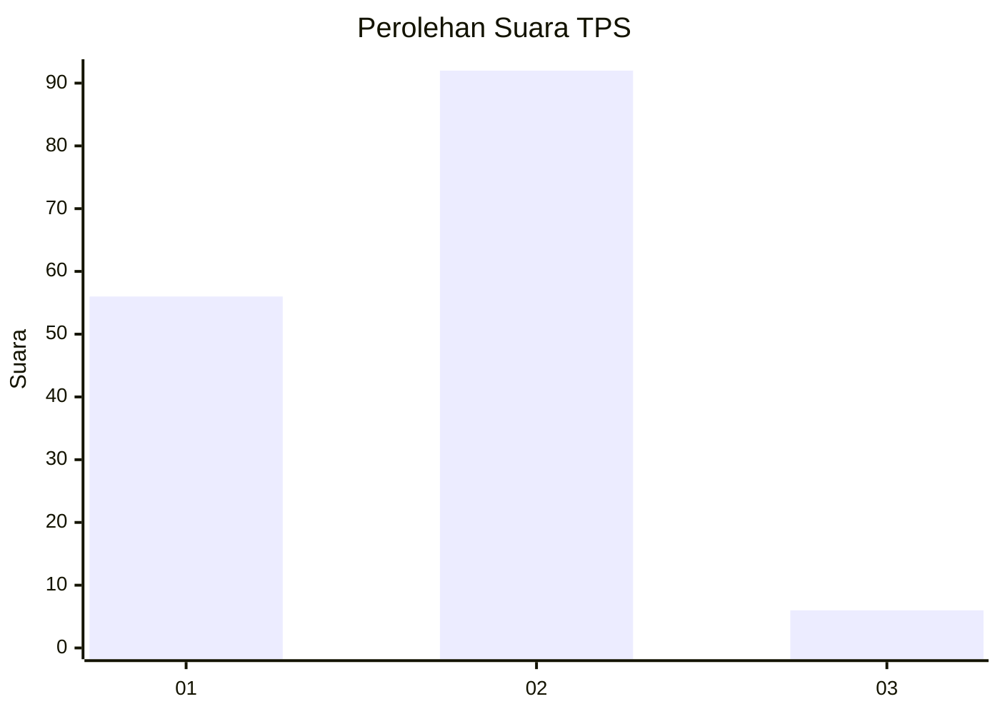
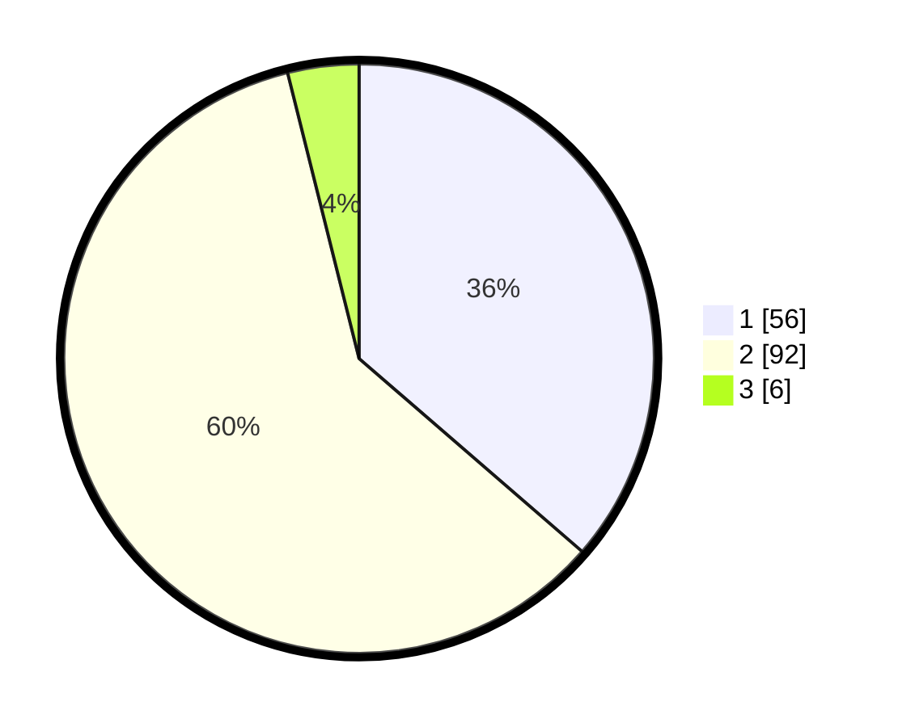

# Hasil

## Grafik

## Tabel

| No. | Nama Paslon    | Suara | Suara (raw) | Persentase |
|:--- |:-------------- | -----:| -----------:| ----------:|
| 1   | ANIES MUHAIMIN | 56    | [56][p-1]   | 36,36      |
| 2   | PRABOWO GIBRAN | 92    | [92][p-2]   | 59,74      |
| 3   | GANJAR MAHFUD  | 6     | [6][p-3]    | 3,90       |

[p-1]: https://github.com/gigit-pemilu/pemilu-2024/blob/main/pilpres/hitung-suara/sub/35-jawa-timur/sub/09-jember/sub/04-gumukmas/sub/2003-gumukmas/sub/004-tps/sub/paslon-1.txt
[p-2]: https://github.com/gigit-pemilu/pemilu-2024/blob/main/pilpres/hitung-suara/sub/35-jawa-timur/sub/09-jember/sub/04-gumukmas/sub/2003-gumukmas/sub/004-tps/sub/paslon-2.txt
[p-3]: https://github.com/gigit-pemilu/pemilu-2024/blob/main/pilpres/hitung-suara/sub/35-jawa-timur/sub/09-jember/sub/04-gumukmas/sub/2003-gumukmas/sub/004-tps/sub/paslon-3.txt

## Foto C Plano

https://sirekap-obj-formc.kpu.go.id/86b1/pemilu/ppwp/35/09/04/20/03/3509042003004-20240221-084331--5f59880a-e0c9-4dee-917d-be9fae90e089.jpg

https://sirekap-obj-formc.kpu.go.id/86b1/pemilu/ppwp/35/09/04/20/03/3509042003004-20240221-084357--304e7102-90a1-4e5c-aeea-46edfb5b56af.jpg

https://sirekap-obj-formc.kpu.go.id/86b1/pemilu/ppwp/35/09/04/20/03/3509042003004-20240221-084428--7bf1bf2e-0a40-4730-8cd8-8cf88b792ec1.jpg

## Metadata

| Key        | Value               |
| ---------- | ------------------- |
| Time Stamp | 2024-02-25 18:00:00 |

