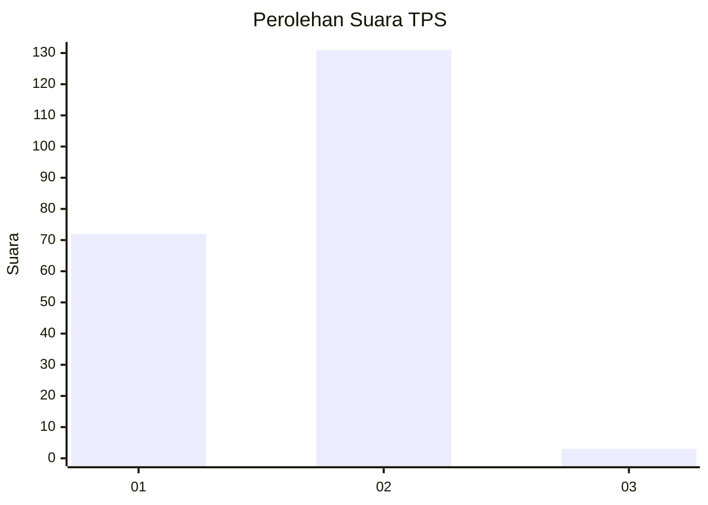
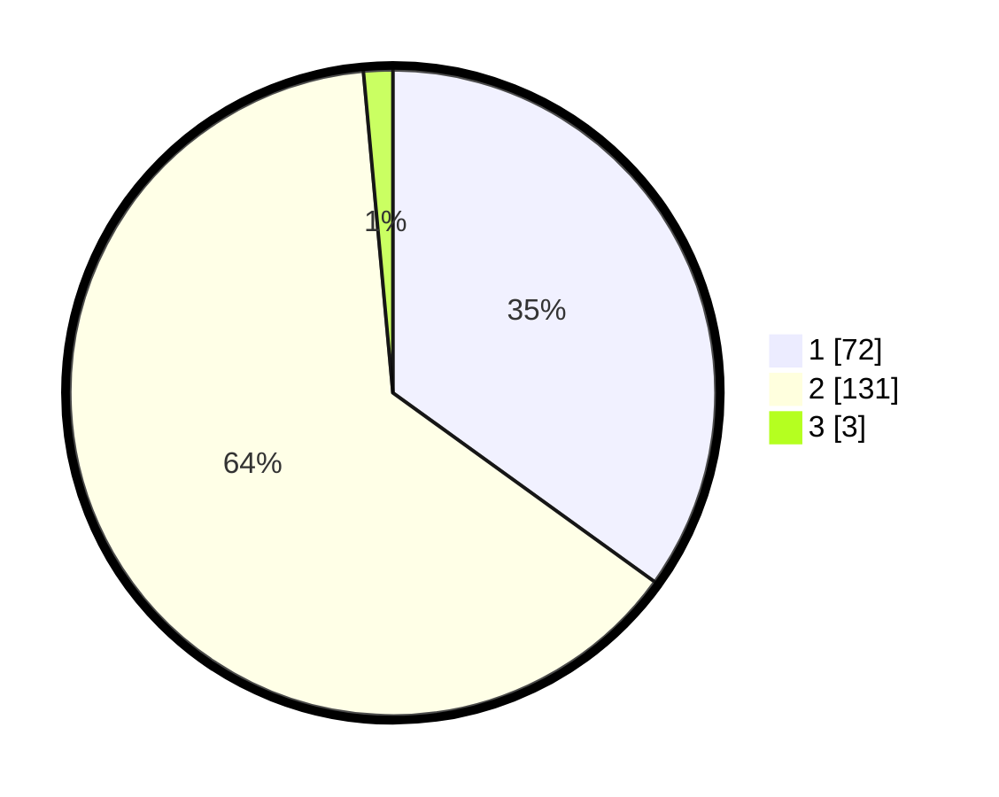

# Hasil

## Grafik

## Tabel

| No. | Nama Paslon    | Suara | Suara (raw) | Persentase |
|:--- |:-------------- | -----:| -----------:| ----------:|
| 1   | ANIES MUHAIMIN | 72    | [72][p-1]   | 34,95      |
| 2   | PRABOWO GIBRAN | 131   | [131][p-2]  | 63,59      |
| 3   | GANJAR MAHFUD  | 3     | [3][p-3]    | 1,46       |

[p-1]: https://github.com/gigit-pemilu/pemilu-2024/blob/main/pilpres/hitung-suara/sub/35-jawa-timur/sub/09-jember/sub/04-gumukmas/sub/2003-gumukmas/sub/009-tps/sub/paslon-1.txt
[p-2]: https://github.com/gigit-pemilu/pemilu-2024/blob/main/pilpres/hitung-suara/sub/35-jawa-timur/sub/09-jember/sub/04-gumukmas/sub/2003-gumukmas/sub/009-tps/sub/paslon-2.txt
[p-3]: https://github.com/gigit-pemilu/pemilu-2024/blob/main/pilpres/hitung-suara/sub/35-jawa-timur/sub/09-jember/sub/04-gumukmas/sub/2003-gumukmas/sub/009-tps/sub/paslon-3.txt

## Foto C Plano

https://sirekap-obj-formc.kpu.go.id/df68/pemilu/ppwp/35/09/04/20/03/3509042003009-20240221-085240--d19b9ef5-0b66-48d7-85b6-73b6c9738e86.jpg

https://sirekap-obj-formc.kpu.go.id/df68/pemilu/ppwp/35/09/04/20/03/3509042003009-20240221-085310--444a9e45-1df1-4cf5-ae71-5b1546e70134.jpg

https://sirekap-obj-formc.kpu.go.id/df68/pemilu/ppwp/35/09/04/20/03/3509042003009-20240221-085332--7cca502c-9868-4ca5-8ba3-cedd3ecb9b15.jpg

## Metadata

| Key        | Value               |
| ---------- | ------------------- |
| Time Stamp | 2024-02-25 16:00:00 |

