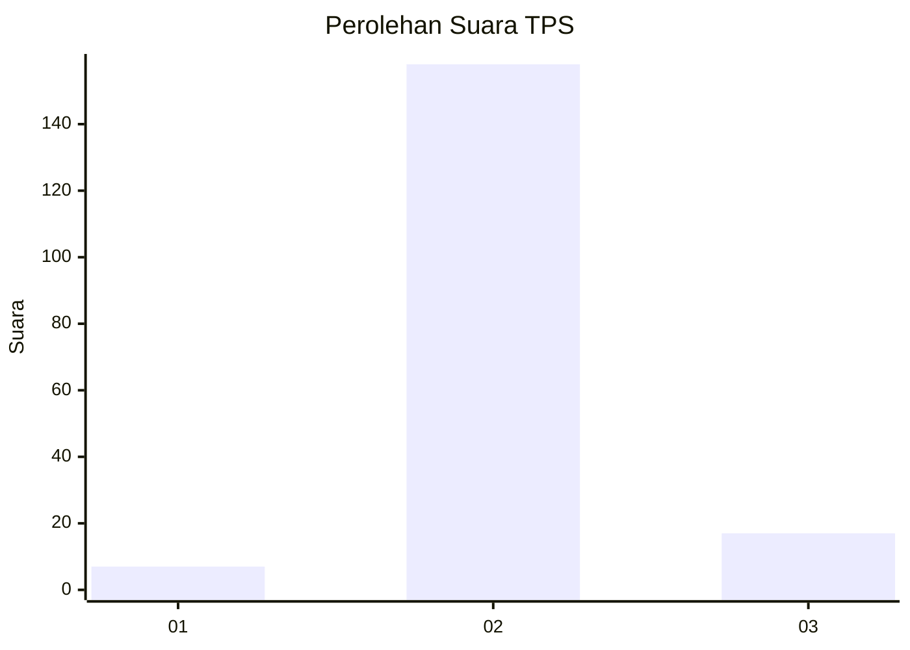
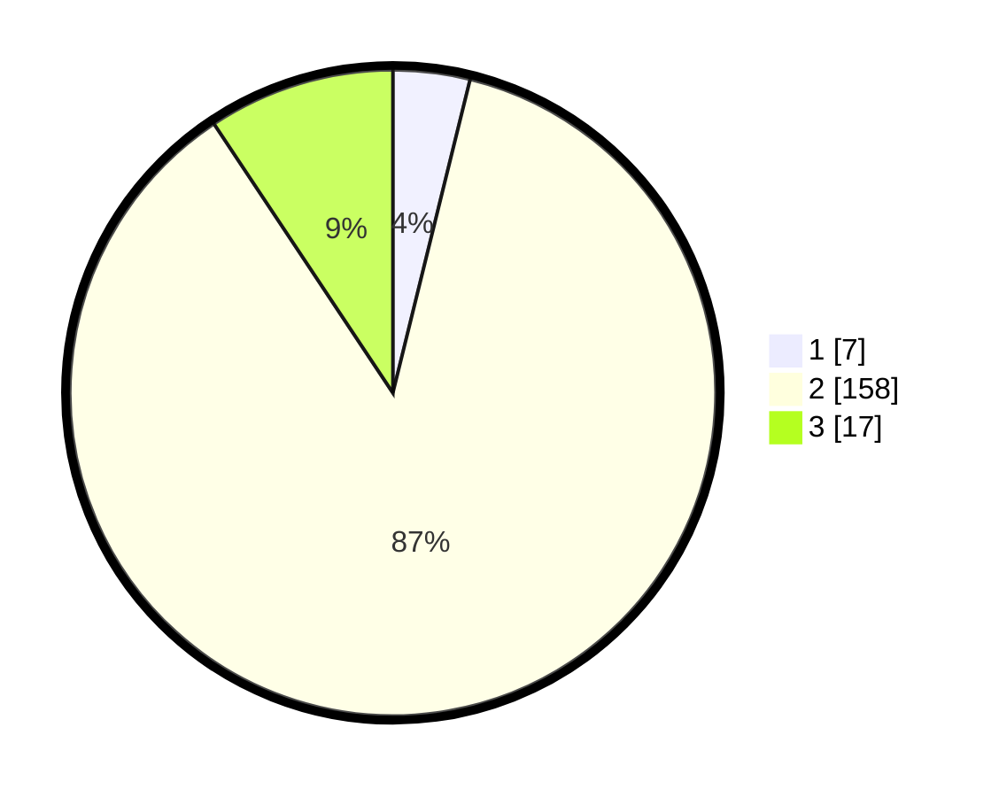

# Hasil

## Grafik

## Tabel

| No. | Nama Paslon    | Suara | Suara (raw) | Persentase |
|:--- |:-------------- | -----:| -----------:| ----------:|
| 1   | ANIES MUHAIMIN | 7     | [7][p-1]    | 3,85       |
| 2   | PRABOWO GIBRAN | 158   | [158][p-2]  | 86,81      |
| 3   | GANJAR MAHFUD  | 17    | [17][p-3]   | 9,34       |

[p-1]: https://github.com/gigit-pemilu/pemilu-2024-35-jawa-timur/blob/main/pilpres/hitung-suara/sub/35-jawa-timur/sub/09-jember/sub/04-gumukmas/sub/2003-gumukmas/sub/023-tps/sub/paslon-1.txt
[p-2]: https://github.com/gigit-pemilu/pemilu-2024-35-jawa-timur/blob/main/pilpres/hitung-suara/sub/35-jawa-timur/sub/09-jember/sub/04-gumukmas/sub/2003-gumukmas/sub/023-tps/sub/paslon-2.txt
[p-3]: https://github.com/gigit-pemilu/pemilu-2024-35-jawa-timur/blob/main/pilpres/hitung-suara/sub/35-jawa-timur/sub/09-jember/sub/04-gumukmas/sub/2003-gumukmas/sub/023-tps/sub/paslon-3.txt

## Foto C Plano

https://sirekap-obj-formc.kpu.go.id/8b7c/pemilu/ppwp/35/09/04/20/03/3509042003023-20240215-015245--5161cdd4-e6e4-4f3c-9f38-a4094ebe7947.jpg

https://sirekap-obj-formc.kpu.go.id/8b7c/pemilu/ppwp/35/09/04/20/03/3509042003023-20240215-015412--102f9a73-8038-4ada-a9ef-e982a376f505.jpg

https://sirekap-obj-formc.kpu.go.id/8b7c/pemilu/ppwp/35/09/04/20/03/3509042003023-20240215-015454--186dfc68-0614-4994-91b9-26e8bac5ad0f.jpg

## Metadata

| Key        | Value               |
| ---------- | ------------------- |
| Time Stamp | 2024-02-15 22:00:27 |

