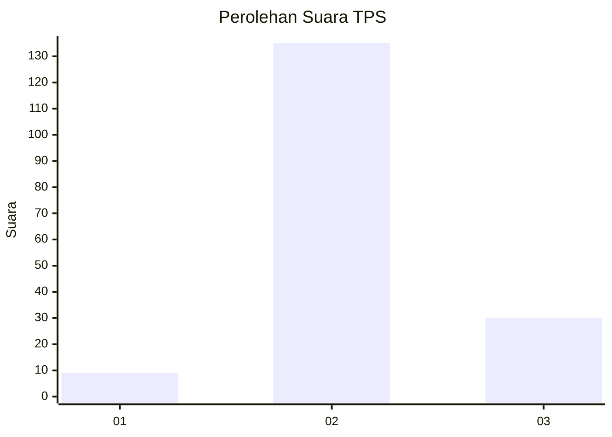

# Hasil

## Grafik

## Tabel

| No. | Nama Paslon    | Suara | Suara (raw) | Persentase |
|:--- |:-------------- | -----:| -----------:| ----------:|
| 1   | ANIES MUHAIMIN | 9     | [9][p-1]    | 5,17       |
| 2   | PRABOWO GIBRAN | 135   | [135][p-2]  | 77,59      |
| 3   | GANJAR MAHFUD  | 30    | [30][p-3]   | 17,24      |

[p-1]: https://github.com/gigit-pemilu/pemilu-2024/blob/main/pilpres/hitung-suara/sub/35-jawa-timur/sub/09-jember/sub/04-gumukmas/sub/2003-gumukmas/sub/030-tps/sub/paslon-1.txt
[p-2]: https://github.com/gigit-pemilu/pemilu-2024/blob/main/pilpres/hitung-suara/sub/35-jawa-timur/sub/09-jember/sub/04-gumukmas/sub/2003-gumukmas/sub/030-tps/sub/paslon-2.txt
[p-3]: https://github.com/gigit-pemilu/pemilu-2024/blob/main/pilpres/hitung-suara/sub/35-jawa-timur/sub/09-jember/sub/04-gumukmas/sub/2003-gumukmas/sub/030-tps/sub/paslon-3.txt

## Foto C Plano

https://sirekap-obj-formc.kpu.go.id/5b80/pemilu/ppwp/35/09/04/20/03/3509042003030-20240215-015016--e5ae3f5f-621c-4e49-a460-de2c2aa50ebe.jpg

https://sirekap-obj-formc.kpu.go.id/5b80/pemilu/ppwp/35/09/04/20/03/3509042003030-20240215-015041--4459f866-3dfd-48ee-8c9a-0279ebceefdd.jpg

https://sirekap-obj-formc.kpu.go.id/5b80/pemilu/ppwp/35/09/04/20/03/3509042003030-20240215-015108--81489e69-46b0-4d75-926e-5a61c2d010c8.jpg

## Metadata

| Key        | Value               |
| ---------- | ------------------- |
| Time Stamp | 2024-02-15 15:00:29 |

