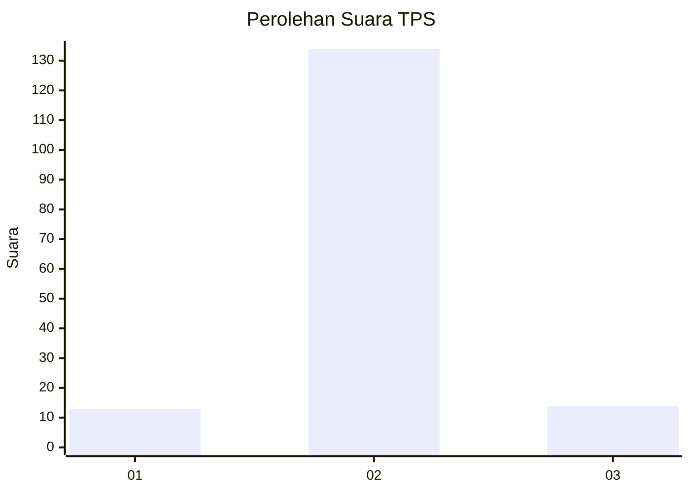
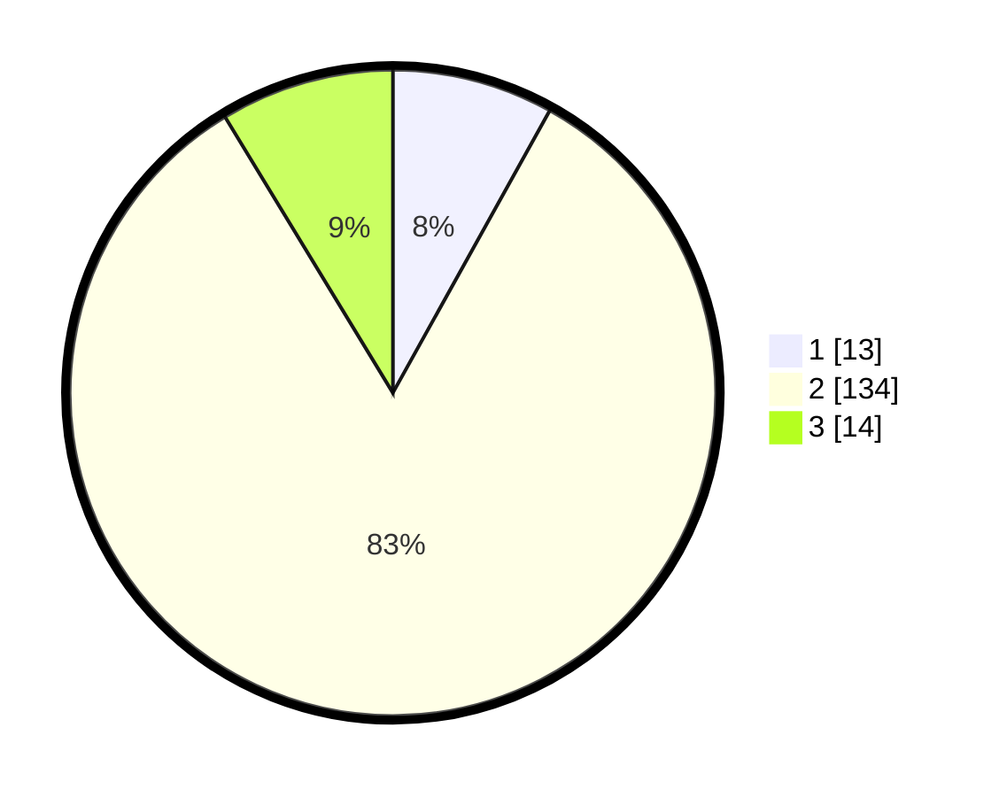

# Hasil

## Grafik

## Tabel

| No. | Nama Paslon    | Suara | Suara (raw) | Persentase |
|:--- |:-------------- | -----:| -----------:| ----------:|
| 1   | ANIES MUHAIMIN | 13    | [13][p-1]   | 8,07       |
| 2   | PRABOWO GIBRAN | 134   | [134][p-2]  | 83,23      |
| 3   | GANJAR MAHFUD  | 14    | [14][p-3]   | 8,70       |

[p-1]: https://github.com/gigit-pemilu/pemilu-2024-35-jawa-timur/blob/main/pilpres/hitung-suara/sub/35-jawa-timur/sub/09-jember/sub/04-gumukmas/sub/2003-gumukmas/sub/033-tps/sub/paslon-1.txt
[p-2]: https://github.com/gigit-pemilu/pemilu-2024-35-jawa-timur/blob/main/pilpres/hitung-suara/sub/35-jawa-timur/sub/09-jember/sub/04-gumukmas/sub/2003-gumukmas/sub/033-tps/sub/paslon-2.txt
[p-3]: https://github.com/gigit-pemilu/pemilu-2024-35-jawa-timur/blob/main/pilpres/hitung-suara/sub/35-jawa-timur/sub/09-jember/sub/04-gumukmas/sub/2003-gumukmas/sub/033-tps/sub/paslon-3.txt

## Foto C Plano

https://sirekap-obj-formc.kpu.go.id/ce28/pemilu/ppwp/35/09/04/20/03/3509042003033-20240215-143118--13fd98e2-7c26-4a5c-a749-aed8cf38233f.jpg

https://sirekap-obj-formc.kpu.go.id/ce28/pemilu/ppwp/35/09/04/20/03/3509042003033-20240217-222331--5e0ec73f-7cef-41cc-ab37-5592d8569599.jpg

https://sirekap-obj-formc.kpu.go.id/ce28/pemilu/ppwp/35/09/04/20/03/3509042003033-20240214-222405--262ade19-c56c-4392-8667-4edabc0cde26.jpg

## Metadata

| Key        | Value               |
| ---------- | ------------------- |
| Time Stamp | 2024-02-20 20:00:00 |

