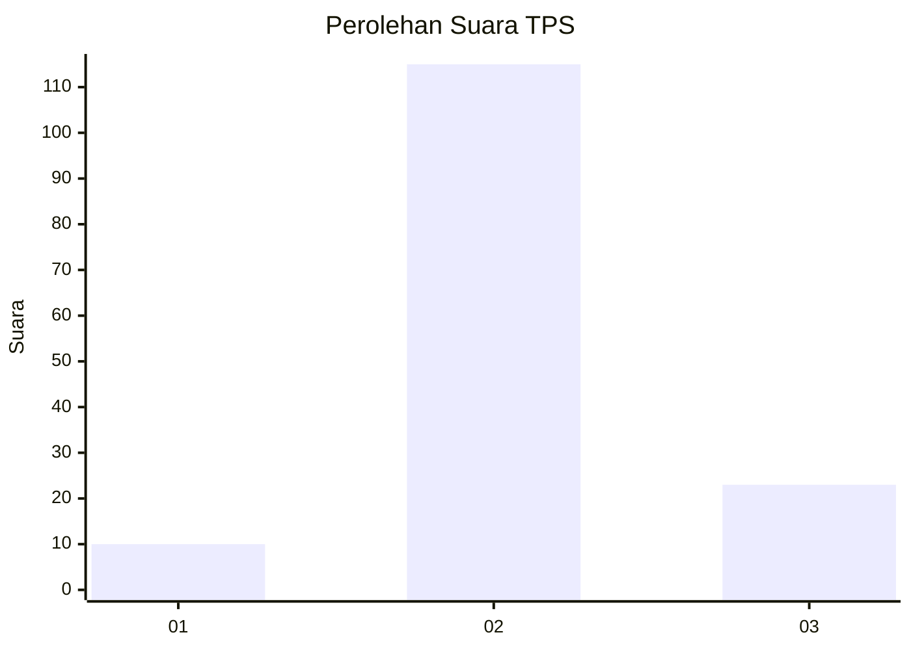
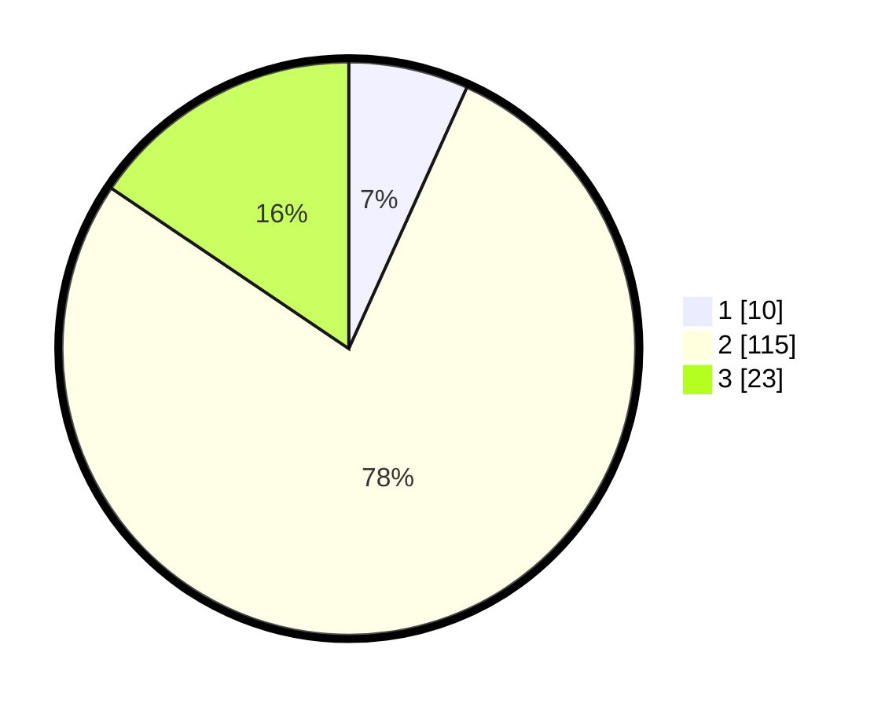

# Hasil

## Grafik

## Tabel

| No. | Nama Paslon    | Suara | Suara (raw) | Persentase |
|:--- |:-------------- | -----:| -----------:| ----------:|
| 1   | ANIES MUHAIMIN | 10    | [10][p-1]   | 6,76       |
| 2   | PRABOWO GIBRAN | 115   | [115][p-2]  | 77,70      |
| 3   | GANJAR MAHFUD  | 23    | [23][p-3]   | 15,54      |

[p-1]: https://github.com/gigit-pemilu/pemilu-2024-35-jawa-timur/blob/main/pilpres/hitung-suara/sub/35-jawa-timur/sub/09-jember/sub/04-gumukmas/sub/2003-gumukmas/sub/043-tps/sub/paslon-1.txt
[p-2]: https://github.com/gigit-pemilu/pemilu-2024-35-jawa-timur/blob/main/pilpres/hitung-suara/sub/35-jawa-timur/sub/09-jember/sub/04-gumukmas/sub/2003-gumukmas/sub/043-tps/sub/paslon-2.txt
[p-3]: https://github.com/gigit-pemilu/pemilu-2024-35-jawa-timur/blob/main/pilpres/hitung-suara/sub/35-jawa-timur/sub/09-jember/sub/04-gumukmas/sub/2003-gumukmas/sub/043-tps/sub/paslon-3.txt

## Foto C Plano

https://sirekap-obj-formc.kpu.go.id/62c1/pemilu/ppwp/35/09/04/20/03/3509042003043-20240221-093340--cb6e7873-3d0e-4d90-a147-4cfa1a4b2681.jpg

https://sirekap-obj-formc.kpu.go.id/62c1/pemilu/ppwp/35/09/04/20/03/3509042003043-20240221-093353--fb4536f4-63bc-4a4f-87dc-5b9ce6526872.jpg

https://sirekap-obj-formc.kpu.go.id/62c1/pemilu/ppwp/35/09/04/20/03/3509042003043-20240221-093422--318222f6-5cc8-4722-8932-84ad368c72fc.jpg

## Metadata

| Key        | Value               |
| ---------- | ------------------- |
| Time Stamp | 2024-02-24 22:31:28 |

