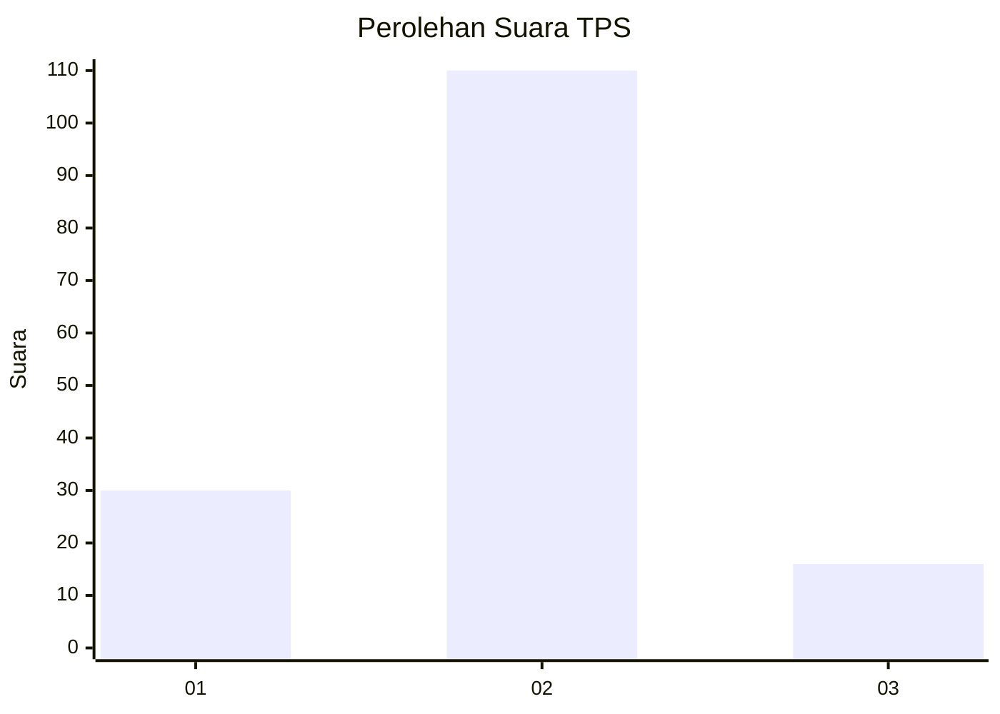
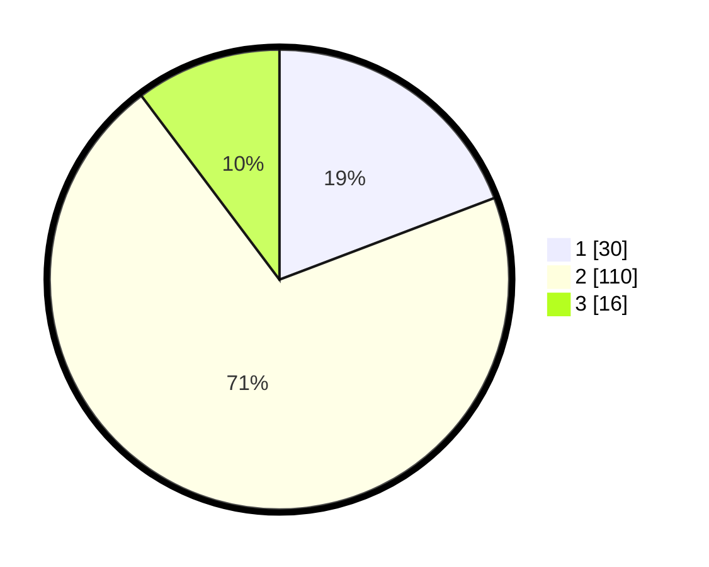

# Hasil

## Grafik

## Tabel

| No. | Nama Paslon    | Suara | Suara (raw) | Persentase |
|:--- |:-------------- | -----:| -----------:| ----------:|
| 1   | ANIES MUHAIMIN | 30    | [30][p-1]   | 19,23      |
| 2   | PRABOWO GIBRAN | 110   | [110][p-2]  | 70,51      |
| 3   | GANJAR MAHFUD  | 16    | [16][p-3]   | 10,26      |

[p-1]: https://github.com/gigit-pemilu/pemilu-2024/blob/main/pilpres/hitung-suara/sub/35-jawa-timur/sub/09-jember/sub/04-gumukmas/sub/2004-menampu/sub/018-tps/sub/paslon-1.txt
[p-2]: https://github.com/gigit-pemilu/pemilu-2024/blob/main/pilpres/hitung-suara/sub/35-jawa-timur/sub/09-jember/sub/04-gumukmas/sub/2004-menampu/sub/018-tps/sub/paslon-2.txt
[p-3]: https://github.com/gigit-pemilu/pemilu-2024/blob/main/pilpres/hitung-suara/sub/35-jawa-timur/sub/09-jember/sub/04-gumukmas/sub/2004-menampu/sub/018-tps/sub/paslon-3.txt

## Foto C Plano

https://sirekap-obj-formc.kpu.go.id/ccc4/pemilu/ppwp/35/09/04/20/04/3509042004018-20240217-170236--25aa52f1-d54c-479f-8c5f-00045e4e4954.jpg

https://sirekap-obj-formc.kpu.go.id/ccc4/pemilu/ppwp/35/09/04/20/04/3509042004018-20240217-170523--1b4d0a76-d9ee-4c4a-864d-43d2c6b61631.jpg

https://sirekap-obj-formc.kpu.go.id/ccc4/pemilu/ppwp/35/09/04/20/04/3509042004018-20240217-170623--cf66b0ca-a5f1-4733-9cf7-7d252cf8ec7a.jpg

## Metadata

| Key        | Value               |
| ---------- | ------------------- |
| Time Stamp | 2024-02-25 21:00:00 |

