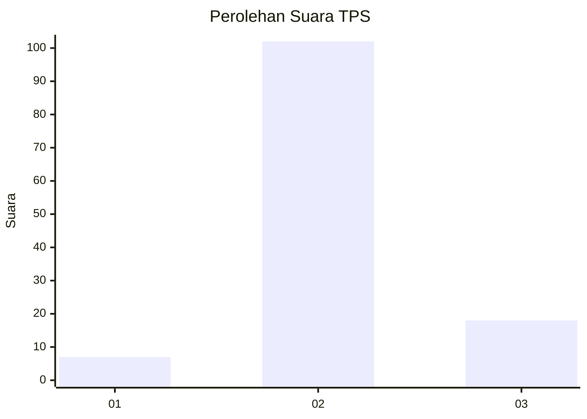
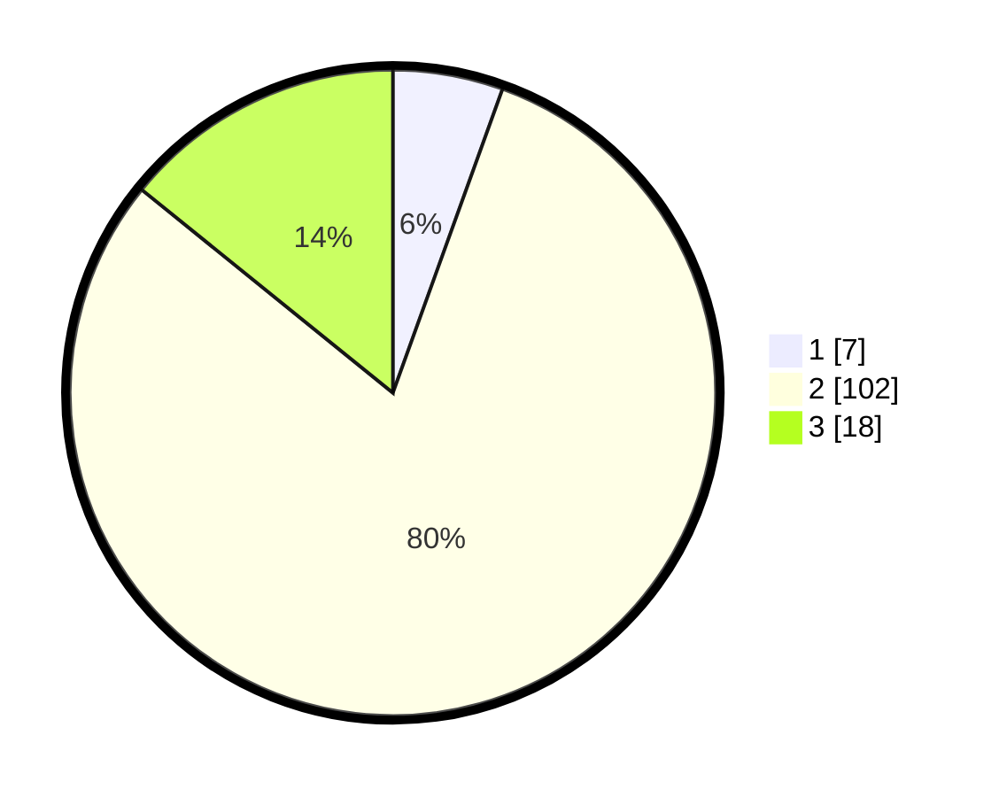

# Hasil

## Grafik

## Tabel

| No. | Nama Paslon    | Suara | Suara (raw) | Persentase |
|:--- |:-------------- | -----:| -----------:| ----------:|
| 1   | ANIES MUHAIMIN | 7     | [7][p-1]    | 5,51       |
| 2   | PRABOWO GIBRAN | 102   | [102][p-2]  | 80,31      |
| 3   | GANJAR MAHFUD  | 18    | [18][p-3]   | 14,17      |

[p-1]: https://github.com/gigit-pemilu/pemilu-2024/blob/main/pilpres/hitung-suara/sub/35-jawa-timur/sub/09-jember/sub/04-gumukmas/sub/2004-menampu/sub/036-tps/sub/paslon-1.txt
[p-2]: https://github.com/gigit-pemilu/pemilu-2024/blob/main/pilpres/hitung-suara/sub/35-jawa-timur/sub/09-jember/sub/04-gumukmas/sub/2004-menampu/sub/036-tps/sub/paslon-2.txt
[p-3]: https://github.com/gigit-pemilu/pemilu-2024/blob/main/pilpres/hitung-suara/sub/35-jawa-timur/sub/09-jember/sub/04-gumukmas/sub/2004-menampu/sub/036-tps/sub/paslon-3.txt

## Foto C Plano

https://sirekap-obj-formc.kpu.go.id/e7be/pemilu/ppwp/35/09/04/20/04/3509042004036-20240214-230833--ac9aa935-0c89-48ca-ae83-d5a5f5586864.jpg

https://sirekap-obj-formc.kpu.go.id/e7be/pemilu/ppwp/35/09/04/20/04/3509042004036-20240214-231317--54853f30-5ae0-43ed-9bff-9eb38401801d.jpg

https://sirekap-obj-formc.kpu.go.id/e7be/pemilu/ppwp/35/09/04/20/04/3509042004036-20240215-060919--2b69eb87-8d0e-42b6-a996-313a2a7cc1ad.jpg

## Metadata

| Key        | Value               |
| ---------- | ------------------- |
| Time Stamp | 2024-02-15 15:00:29 |

