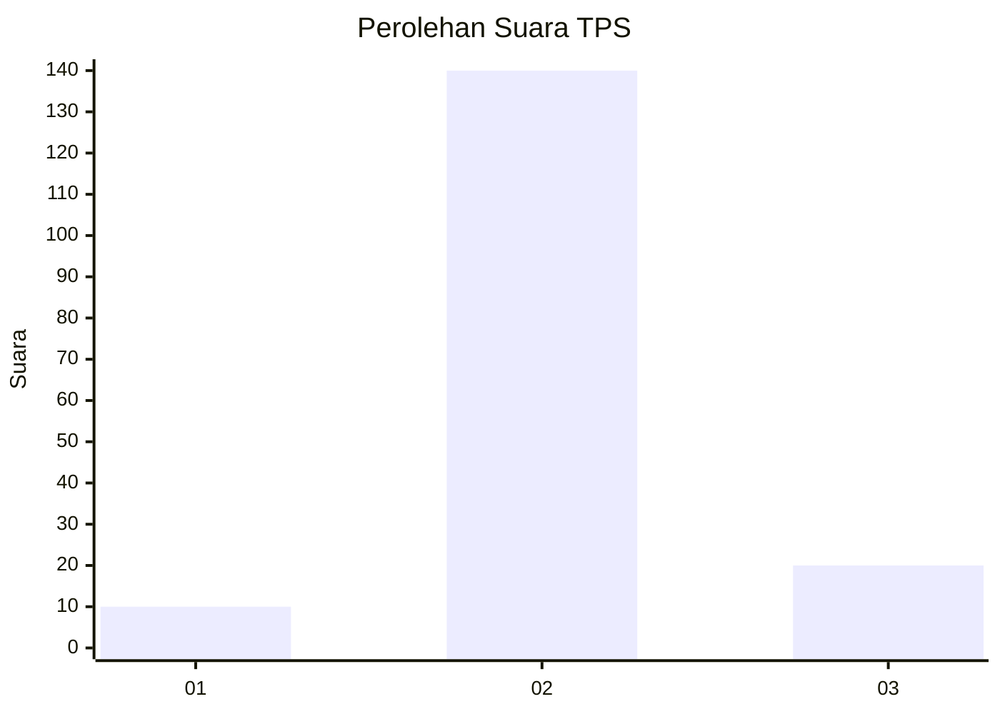
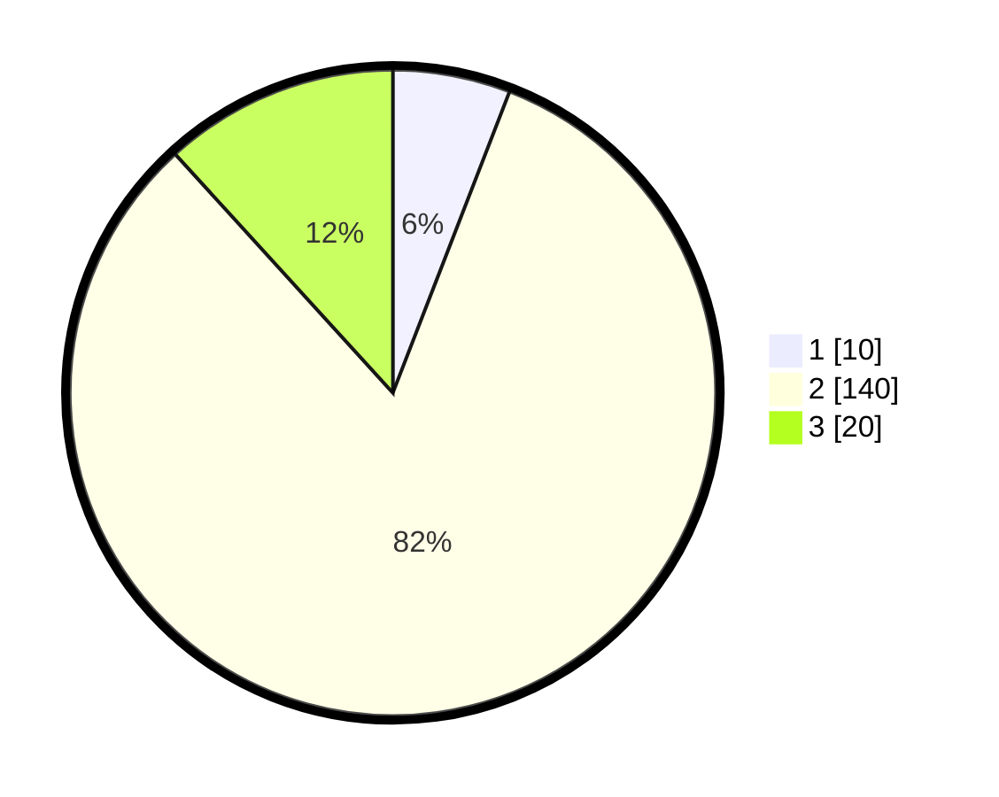

# Hasil

## Grafik

## Tabel

| No. | Nama Paslon    | Suara | Suara (raw) | Persentase |
|:--- |:-------------- | -----:| -----------:| ----------:|
| 1   | ANIES MUHAIMIN | 10    | [10][p-1]   | 5,88       |
| 2   | PRABOWO GIBRAN | 140   | [140][p-2]  | 82,35      |
| 3   | GANJAR MAHFUD  | 20    | [20][p-3]   | 11,76      |

[p-1]: https://github.com/gigit-pemilu/pemilu-2024-35-jawa-timur/blob/main/pilpres/hitung-suara/sub/35-jawa-timur/sub/09-jember/sub/04-gumukmas/sub/2005-tembokrejo/sub/012-tps/sub/paslon-1.txt
[p-2]: https://github.com/gigit-pemilu/pemilu-2024-35-jawa-timur/blob/main/pilpres/hitung-suara/sub/35-jawa-timur/sub/09-jember/sub/04-gumukmas/sub/2005-tembokrejo/sub/012-tps/sub/paslon-2.txt
[p-3]: https://github.com/gigit-pemilu/pemilu-2024-35-jawa-timur/blob/main/pilpres/hitung-suara/sub/35-jawa-timur/sub/09-jember/sub/04-gumukmas/sub/2005-tembokrejo/sub/012-tps/sub/paslon-3.txt

## Foto C Plano

https://sirekap-obj-formc.kpu.go.id/b291/pemilu/ppwp/35/09/04/20/05/3509042005012-20240214-223614--2521441e-f3d6-4f51-b31e-164795246d1b.jpg

https://sirekap-obj-formc.kpu.go.id/b291/pemilu/ppwp/35/09/04/20/05/3509042005012-20240217-170108--cc006b07-95d4-4b97-a012-1a292e81c48b.jpg

https://sirekap-obj-formc.kpu.go.id/b291/pemilu/ppwp/35/09/04/20/05/3509042005012-20240214-225331--be1fa840-b475-4958-b5fe-2972f3181dae.jpg

## Metadata

| Key        | Value               |
| ---------- | ------------------- |
| Time Stamp | 2024-02-21 16:00:00 |

