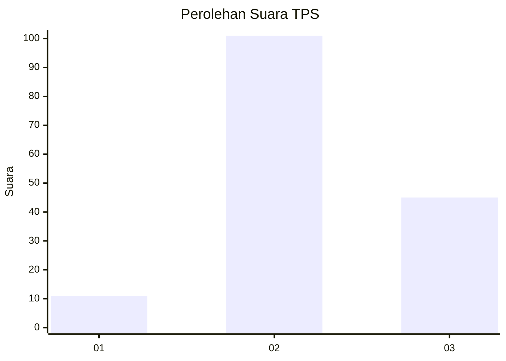
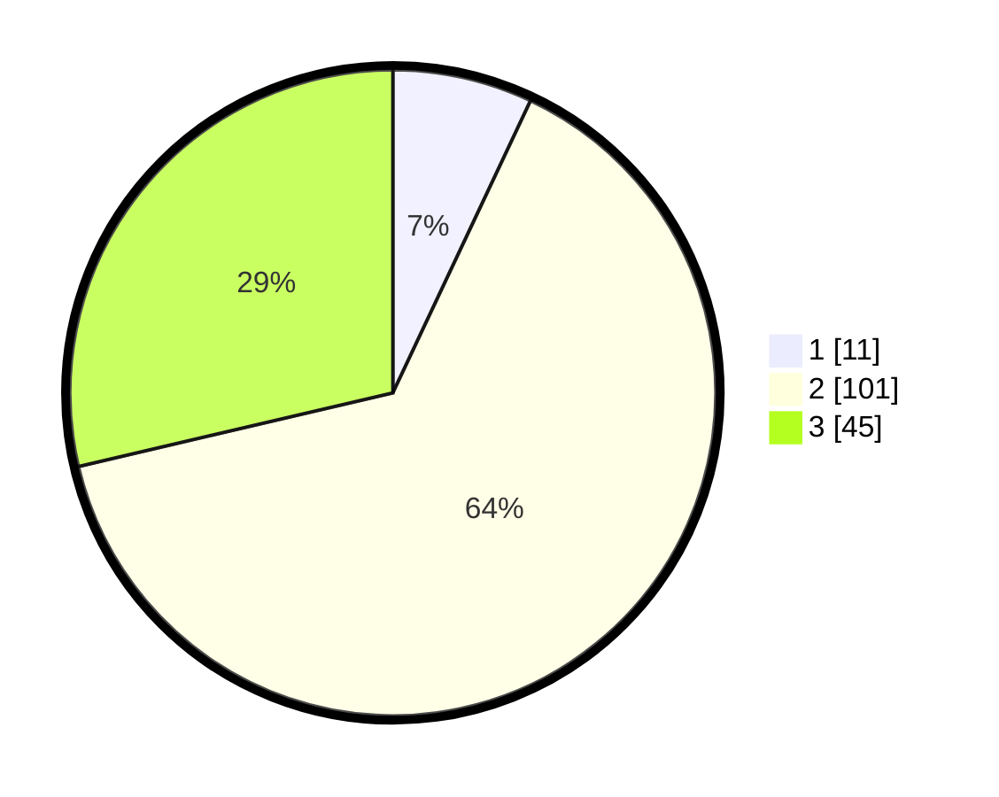

# Hasil

## Grafik

## Tabel

| No. | Nama Paslon    | Suara | Suara (raw) | Persentase |
|:--- |:-------------- | -----:| -----------:| ----------:|
| 1   | ANIES MUHAIMIN | 11    | [11][p-1]   | 7,01       |
| 2   | PRABOWO GIBRAN | 101   | [101][p-2]  | 64,33      |
| 3   | GANJAR MAHFUD  | 45    | [45][p-3]   | 28,66      |

[p-1]: https://github.com/gigit-pemilu/pemilu-2024-35-jawa-timur/blob/main/pilpres/hitung-suara/sub/35-jawa-timur/sub/09-jember/sub/04-gumukmas/sub/2005-tembokrejo/sub/013-tps/sub/paslon-1.txt
[p-2]: https://github.com/gigit-pemilu/pemilu-2024-35-jawa-timur/blob/main/pilpres/hitung-suara/sub/35-jawa-timur/sub/09-jember/sub/04-gumukmas/sub/2005-tembokrejo/sub/013-tps/sub/paslon-2.txt
[p-3]: https://github.com/gigit-pemilu/pemilu-2024-35-jawa-timur/blob/main/pilpres/hitung-suara/sub/35-jawa-timur/sub/09-jember/sub/04-gumukmas/sub/2005-tembokrejo/sub/013-tps/sub/paslon-3.txt

## Foto C Plano

https://sirekap-obj-formc.kpu.go.id/bc44/pemilu/ppwp/35/09/04/20/05/3509042005013-20240218-112014--1b199235-d45f-4f17-8d4f-13b3ac8ca030.jpg

https://sirekap-obj-formc.kpu.go.id/bc44/pemilu/ppwp/35/09/04/20/05/3509042005013-20240218-112052--6d9683d4-9e26-492d-89b5-17da230ad96b.jpg

https://sirekap-obj-formc.kpu.go.id/bc44/pemilu/ppwp/35/09/04/20/05/3509042005013-20240218-112124--185aaa6a-8250-46ec-90a7-d32ae5892c15.jpg

## Metadata

| Key        | Value               |
| ---------- | ------------------- |
| Time Stamp | 2024-02-25 16:00:00 |

