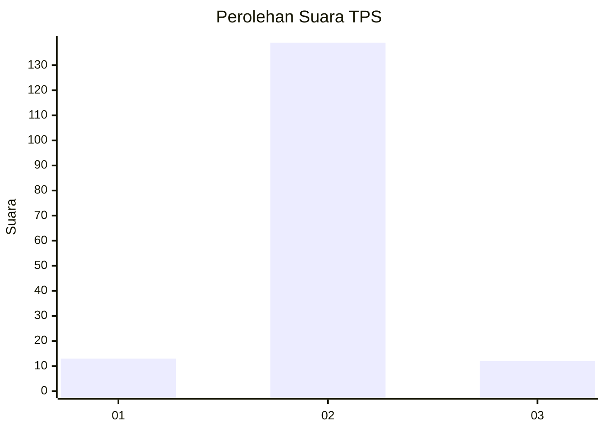
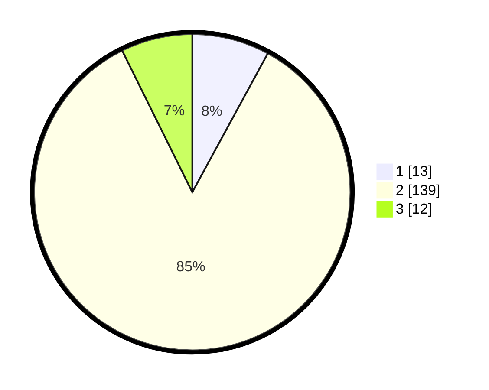

# Hasil

## Grafik

## Tabel

| No. | Nama Paslon    | Suara | Suara (raw) | Persentase |
|:--- |:-------------- | -----:| -----------:| ----------:|
| 1   | ANIES MUHAIMIN | 13    | [13][p-1]   | 7,93       |
| 2   | PRABOWO GIBRAN | 139   | [139][p-2]  | 84,76      |
| 3   | GANJAR MAHFUD  | 12    | [12][p-3]   | 7,32       |

[p-1]: https://github.com/gigit-pemilu/pemilu-2024-35-jawa-timur/blob/main/pilpres/hitung-suara/sub/35-jawa-timur/sub/09-jember/sub/04-gumukmas/sub/2006-purwoasri/sub/014-tps/sub/paslon-1.txt
[p-2]: https://github.com/gigit-pemilu/pemilu-2024-35-jawa-timur/blob/main/pilpres/hitung-suara/sub/35-jawa-timur/sub/09-jember/sub/04-gumukmas/sub/2006-purwoasri/sub/014-tps/sub/paslon-2.txt
[p-3]: https://github.com/gigit-pemilu/pemilu-2024-35-jawa-timur/blob/main/pilpres/hitung-suara/sub/35-jawa-timur/sub/09-jember/sub/04-gumukmas/sub/2006-purwoasri/sub/014-tps/sub/paslon-3.txt

## Foto C Plano

https://sirekap-obj-formc.kpu.go.id/7de9/pemilu/ppwp/35/09/04/20/06/3509042006014-20240217-193042--97c680ca-c4fb-4c90-bd95-c9f6b11372e5.jpg

https://sirekap-obj-formc.kpu.go.id/7de9/pemilu/ppwp/35/09/04/20/06/3509042006014-20240218-123633--e2181966-c65b-4ef3-b65e-852b30ec8c74.jpg

https://sirekap-obj-formc.kpu.go.id/7de9/pemilu/ppwp/35/09/04/20/06/3509042006014-20240218-123724--73b182a8-a842-4050-a5bf-43111679f2e3.jpg

## Metadata

| Key        | Value               |
| ---------- | ------------------- |
| Time Stamp | 2024-02-19 06:16:00 |

