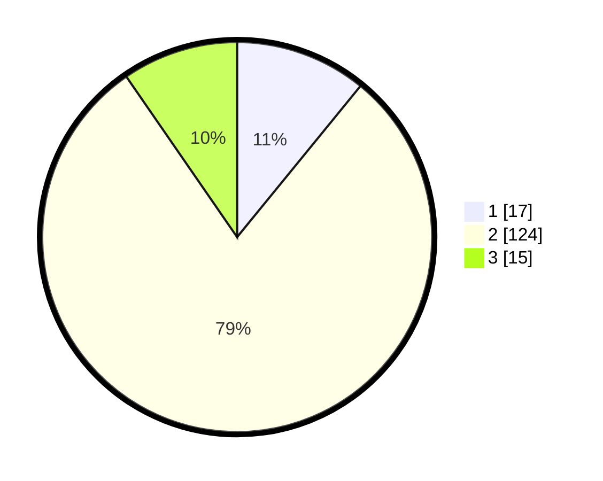

# Hasil

## Grafik

## Tabel

| No. | Nama Paslon    | Suara | Suara (raw) | Persentase |
|:--- |:-------------- | -----:| -----------:| ----------:|
| 1   | ANIES MUHAIMIN | 17    | [17][p-1]   | 10,90      |
| 2   | PRABOWO GIBRAN | 124   | [124][p-2]  | 79,49      |
| 3   | GANJAR MAHFUD  | 15    | [15][p-3]   | 9,62       |

[p-1]: https://github.com/gigit-pemilu/pemilu-2024-35-jawa-timur/blob/main/pilpres/hitung-suara/sub/35-jawa-timur/sub/09-jember/sub/04-gumukmas/sub/2006-purwoasri/sub/015-tps/sub/paslon-1.txt
[p-2]: https://github.com/gigit-pemilu/pemilu-2024-35-jawa-timur/blob/main/pilpres/hitung-suara/sub/35-jawa-timur/sub/09-jember/sub/04-gumukmas/sub/2006-purwoasri/sub/015-tps/sub/paslon-2.txt
[p-3]: https://github.com/gigit-pemilu/pemilu-2024-35-jawa-timur/blob/main/pilpres/hitung-suara/sub/35-jawa-timur/sub/09-jember/sub/04-gumukmas/sub/2006-purwoasri/sub/015-tps/sub/paslon-3.txt

## Foto C Plano

https://sirekap-obj-formc.kpu.go.id/c7ff/pemilu/ppwp/35/09/04/20/06/3509042006015-20240215-015922--30c154e8-f20f-4105-a538-dd3bba0a2063.jpg

https://sirekap-obj-formc.kpu.go.id/c7ff/pemilu/ppwp/35/09/04/20/06/3509042006015-20240217-234657--2dedd0c5-09c1-4e68-9bba-ef3df2b01143.jpg

https://sirekap-obj-formc.kpu.go.id/c7ff/pemilu/ppwp/35/09/04/20/06/3509042006015-20240215-020220--76968ddd-18ec-43d1-a9f7-8fbe1110fe34.jpg

## Metadata

| Key        | Value               |
| ---------- | ------------------- |
| Time Stamp | 2024-02-24 22:31:28 |

