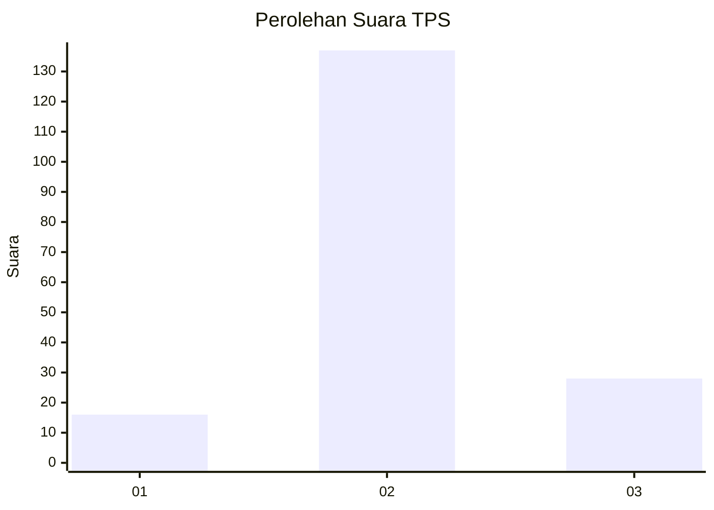
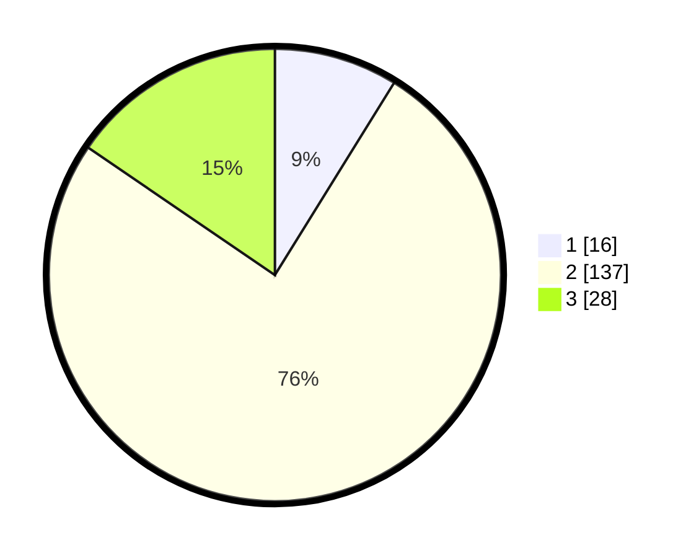

# Hasil

## Grafik

## Tabel

| No. | Nama Paslon    | Suara | Suara (raw) | Persentase |
|:--- |:-------------- | -----:| -----------:| ----------:|
| 1   | ANIES MUHAIMIN | 16    | [16][p-1]   | 8,84       |
| 2   | PRABOWO GIBRAN | 137   | [137][p-2]  | 75,69      |
| 3   | GANJAR MAHFUD  | 28    | [28][p-3]   | 15,47      |

[p-1]: https://github.com/gigit-pemilu/pemilu-2024/blob/main/pilpres/hitung-suara/sub/35-jawa-timur/sub/09-jember/sub/04-gumukmas/sub/2007-bagorejo/sub/016-tps/sub/paslon-1.txt
[p-2]: https://github.com/gigit-pemilu/pemilu-2024/blob/main/pilpres/hitung-suara/sub/35-jawa-timur/sub/09-jember/sub/04-gumukmas/sub/2007-bagorejo/sub/016-tps/sub/paslon-2.txt
[p-3]: https://github.com/gigit-pemilu/pemilu-2024/blob/main/pilpres/hitung-suara/sub/35-jawa-timur/sub/09-jember/sub/04-gumukmas/sub/2007-bagorejo/sub/016-tps/sub/paslon-3.txt

## Foto C Plano

https://sirekap-obj-formc.kpu.go.id/df28/pemilu/ppwp/35/09/04/20/07/3509042007016-20240215-095744--a7df1b42-a1d0-4588-be01-1c3d59bae3d6.jpg

https://sirekap-obj-formc.kpu.go.id/df28/pemilu/ppwp/35/09/04/20/07/3509042007016-20240214-141445--9c2d2f4c-200d-4a2a-a61a-09d34f2b1f05.jpg

https://sirekap-obj-formc.kpu.go.id/df28/pemilu/ppwp/35/09/04/20/07/3509042007016-20240215-095936--080cac06-b154-4c19-ae0e-b6d54758bbfd.jpg

## Metadata

| Key        | Value               |
| ---------- | ------------------- |
| Time Stamp | 2024-02-16 14:30:33 |

