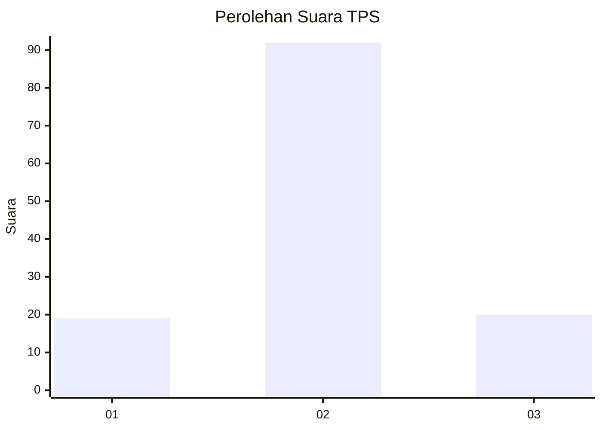
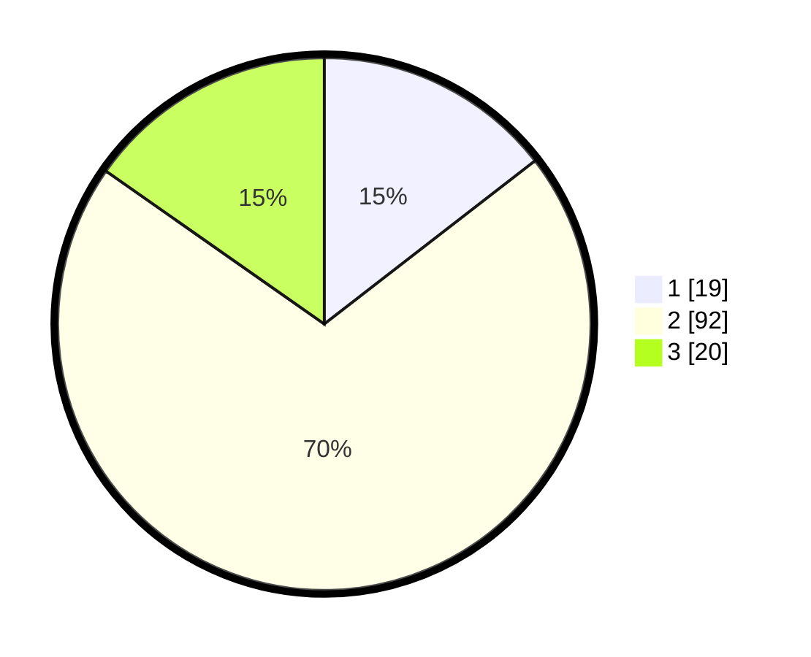

# Hasil

## Grafik

## Tabel

| No. | Nama Paslon    | Suara | Suara (raw) | Persentase |
|:--- |:-------------- | -----:| -----------:| ----------:|
| 1   | ANIES MUHAIMIN | 19    | [19][p-1]   | 14,50      |
| 2   | PRABOWO GIBRAN | 92    | [92][p-2]   | 70,23      |
| 3   | GANJAR MAHFUD  | 20    | [20][p-3]   | 15,27      |

[p-1]: https://github.com/gigit-pemilu/pemilu-2024/blob/main/pilpres/hitung-suara/sub/35-jawa-timur/sub/09-jember/sub/04-gumukmas/sub/2007-bagorejo/sub/022-tps/sub/paslon-1.txt
[p-2]: https://github.com/gigit-pemilu/pemilu-2024/blob/main/pilpres/hitung-suara/sub/35-jawa-timur/sub/09-jember/sub/04-gumukmas/sub/2007-bagorejo/sub/022-tps/sub/paslon-2.txt
[p-3]: https://github.com/gigit-pemilu/pemilu-2024/blob/main/pilpres/hitung-suara/sub/35-jawa-timur/sub/09-jember/sub/04-gumukmas/sub/2007-bagorejo/sub/022-tps/sub/paslon-3.txt

## Foto C Plano

https://sirekap-obj-formc.kpu.go.id/76ce/pemilu/ppwp/35/09/04/20/07/3509042007022-20240221-152547--181b750a-a0f3-4629-8ee0-20f65e324f17.jpg

https://sirekap-obj-formc.kpu.go.id/76ce/pemilu/ppwp/35/09/04/20/07/3509042007022-20240221-152647--28ce2715-60c4-4187-bfa1-9dbe7e9d7fe5.jpg

https://sirekap-obj-formc.kpu.go.id/76ce/pemilu/ppwp/35/09/04/20/07/3509042007022-20240221-152812--805fad2f-4642-4ee5-9d10-ccae1c8bfe97.jpg

## Metadata

| Key        | Value               |
| ---------- | ------------------- |
| Time Stamp | 2024-02-24 22:31:28 |

