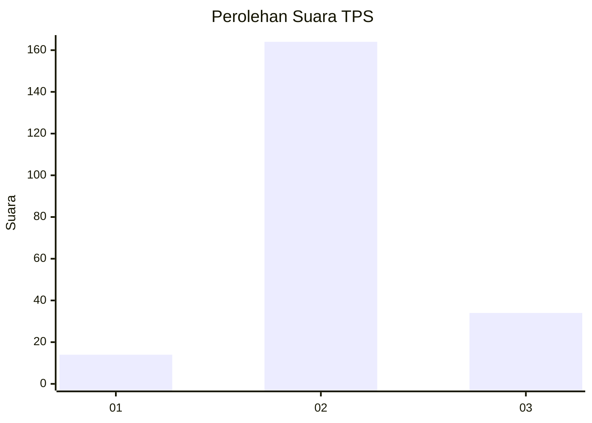
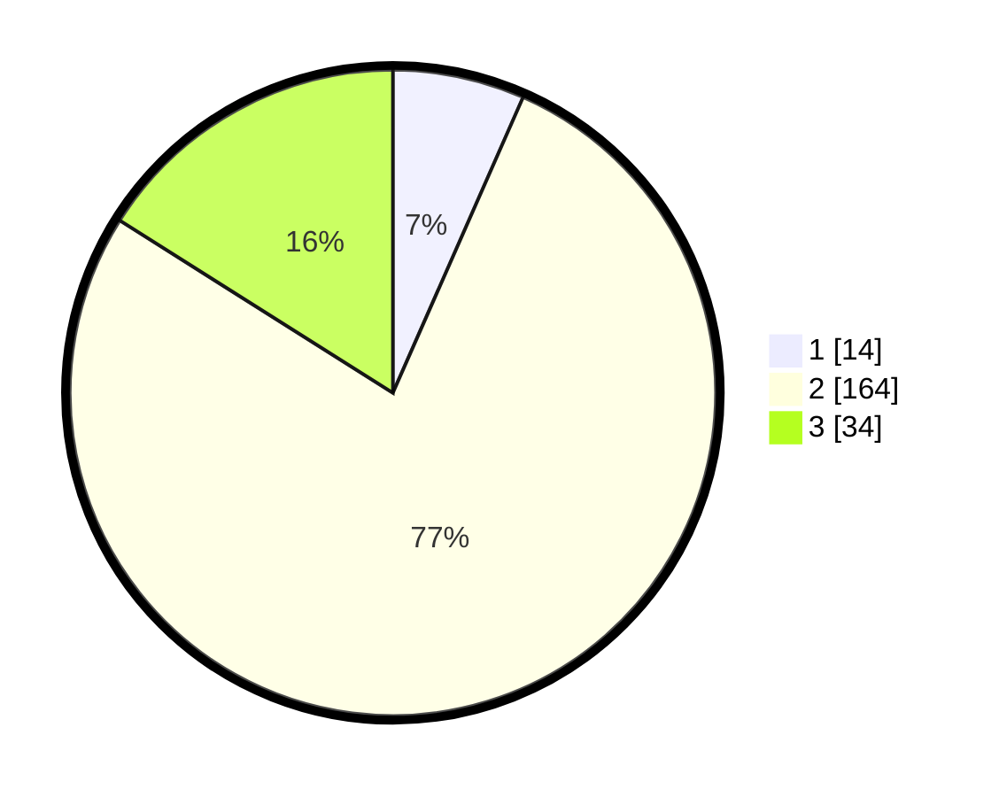

# Hasil

## Grafik

## Tabel

| No. | Nama Paslon    | Suara | Suara (raw) | Persentase |
|:--- |:-------------- | -----:| -----------:| ----------:|
| 1   | ANIES MUHAIMIN | 14    | [14][p-1]   | 6,60       |
| 2   | PRABOWO GIBRAN | 164   | [164][p-2]  | 77,36      |
| 3   | GANJAR MAHFUD  | 34    | [34][p-3]   | 16,04      |

[p-1]: https://github.com/gigit-pemilu/pemilu-2024-35-jawa-timur/blob/main/pilpres/hitung-suara/sub/35-jawa-timur/sub/09-jember/sub/04-gumukmas/sub/2008-karangrejo/sub/008-tps/sub/paslon-1.txt
[p-2]: https://github.com/gigit-pemilu/pemilu-2024-35-jawa-timur/blob/main/pilpres/hitung-suara/sub/35-jawa-timur/sub/09-jember/sub/04-gumukmas/sub/2008-karangrejo/sub/008-tps/sub/paslon-2.txt
[p-3]: https://github.com/gigit-pemilu/pemilu-2024-35-jawa-timur/blob/main/pilpres/hitung-suara/sub/35-jawa-timur/sub/09-jember/sub/04-gumukmas/sub/2008-karangrejo/sub/008-tps/sub/paslon-3.txt

## Foto C Plano

https://sirekap-obj-formc.kpu.go.id/f426/pemilu/ppwp/35/09/04/20/08/3509042008008-20240220-090725--89d11e09-a717-450c-8fec-adf6262bdc32.jpg

https://sirekap-obj-formc.kpu.go.id/f426/pemilu/ppwp/35/09/04/20/08/3509042008008-20240220-090400--a488bf9b-8556-4495-9fbb-cb483bce7a92.jpg

https://sirekap-obj-formc.kpu.go.id/f426/pemilu/ppwp/35/09/04/20/08/3509042008008-20240220-090458--9ef00f3c-5834-4f39-abb0-65ee1ff28d0e.jpg

## Metadata

| Key        | Value               |
| ---------- | ------------------- |
| Time Stamp | 2024-02-25 12:00:00 |

