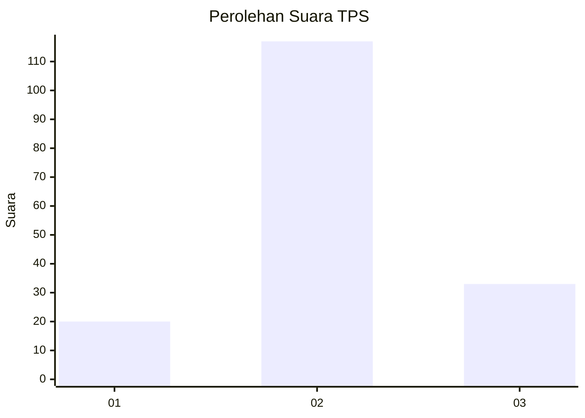
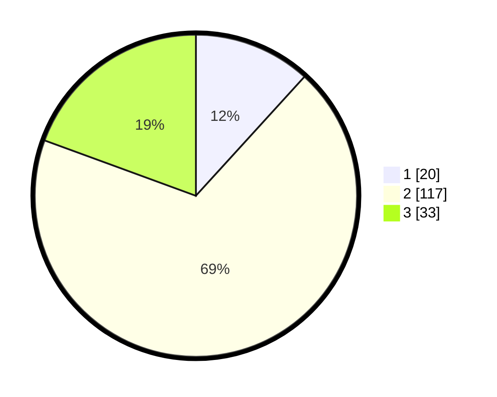

# Hasil

## Grafik

## Tabel

| No. | Nama Paslon    | Suara | Suara (raw) | Persentase |
|:--- |:-------------- | -----:| -----------:| ----------:|
| 1   | ANIES MUHAIMIN | 20    | [20][p-1]   | 11,76      |
| 2   | PRABOWO GIBRAN | 117   | [117][p-2]  | 68,82      |
| 3   | GANJAR MAHFUD  | 33    | [33][p-3]   | 19,41      |

[p-1]: https://github.com/gigit-pemilu/pemilu-2024-35-jawa-timur/blob/main/pilpres/hitung-suara/sub/35-jawa-timur/sub/09-jember/sub/05-umbulsari/sub/2007-tanjungsari/sub/012-tps/sub/paslon-1.txt
[p-2]: https://github.com/gigit-pemilu/pemilu-2024-35-jawa-timur/blob/main/pilpres/hitung-suara/sub/35-jawa-timur/sub/09-jember/sub/05-umbulsari/sub/2007-tanjungsari/sub/012-tps/sub/paslon-2.txt
[p-3]: https://github.com/gigit-pemilu/pemilu-2024-35-jawa-timur/blob/main/pilpres/hitung-suara/sub/35-jawa-timur/sub/09-jember/sub/05-umbulsari/sub/2007-tanjungsari/sub/012-tps/sub/paslon-3.txt

## Foto C Plano

https://sirekap-obj-formc.kpu.go.id/4415/pemilu/ppwp/35/09/05/20/07/3509052007012-20240217-105234--35609e4b-4187-474b-b097-941d3b6608a7.jpg

https://sirekap-obj-formc.kpu.go.id/4415/pemilu/ppwp/35/09/05/20/07/3509052007012-20240217-113826--3001af52-5608-4ddf-ab8f-49bc3aaa1642.jpg

https://sirekap-obj-formc.kpu.go.id/4415/pemilu/ppwp/35/09/05/20/07/3509052007012-20240217-115001--f5b66708-51a9-4c16-95e6-e4a342f7d517.jpg

## Metadata

| Key        | Value               |
| ---------- | ------------------- |
| Time Stamp | 2024-02-17 12:00:00 |

