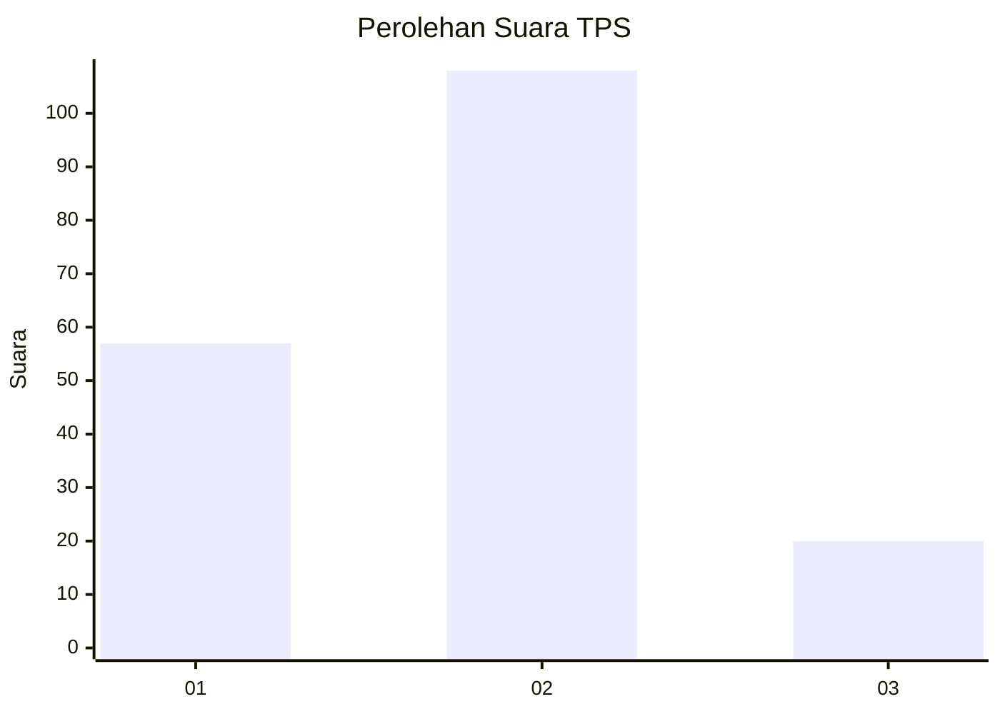
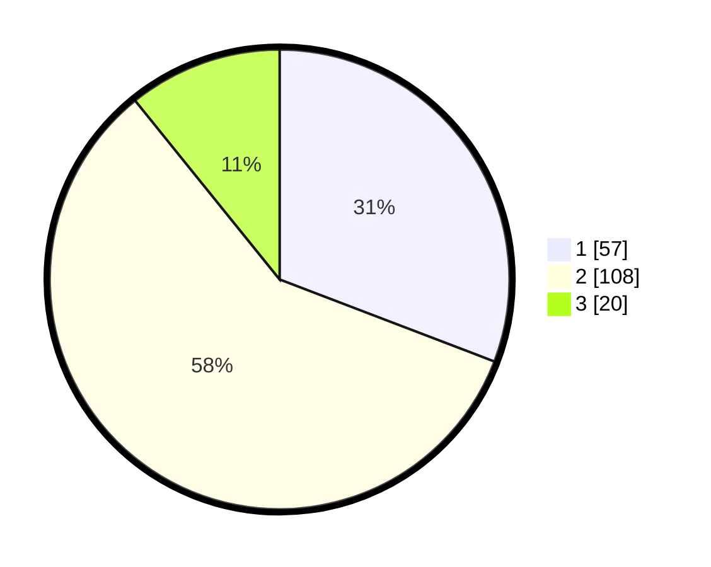

# Hasil

## Grafik

## Tabel

| No. | Nama Paslon    | Suara | Suara (raw) | Persentase |
|:--- |:-------------- | -----:| -----------:| ----------:|
| 1   | ANIES MUHAIMIN | 57    | [57][p-1]   | 30,81      |
| 2   | PRABOWO GIBRAN | 108   | [108][p-2]  | 58,38      |
| 3   | GANJAR MAHFUD  | 20    | [20][p-3]   | 10,81      |

[p-1]: https://github.com/gigit-pemilu/pemilu-2024/blob/main/pilpres/hitung-suara/sub/35-jawa-timur/sub/09-jember/sub/06-tanggul/sub/2001-tanggulkulon/sub/002-tps/sub/paslon-1.txt
[p-2]: https://github.com/gigit-pemilu/pemilu-2024/blob/main/pilpres/hitung-suara/sub/35-jawa-timur/sub/09-jember/sub/06-tanggul/sub/2001-tanggulkulon/sub/002-tps/sub/paslon-2.txt
[p-3]: https://github.com/gigit-pemilu/pemilu-2024/blob/main/pilpres/hitung-suara/sub/35-jawa-timur/sub/09-jember/sub/06-tanggul/sub/2001-tanggulkulon/sub/002-tps/sub/paslon-3.txt

## Foto C Plano

https://sirekap-obj-formc.kpu.go.id/5bb0/pemilu/ppwp/35/09/06/20/01/3509062001002-20240215-084959--92278b35-4d17-4ea7-9d2f-392db1302d61.jpg

https://sirekap-obj-formc.kpu.go.id/5bb0/pemilu/ppwp/35/09/06/20/01/3509062001002-20240215-085145--30f50b2b-5b68-462f-bf74-84baf75c5a77.jpg

https://sirekap-obj-formc.kpu.go.id/5bb0/pemilu/ppwp/35/09/06/20/01/3509062001002-20240214-220305--bdffcb3f-d977-4160-bd4d-d0006ff9f4b0.jpg

## Metadata

| Key        | Value               |
| ---------- | ------------------- |
| Time Stamp | 2024-02-24 23:00:00 |

