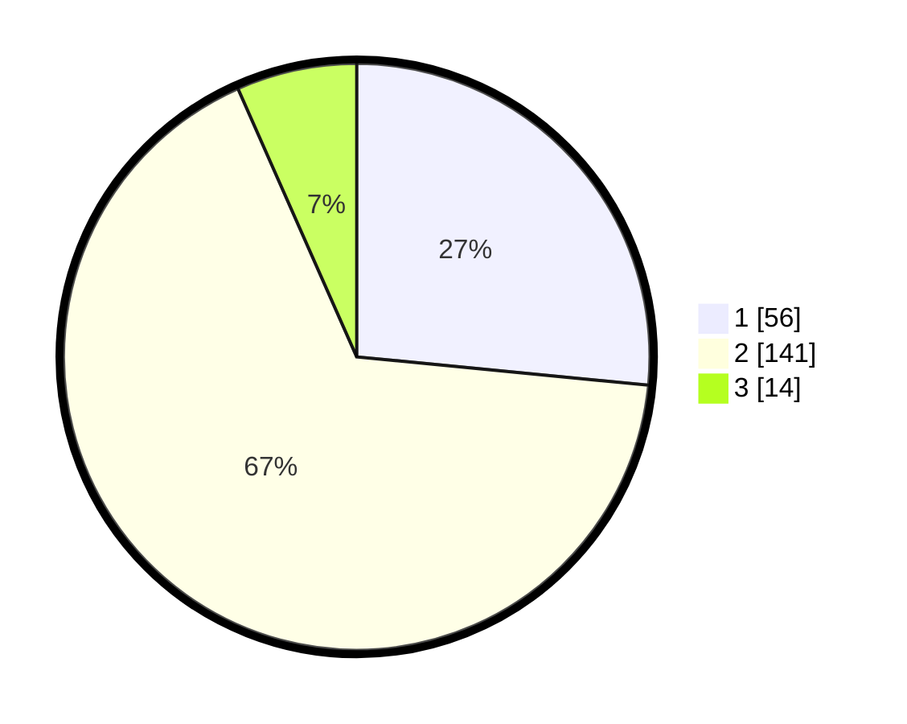

# Hasil

## Grafik

## Tabel

| No. | Nama Paslon    | Suara | Suara (raw) | Persentase |
|:--- |:-------------- | -----:| -----------:| ----------:|
| 1   | ANIES MUHAIMIN | 56    | [56][p-1]   | 26,54      |
| 2   | PRABOWO GIBRAN | 141   | [141][p-2]  | 66,82      |
| 3   | GANJAR MAHFUD  | 14    | [14][p-3]   | 6,64       |

[p-1]: https://github.com/gigit-pemilu/pemilu-2024/blob/main/pilpres/hitung-suara/sub/35-jawa-timur/sub/09-jember/sub/06-tanggul/sub/2001-tanggulkulon/sub/008-tps/sub/paslon-1.txt
[p-2]: https://github.com/gigit-pemilu/pemilu-2024/blob/main/pilpres/hitung-suara/sub/35-jawa-timur/sub/09-jember/sub/06-tanggul/sub/2001-tanggulkulon/sub/008-tps/sub/paslon-2.txt
[p-3]: https://github.com/gigit-pemilu/pemilu-2024/blob/main/pilpres/hitung-suara/sub/35-jawa-timur/sub/09-jember/sub/06-tanggul/sub/2001-tanggulkulon/sub/008-tps/sub/paslon-3.txt

## Foto C Plano

https://sirekap-obj-formc.kpu.go.id/0b96/pemilu/ppwp/35/09/06/20/01/3509062001008-20240215-024152--a5588d15-abbd-4ee2-82aa-613c54ad34c3.jpg

https://sirekap-obj-formc.kpu.go.id/0b96/pemilu/ppwp/35/09/06/20/01/3509062001008-20240214-203937--65be2d11-0e0d-4cd6-b1c2-c58ddad9e5c1.jpg

https://sirekap-obj-formc.kpu.go.id/0b96/pemilu/ppwp/35/09/06/20/01/3509062001008-20240214-204043--e780a024-6bde-465c-bc49-f0ae6b495248.jpg

## Metadata

| Key        | Value               |
| ---------- | ------------------- |
| Time Stamp | 2024-02-15 15:00:29 |

