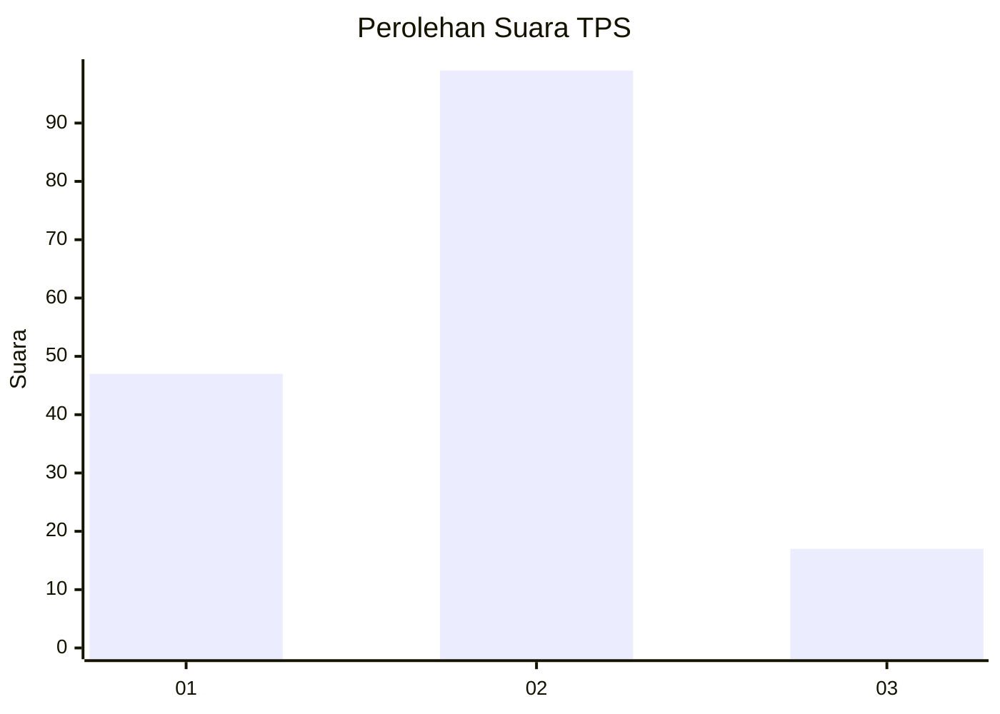
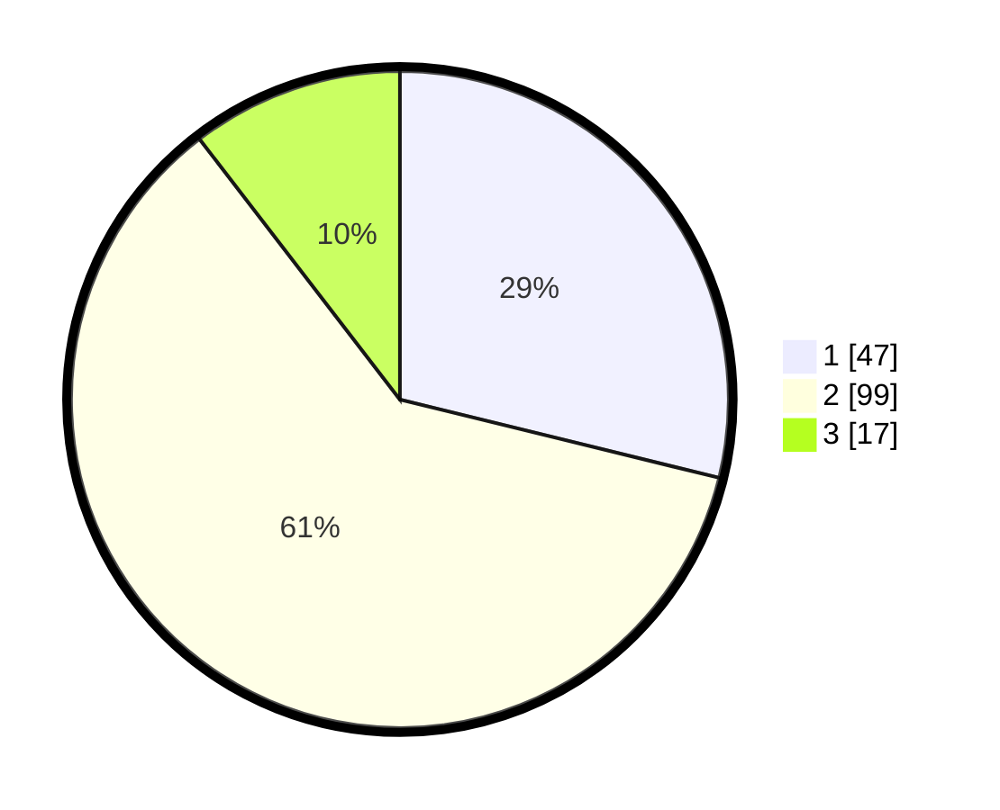

# Hasil

## Grafik

## Tabel

| No. | Nama Paslon    | Suara | Suara (raw) | Persentase |
|:--- |:-------------- | -----:| -----------:| ----------:|
| 1   | ANIES MUHAIMIN | 47    | [47][p-1]   | 28,83      |
| 2   | PRABOWO GIBRAN | 99    | [99][p-2]   | 60,74      |
| 3   | GANJAR MAHFUD  | 17    | [17][p-3]   | 10,43      |

[p-1]: https://github.com/gigit-pemilu/pemilu-2024/blob/main/pilpres/hitung-suara/sub/35-jawa-timur/sub/09-jember/sub/06-tanggul/sub/2001-tanggulkulon/sub/022-tps/sub/paslon-1.txt
[p-2]: https://github.com/gigit-pemilu/pemilu-2024/blob/main/pilpres/hitung-suara/sub/35-jawa-timur/sub/09-jember/sub/06-tanggul/sub/2001-tanggulkulon/sub/022-tps/sub/paslon-2.txt
[p-3]: https://github.com/gigit-pemilu/pemilu-2024/blob/main/pilpres/hitung-suara/sub/35-jawa-timur/sub/09-jember/sub/06-tanggul/sub/2001-tanggulkulon/sub/022-tps/sub/paslon-3.txt

## Foto C Plano

https://sirekap-obj-formc.kpu.go.id/7266/pemilu/ppwp/35/09/06/20/01/3509062001022-20240214-191246--46947dc1-4e20-44f9-bf15-2c7db0cc6a0a.jpg

https://sirekap-obj-formc.kpu.go.id/7266/pemilu/ppwp/35/09/06/20/01/3509062001022-20240214-192019--731b11a4-11b7-4adc-b29e-904f87be285d.jpg

https://sirekap-obj-formc.kpu.go.id/7266/pemilu/ppwp/35/09/06/20/01/3509062001022-20240214-194836--cd37679a-6ff9-4220-a6cf-fd5749a1db5d.jpg

## Metadata

| Key        | Value               |
| ---------- | ------------------- |
| Time Stamp | 2024-02-15 12:00:28 |

