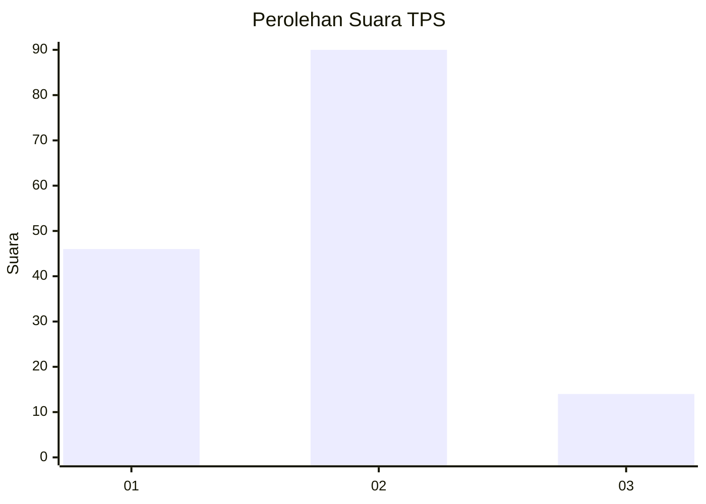
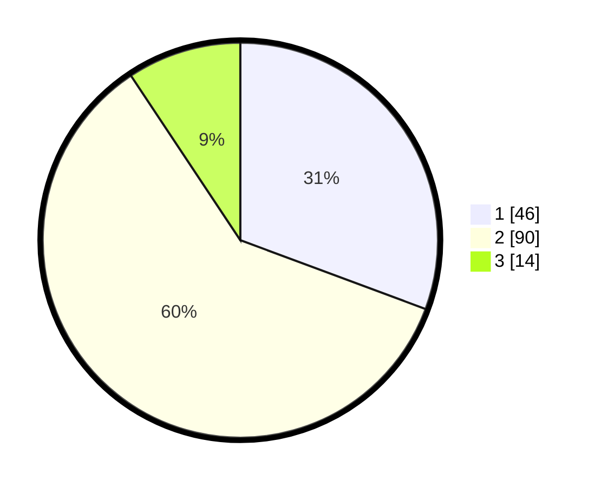

# Hasil

## Grafik

## Tabel

| No. | Nama Paslon    | Suara | Suara (raw) | Persentase |
|:--- |:-------------- | -----:| -----------:| ----------:|
| 1   | ANIES MUHAIMIN | 46    | [46][p-1]   | 30,67      |
| 2   | PRABOWO GIBRAN | 90    | [90][p-2]   | 60,00      |
| 3   | GANJAR MAHFUD  | 14    | [14][p-3]   | 9,33       |

[p-1]: https://github.com/gigit-pemilu/pemilu-2024-35-jawa-timur/blob/main/pilpres/hitung-suara/sub/35-jawa-timur/sub/09-jember/sub/06-tanggul/sub/2001-tanggulkulon/sub/023-tps/sub/paslon-1.txt
[p-2]: https://github.com/gigit-pemilu/pemilu-2024-35-jawa-timur/blob/main/pilpres/hitung-suara/sub/35-jawa-timur/sub/09-jember/sub/06-tanggul/sub/2001-tanggulkulon/sub/023-tps/sub/paslon-2.txt
[p-3]: https://github.com/gigit-pemilu/pemilu-2024-35-jawa-timur/blob/main/pilpres/hitung-suara/sub/35-jawa-timur/sub/09-jember/sub/06-tanggul/sub/2001-tanggulkulon/sub/023-tps/sub/paslon-3.txt

## Foto C Plano

https://sirekap-obj-formc.kpu.go.id/bafc/pemilu/ppwp/35/09/06/20/01/3509062001023-20240214-231139--66eb8f11-9fdc-4a1f-8327-6e07f7d68162.jpg

https://sirekap-obj-formc.kpu.go.id/bafc/pemilu/ppwp/35/09/06/20/01/3509062001023-20240214-231407--2a9b75c9-da83-45bd-88c2-667c2eb97530.jpg

https://sirekap-obj-formc.kpu.go.id/bafc/pemilu/ppwp/35/09/06/20/01/3509062001023-20240214-231816--2127a831-03a6-4ad0-a1c2-705625d5182a.jpg

## Metadata

| Key        | Value               |
| ---------- | ------------------- |
| Time Stamp | 2024-02-15 12:00:28 |

