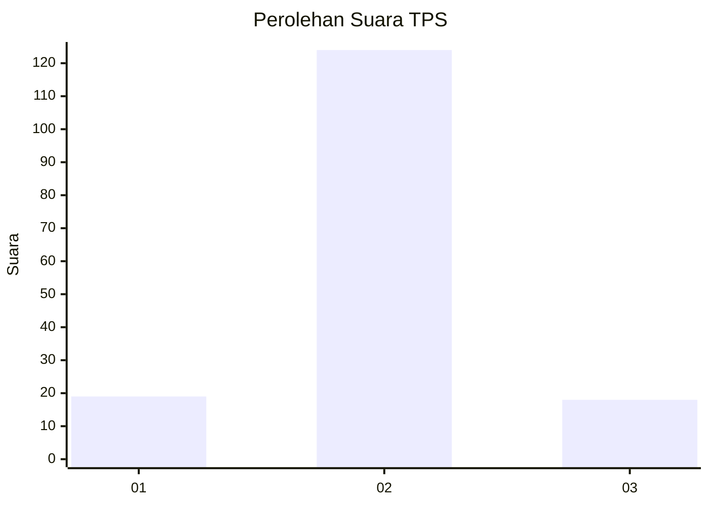
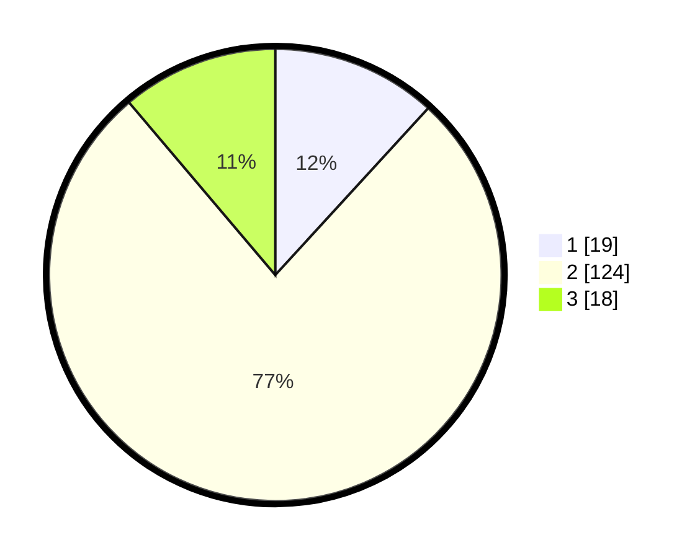

# Hasil

## Grafik

## Tabel

| No. | Nama Paslon    | Suara | Suara (raw) | Persentase |
|:--- |:-------------- | -----:| -----------:| ----------:|
| 1   | ANIES MUHAIMIN | 19    | [19][p-1]   | 11,80      |
| 2   | PRABOWO GIBRAN | 124   | [124][p-2]  | 77,02      |
| 3   | GANJAR MAHFUD  | 18    | [18][p-3]   | 11,18      |

[p-1]: https://github.com/gigit-pemilu/pemilu-2024-35-jawa-timur/blob/main/pilpres/hitung-suara/sub/35-jawa-timur/sub/09-jember/sub/06-tanggul/sub/2001-tanggulkulon/sub/027-tps/sub/paslon-1.txt
[p-2]: https://github.com/gigit-pemilu/pemilu-2024-35-jawa-timur/blob/main/pilpres/hitung-suara/sub/35-jawa-timur/sub/09-jember/sub/06-tanggul/sub/2001-tanggulkulon/sub/027-tps/sub/paslon-2.txt
[p-3]: https://github.com/gigit-pemilu/pemilu-2024-35-jawa-timur/blob/main/pilpres/hitung-suara/sub/35-jawa-timur/sub/09-jember/sub/06-tanggul/sub/2001-tanggulkulon/sub/027-tps/sub/paslon-3.txt

## Foto C Plano

https://sirekap-obj-formc.kpu.go.id/8f8c/pemilu/ppwp/35/09/06/20/01/3509062001027-20240215-012405--891c54d4-2999-4dc7-ac4e-95ee41aada8f.jpg

https://sirekap-obj-formc.kpu.go.id/8f8c/pemilu/ppwp/35/09/06/20/01/3509062001027-20240215-021228--970e246a-37fb-4d03-bfba-943ddc27b774.jpg

https://sirekap-obj-formc.kpu.go.id/8f8c/pemilu/ppwp/35/09/06/20/01/3509062001027-20240215-012606--cbeb5139-8a82-4873-8788-f811de2b7f2e.jpg

## Metadata

| Key        | Value               |
| ---------- | ------------------- |
| Time Stamp | 2024-02-25 13:00:00 |

