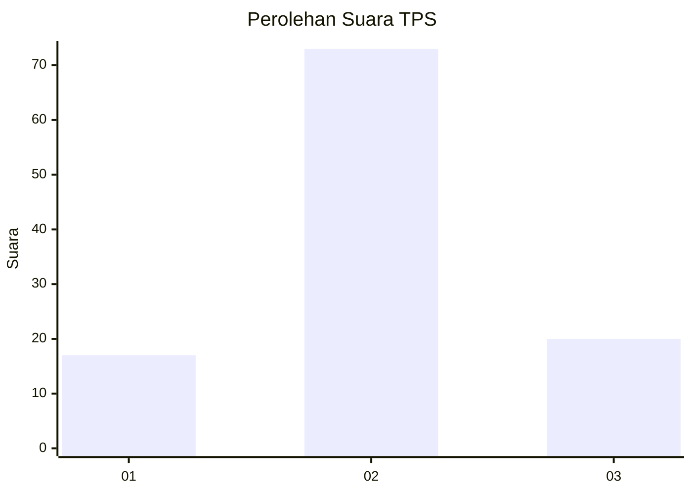
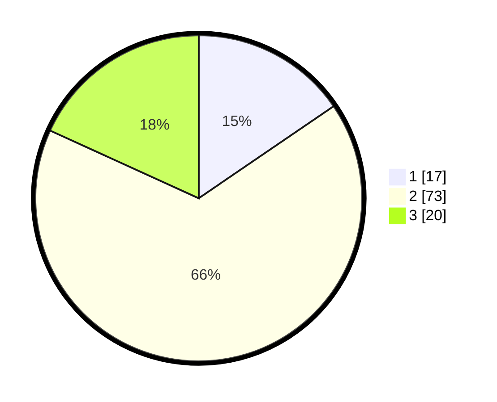

# Hasil

## Grafik

## Tabel

| No. | Nama Paslon    | Suara | Suara (raw) | Persentase |
|:--- |:-------------- | -----:| -----------:| ----------:|
| 1   | ANIES MUHAIMIN | 17    | [17][p-1]   | 15,45      |
| 2   | PRABOWO GIBRAN | 73    | [73][p-2]   | 66,36      |
| 3   | GANJAR MAHFUD  | 20    | [20][p-3]   | 18,18      |

[p-1]: https://github.com/gigit-pemilu/pemilu-2024/blob/main/pilpres/hitung-suara/sub/35-jawa-timur/sub/09-jember/sub/06-tanggul/sub/2001-tanggulkulon/sub/029-tps/sub/paslon-1.txt
[p-2]: https://github.com/gigit-pemilu/pemilu-2024/blob/main/pilpres/hitung-suara/sub/35-jawa-timur/sub/09-jember/sub/06-tanggul/sub/2001-tanggulkulon/sub/029-tps/sub/paslon-2.txt
[p-3]: https://github.com/gigit-pemilu/pemilu-2024/blob/main/pilpres/hitung-suara/sub/35-jawa-timur/sub/09-jember/sub/06-tanggul/sub/2001-tanggulkulon/sub/029-tps/sub/paslon-3.txt

## Foto C Plano

https://sirekap-obj-formc.kpu.go.id/bb46/pemilu/ppwp/35/09/06/20/01/3509062001029-20240215-001526--8f2c8534-c047-4606-ad7b-09c0d0aad75a.jpg

https://sirekap-obj-formc.kpu.go.id/bb46/pemilu/ppwp/35/09/06/20/01/3509062001029-20240215-002035--1ea034c0-64b0-411e-b5fc-b9bee23bb6a6.jpg

https://sirekap-obj-formc.kpu.go.id/bb46/pemilu/ppwp/35/09/06/20/01/3509062001029-20240215-001704--1f00d541-6491-4fd0-8872-6aafc9327063.jpg

## Metadata

| Key        | Value               |
| ---------- | ------------------- |
| Time Stamp | 2024-02-15 15:30:25 |

