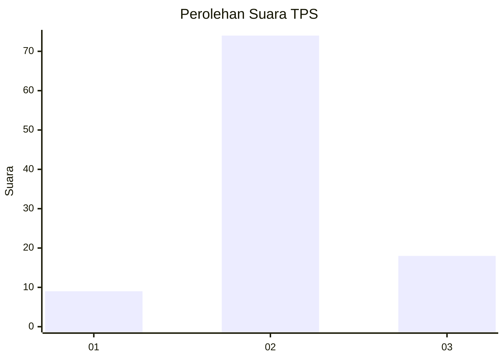
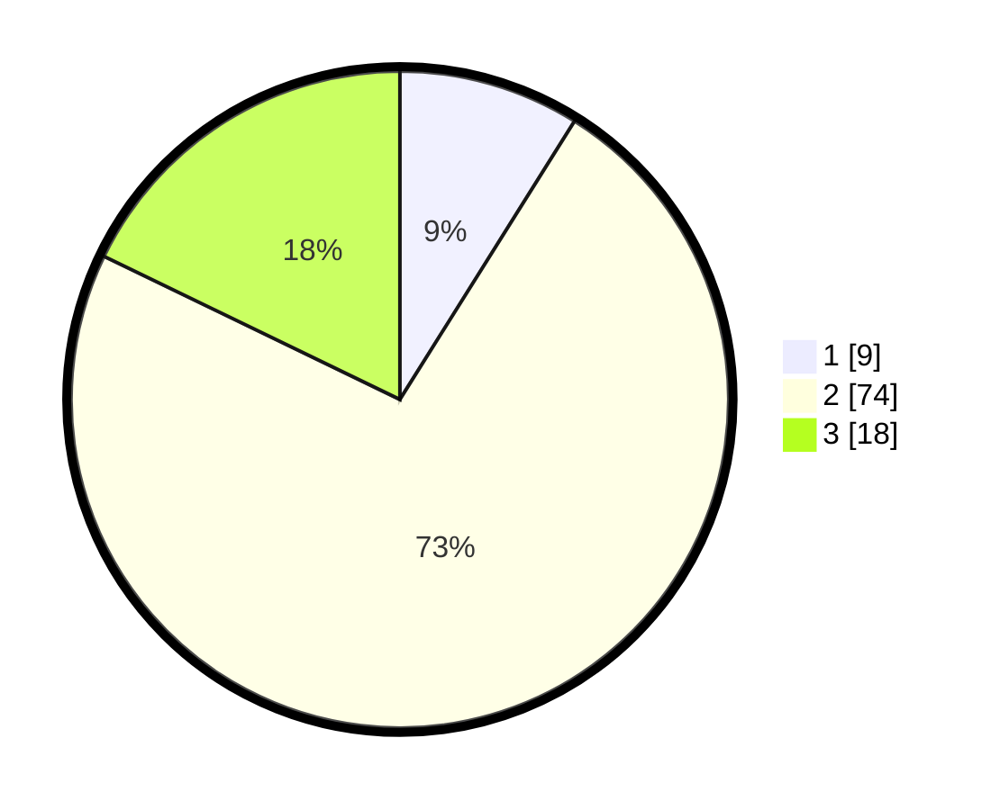

# Hasil

## Grafik

## Tabel

| No. | Nama Paslon    | Suara | Suara (raw) | Persentase |
|:--- |:-------------- | -----:| -----------:| ----------:|
| 1   | ANIES MUHAIMIN | 9     | [9][p-1]    | 8,91       |
| 2   | PRABOWO GIBRAN | 74    | [74][p-2]   | 73,27      |
| 3   | GANJAR MAHFUD  | 18    | [18][p-3]   | 17,82      |

[p-1]: https://github.com/gigit-pemilu/pemilu-2024/blob/main/pilpres/hitung-suara/sub/35-jawa-timur/sub/09-jember/sub/06-tanggul/sub/2001-tanggulkulon/sub/030-tps/sub/paslon-1.txt
[p-2]: https://github.com/gigit-pemilu/pemilu-2024/blob/main/pilpres/hitung-suara/sub/35-jawa-timur/sub/09-jember/sub/06-tanggul/sub/2001-tanggulkulon/sub/030-tps/sub/paslon-2.txt
[p-3]: https://github.com/gigit-pemilu/pemilu-2024/blob/main/pilpres/hitung-suara/sub/35-jawa-timur/sub/09-jember/sub/06-tanggul/sub/2001-tanggulkulon/sub/030-tps/sub/paslon-3.txt

## Foto C Plano

https://sirekap-obj-formc.kpu.go.id/eeb6/pemilu/ppwp/35/09/06/20/01/3509062001030-20240214-211756--6a168f4d-418e-460f-b898-e699f74fd4da.jpg

https://sirekap-obj-formc.kpu.go.id/eeb6/pemilu/ppwp/35/09/06/20/01/3509062001030-20240214-211900--bfbc59f2-b1cc-4d1b-92c4-0f1050beee56.jpg

https://sirekap-obj-formc.kpu.go.id/eeb6/pemilu/ppwp/35/09/06/20/01/3509062001030-20240214-212103--7420c5d6-eeb5-48cd-82ef-56cdcdf92bb1.jpg

## Metadata

| Key        | Value               |
| ---------- | ------------------- |
| Time Stamp | 2024-02-15 15:30:25 |

