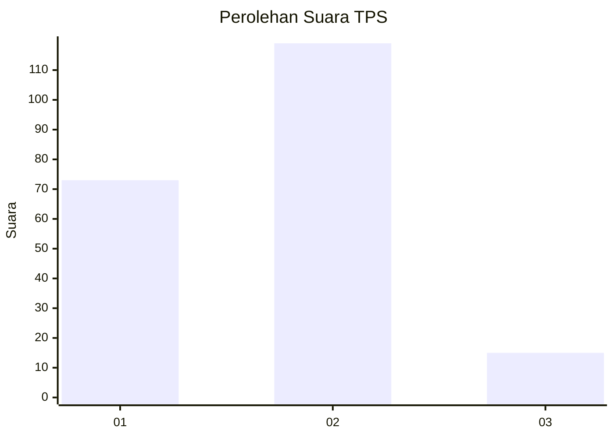
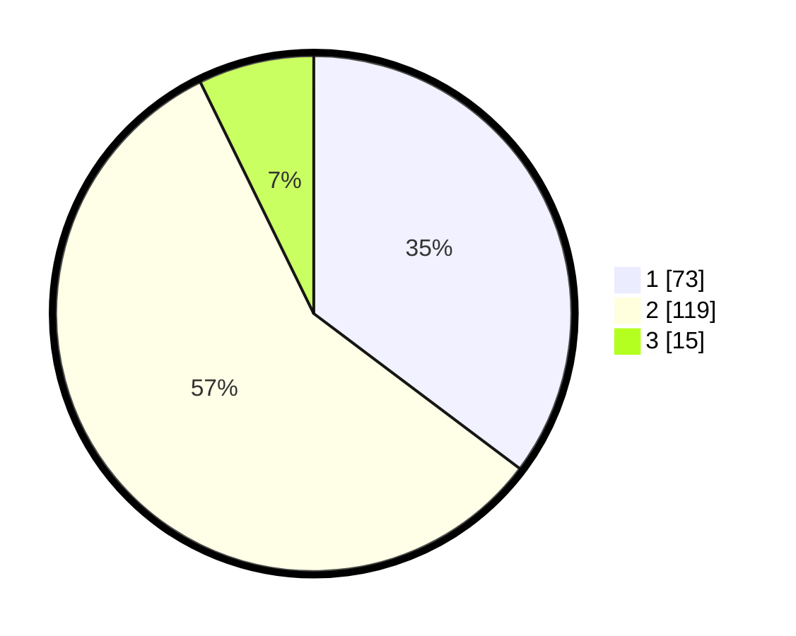

# Hasil

## Grafik

## Tabel

| No. | Nama Paslon    | Suara | Suara (raw) | Persentase |
|:--- |:-------------- | -----:| -----------:| ----------:|
| 1   | ANIES MUHAIMIN | 73    | [73][p-1]   | 35,27      |
| 2   | PRABOWO GIBRAN | 119   | [119][p-2]  | 57,49      |
| 3   | GANJAR MAHFUD  | 15    | [15][p-3]   | 7,25       |

[p-1]: https://github.com/gigit-pemilu/pemilu-2024/blob/main/pilpres/hitung-suara/sub/35-jawa-timur/sub/09-jember/sub/06-tanggul/sub/2001-tanggulkulon/sub/032-tps/sub/paslon-1.txt
[p-2]: https://github.com/gigit-pemilu/pemilu-2024/blob/main/pilpres/hitung-suara/sub/35-jawa-timur/sub/09-jember/sub/06-tanggul/sub/2001-tanggulkulon/sub/032-tps/sub/paslon-2.txt
[p-3]: https://github.com/gigit-pemilu/pemilu-2024/blob/main/pilpres/hitung-suara/sub/35-jawa-timur/sub/09-jember/sub/06-tanggul/sub/2001-tanggulkulon/sub/032-tps/sub/paslon-3.txt

## Foto C Plano

https://sirekap-obj-formc.kpu.go.id/e8bc/pemilu/ppwp/35/09/06/20/01/3509062001032-20240216-175645--122f80e5-c7cd-4ae8-8b36-f921cf7d3fba.jpg

https://sirekap-obj-formc.kpu.go.id/e8bc/pemilu/ppwp/35/09/06/20/01/3509062001032-20240215-230947--96f3687d-b670-409b-ad8f-fe6d8f9f152b.jpg

https://sirekap-obj-formc.kpu.go.id/e8bc/pemilu/ppwp/35/09/06/20/01/3509062001032-20240216-175357--d2c598a0-f772-49d4-83ba-0dcb49e29dab.jpg

## Metadata

| Key        | Value               |
| ---------- | ------------------- |
| Time Stamp | 2024-02-21 22:00:00 |

