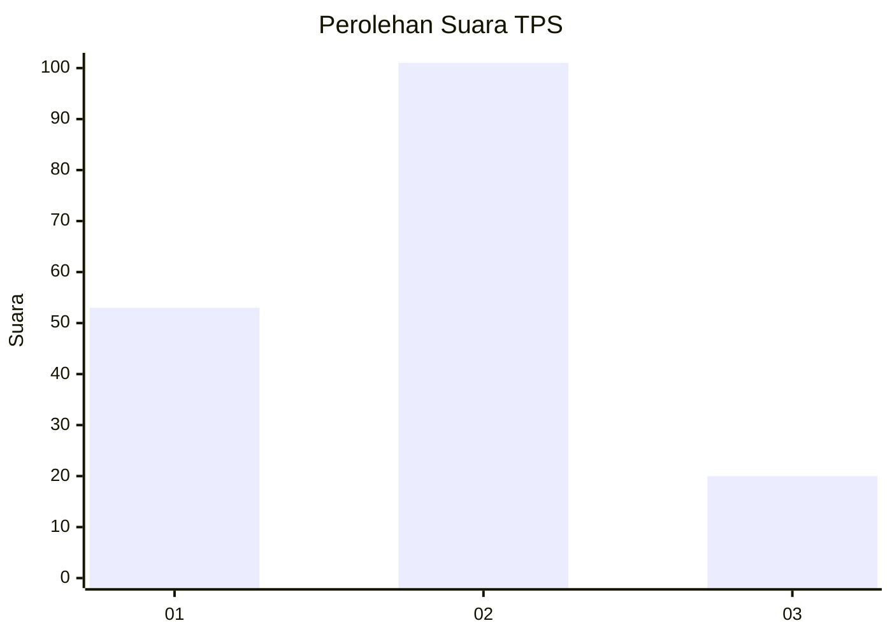
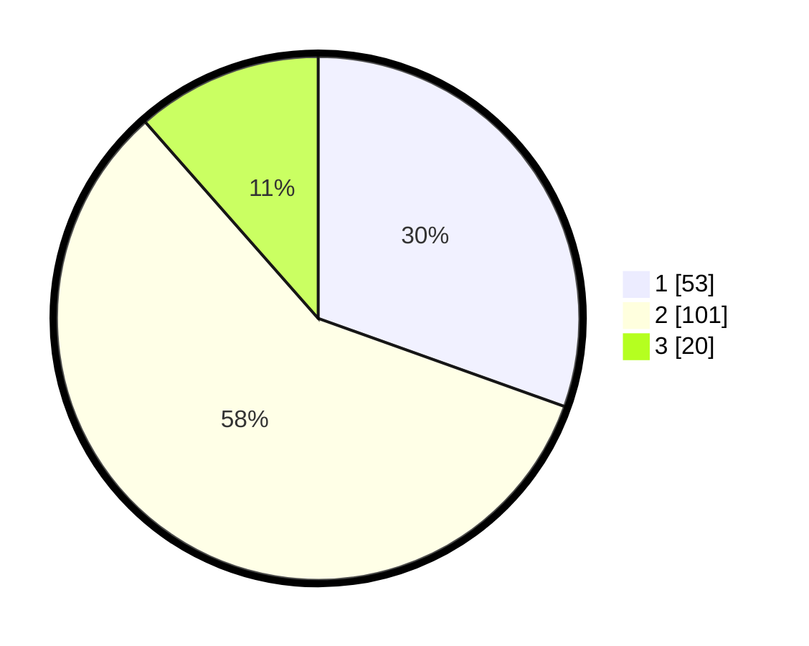

# Hasil

## Grafik

## Tabel

| No. | Nama Paslon    | Suara | Suara (raw) | Persentase |
|:--- |:-------------- | -----:| -----------:| ----------:|
| 1   | ANIES MUHAIMIN | 53    | [53][p-1]   | 30,46      |
| 2   | PRABOWO GIBRAN | 101   | [101][p-2]  | 58,05      |
| 3   | GANJAR MAHFUD  | 20    | [20][p-3]   | 11,49      |

[p-1]: https://github.com/gigit-pemilu/pemilu-2024/blob/main/pilpres/hitung-suara/sub/35-jawa-timur/sub/09-jember/sub/06-tanggul/sub/2001-tanggulkulon/sub/036-tps/sub/paslon-1.txt
[p-2]: https://github.com/gigit-pemilu/pemilu-2024/blob/main/pilpres/hitung-suara/sub/35-jawa-timur/sub/09-jember/sub/06-tanggul/sub/2001-tanggulkulon/sub/036-tps/sub/paslon-2.txt
[p-3]: https://github.com/gigit-pemilu/pemilu-2024/blob/main/pilpres/hitung-suara/sub/35-jawa-timur/sub/09-jember/sub/06-tanggul/sub/2001-tanggulkulon/sub/036-tps/sub/paslon-3.txt

## Foto C Plano

https://sirekap-obj-formc.kpu.go.id/4678/pemilu/ppwp/35/09/06/20/01/3509062001036-20240215-044730--c9421dbf-3781-4566-b85a-d4dd64b81ef3.jpg

https://sirekap-obj-formc.kpu.go.id/4678/pemilu/ppwp/35/09/06/20/01/3509062001036-20240215-045105--9241a2cd-db29-4f16-9039-f963deab0ad4.jpg

https://sirekap-obj-formc.kpu.go.id/4678/pemilu/ppwp/35/09/06/20/01/3509062001036-20240215-035202--bb0aa940-6c0f-4cbc-a7e6-87f77a797f3d.jpg

## Metadata

| Key        | Value               |
| ---------- | ------------------- |
| Time Stamp | 2024-02-15 19:00:26 |

