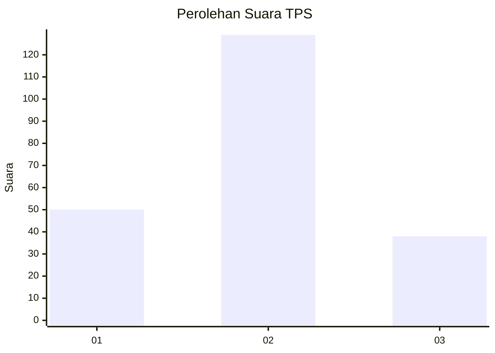
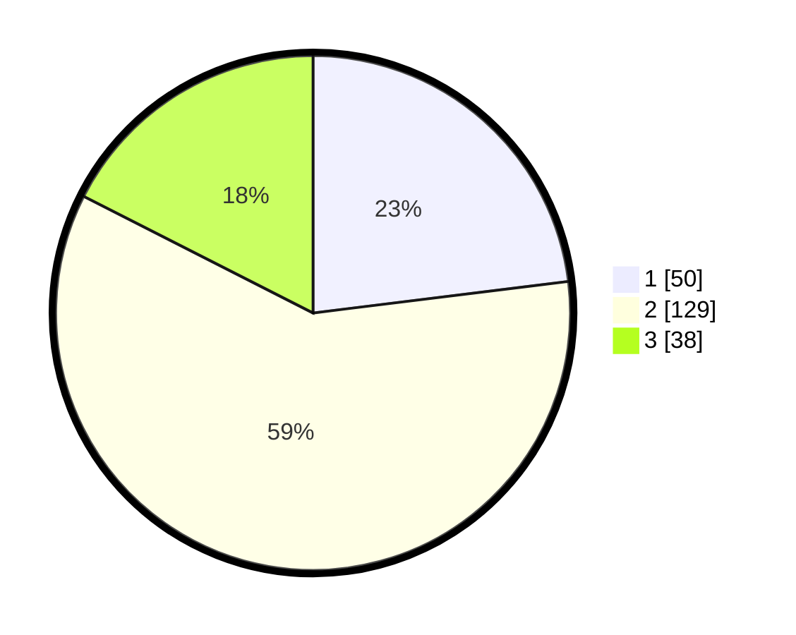

# Hasil

## Grafik

## Tabel

| No. | Nama Paslon    | Suara | Suara (raw) | Persentase |
|:--- |:-------------- | -----:| -----------:| ----------:|
| 1   | ANIES MUHAIMIN | 50    | [50][p-1]   | 23,04      |
| 2   | PRABOWO GIBRAN | 129   | [129][p-2]  | 59,45      |
| 3   | GANJAR MAHFUD  | 38    | [38][p-3]   | 17,51      |

[p-1]: https://github.com/gigit-pemilu/pemilu-2024/blob/main/pilpres/hitung-suara/sub/35-jawa-timur/sub/09-jember/sub/06-tanggul/sub/2002-tanggulwetan/sub/002-tps/sub/paslon-1.txt
[p-2]: https://github.com/gigit-pemilu/pemilu-2024/blob/main/pilpres/hitung-suara/sub/35-jawa-timur/sub/09-jember/sub/06-tanggul/sub/2002-tanggulwetan/sub/002-tps/sub/paslon-2.txt
[p-3]: https://github.com/gigit-pemilu/pemilu-2024/blob/main/pilpres/hitung-suara/sub/35-jawa-timur/sub/09-jember/sub/06-tanggul/sub/2002-tanggulwetan/sub/002-tps/sub/paslon-3.txt

## Foto C Plano

https://sirekap-obj-formc.kpu.go.id/9766/pemilu/ppwp/35/09/06/20/02/3509062002002-20240214-234335--0f515ee3-2477-4204-b8b5-d990791e180e.jpg

https://sirekap-obj-formc.kpu.go.id/9766/pemilu/ppwp/35/09/06/20/02/3509062002002-20240214-233540--454ac88e-9d9d-4e70-acc9-ea8f9d95ffec.jpg

https://sirekap-obj-formc.kpu.go.id/9766/pemilu/ppwp/35/09/06/20/02/3509062002002-20240214-234423--158f0e7a-45a6-424d-b6bd-b381193a0c88.jpg

## Metadata

| Key        | Value               |
| ---------- | ------------------- |
| Time Stamp | 2024-02-15 15:30:25 |

