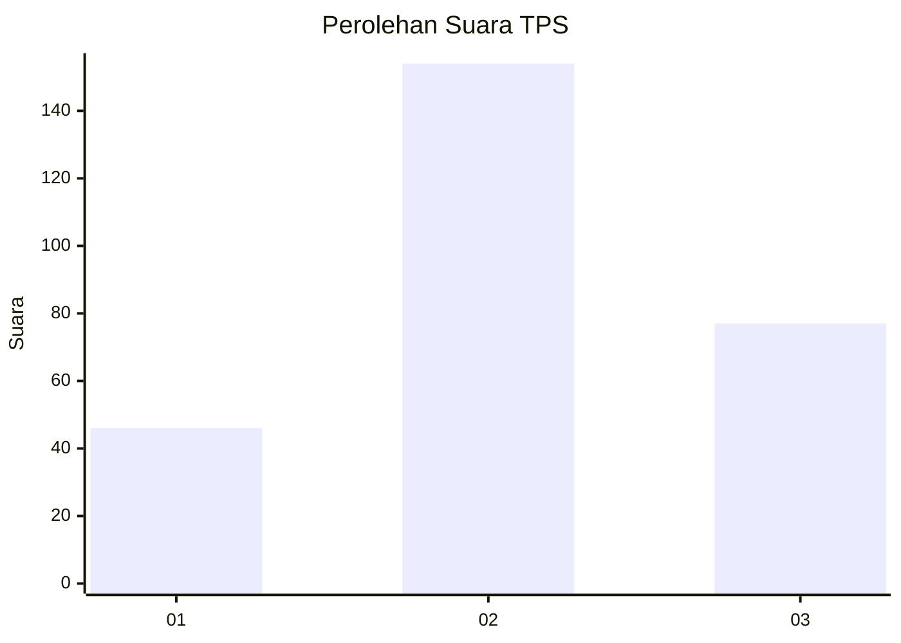
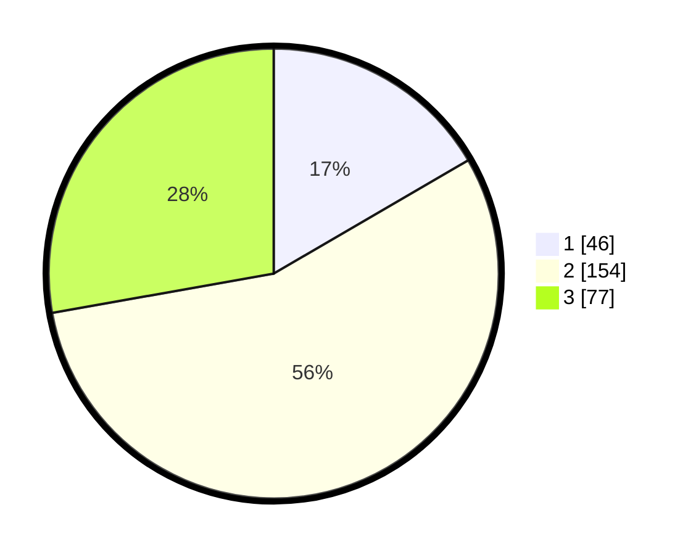

# Hasil

## Grafik

## Tabel

| No. | Nama Paslon    | Suara | Suara (raw) | Persentase |
|:--- |:-------------- | -----:| -----------:| ----------:|
| 1   | ANIES MUHAIMIN | 46    | [46][p-1]   | 16,61      |
| 2   | PRABOWO GIBRAN | 154   | [154][p-2]  | 55,60      |
| 3   | GANJAR MAHFUD  | 77    | [77][p-3]   | 27,80      |

[p-1]: https://github.com/gigit-pemilu/pemilu-2024-35-jawa-timur/blob/main/pilpres/hitung-suara/sub/35-jawa-timur/sub/09-jember/sub/06-tanggul/sub/2002-tanggulwetan/sub/005-tps/sub/paslon-1.txt
[p-2]: https://github.com/gigit-pemilu/pemilu-2024-35-jawa-timur/blob/main/pilpres/hitung-suara/sub/35-jawa-timur/sub/09-jember/sub/06-tanggul/sub/2002-tanggulwetan/sub/005-tps/sub/paslon-2.txt
[p-3]: https://github.com/gigit-pemilu/pemilu-2024-35-jawa-timur/blob/main/pilpres/hitung-suara/sub/35-jawa-timur/sub/09-jember/sub/06-tanggul/sub/2002-tanggulwetan/sub/005-tps/sub/paslon-3.txt

## Foto C Plano

https://sirekap-obj-formc.kpu.go.id/adde/pemilu/ppwp/35/09/06/20/02/3509062002005-20240215-045429--fd9446b3-34e9-4f4d-b684-2df9ce2608be.jpg

https://sirekap-obj-formc.kpu.go.id/adde/pemilu/ppwp/35/09/06/20/02/3509062002005-20240215-045648--92fcddf8-049d-42d2-8705-5bb1eebe5146.jpg

https://sirekap-obj-formc.kpu.go.id/adde/pemilu/ppwp/35/09/06/20/02/3509062002005-20240215-045855--696dd32b-83a3-4dda-a2a2-f88585c89118.jpg

## Metadata

| Key        | Value               |
| ---------- | ------------------- |
| Time Stamp | 2024-02-15 15:30:25 |

