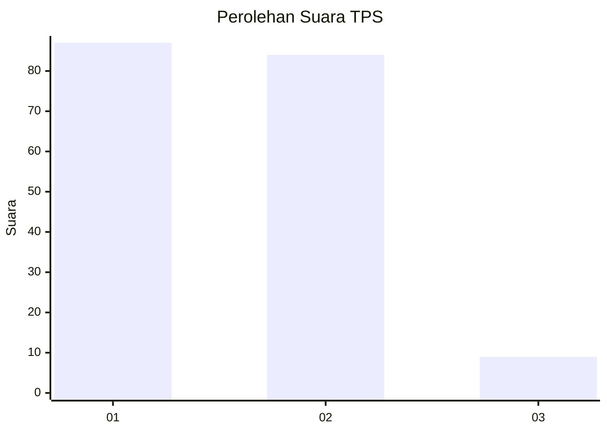
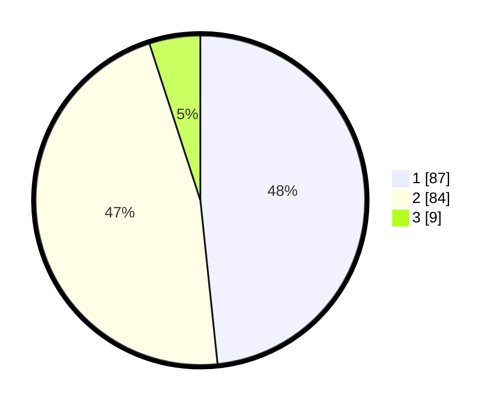

# Hasil

## Grafik

## Tabel

| No. | Nama Paslon    | Suara | Suara (raw) | Persentase |
|:--- |:-------------- | -----:| -----------:| ----------:|
| 1   | ANIES MUHAIMIN | 87    | [87][p-1]   | 48,33      |
| 2   | PRABOWO GIBRAN | 84    | [84][p-2]   | 46,67      |
| 3   | GANJAR MAHFUD  | 9     | [9][p-3]    | 5,00       |

[p-1]: https://github.com/gigit-pemilu/pemilu-2024-35-jawa-timur/blob/main/pilpres/hitung-suara/sub/35-jawa-timur/sub/09-jember/sub/06-tanggul/sub/2002-tanggulwetan/sub/032-tps/sub/paslon-1.txt
[p-2]: https://github.com/gigit-pemilu/pemilu-2024-35-jawa-timur/blob/main/pilpres/hitung-suara/sub/35-jawa-timur/sub/09-jember/sub/06-tanggul/sub/2002-tanggulwetan/sub/032-tps/sub/paslon-2.txt
[p-3]: https://github.com/gigit-pemilu/pemilu-2024-35-jawa-timur/blob/main/pilpres/hitung-suara/sub/35-jawa-timur/sub/09-jember/sub/06-tanggul/sub/2002-tanggulwetan/sub/032-tps/sub/paslon-3.txt

## Foto C Plano

https://sirekap-obj-formc.kpu.go.id/fe3c/pemilu/ppwp/35/09/06/20/02/3509062002032-20240216-133903--aadaeffb-83f1-4ed3-b3ec-ad50b92efd76.jpg

https://sirekap-obj-formc.kpu.go.id/fe3c/pemilu/ppwp/35/09/06/20/02/3509062002032-20240216-133904--5736018c-42cd-4395-b75c-f1cf67f0b1c2.jpg

https://sirekap-obj-formc.kpu.go.id/fe3c/pemilu/ppwp/35/09/06/20/02/3509062002032-20240216-133903--ba739ef2-f4df-4ea3-b559-217baaca23f0.jpg

## Metadata

| Key        | Value               |
| ---------- | ------------------- |
| Time Stamp | 2024-02-21 22:00:00 |

## DATA PEMILIH TETAP

Jumlah pemilih dalam DPT: **279**.
 * L: **140**.
 * P: **139**.

## DATA PENGGUNA HAK PILIH

Jumlah pengguna hak pilih dalam DPT: **279**.
 * L: **140**.
 * P: **139**.

Jumlah pengguna hak pilih dalam DPTb: **186**.
 * L: **80**.
 * P: **106**.

Jumlah pengguna hak pilih dalam DPK: **0**.
 * L: **0**.
 * P: **0**.

Jumlah pengguna hak pilih: **186**.
 * L: **80**.
 * P: **106**.

## JUMLAH SUARA SAH DAN TIDAK SAH

JUMLAH SELURUH SUARA SAH: **180**.

JUMLAH SUARA TIDAK SAH: **6**.

JUMLAH SELURUH SUARA SAH DAN SUARA TIDAK SAH: **186**.

