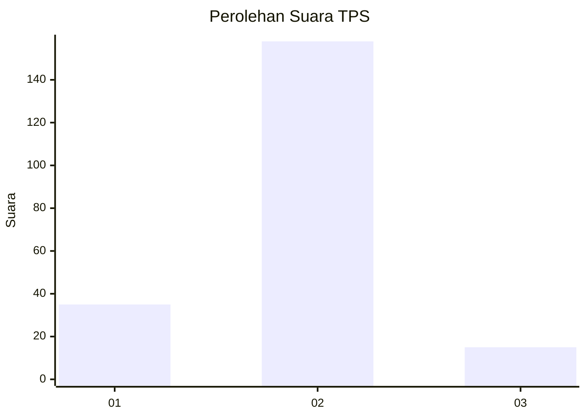
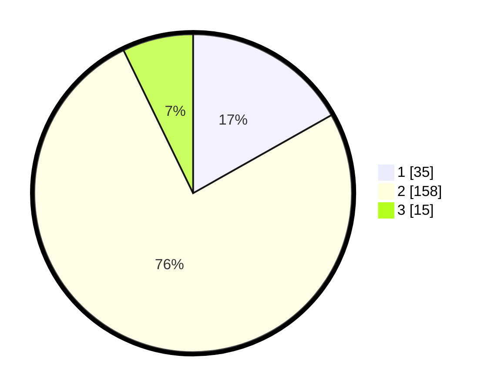

# Hasil

## Grafik

## Tabel

| No. | Nama Paslon    | Suara | Suara (raw) | Persentase |
|:--- |:-------------- | -----:| -----------:| ----------:|
| 1   | ANIES MUHAIMIN | 35    | [35][p-1]   | 16,83      |
| 2   | PRABOWO GIBRAN | 158   | [158][p-2]  | 75,96      |
| 3   | GANJAR MAHFUD  | 15    | [15][p-3]   | 7,21       |

[p-1]: https://github.com/gigit-pemilu/pemilu-2024/blob/main/pilpres/hitung-suara/sub/35-jawa-timur/sub/09-jember/sub/06-tanggul/sub/2003-patemon/sub/004-tps/sub/paslon-1.txt
[p-2]: https://github.com/gigit-pemilu/pemilu-2024/blob/main/pilpres/hitung-suara/sub/35-jawa-timur/sub/09-jember/sub/06-tanggul/sub/2003-patemon/sub/004-tps/sub/paslon-2.txt
[p-3]: https://github.com/gigit-pemilu/pemilu-2024/blob/main/pilpres/hitung-suara/sub/35-jawa-timur/sub/09-jember/sub/06-tanggul/sub/2003-patemon/sub/004-tps/sub/paslon-3.txt

## Foto C Plano

https://sirekap-obj-formc.kpu.go.id/70b6/pemilu/ppwp/35/09/06/20/03/3509062003004-20240215-001524--637d0abb-2f79-4a8e-9ab6-9126a93fa877.jpg

https://sirekap-obj-formc.kpu.go.id/70b6/pemilu/ppwp/35/09/06/20/03/3509062003004-20240215-001613--19d82781-d8d5-430f-85e3-b7fb8d692ab7.jpg

https://sirekap-obj-formc.kpu.go.id/70b6/pemilu/ppwp/35/09/06/20/03/3509062003004-20240215-001651--144205ac-87de-43da-8434-ce0af3a878c1.jpg

## Metadata

| Key        | Value               |
| ---------- | ------------------- |
| Time Stamp | 2024-02-15 12:00:28 |

