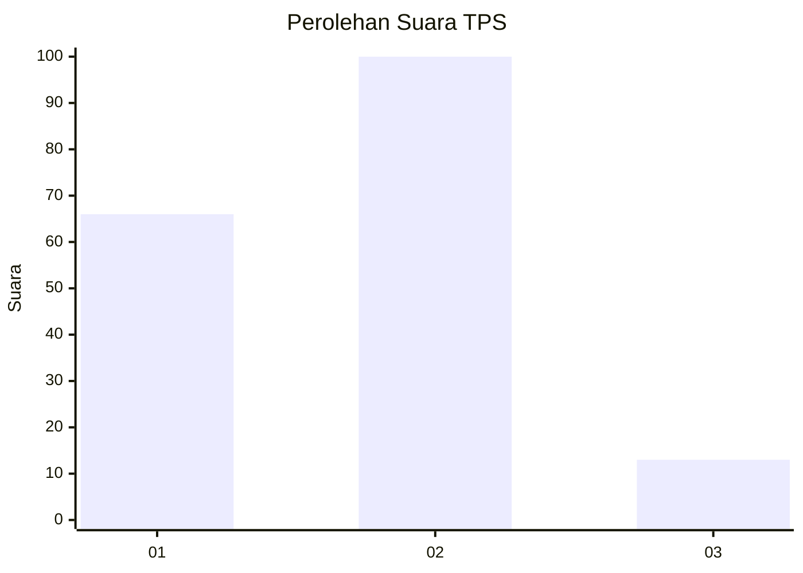

# Hasil

## Grafik

## Tabel

| No. | Nama Paslon    | Suara | Suara (raw) | Persentase |
|:--- |:-------------- | -----:| -----------:| ----------:|
| 1   | ANIES MUHAIMIN | 66    | [66][p-1]   | 36,87      |
| 2   | PRABOWO GIBRAN | 100   | [100][p-2]  | 55,87      |
| 3   | GANJAR MAHFUD  | 13    | [13][p-3]   | 7,26       |

[p-1]: https://github.com/gigit-pemilu/pemilu-2024-35-jawa-timur/blob/main/pilpres/hitung-suara/sub/35-jawa-timur/sub/09-jember/sub/06-tanggul/sub/2003-patemon/sub/007-tps/sub/paslon-1.txt
[p-2]: https://github.com/gigit-pemilu/pemilu-2024-35-jawa-timur/blob/main/pilpres/hitung-suara/sub/35-jawa-timur/sub/09-jember/sub/06-tanggul/sub/2003-patemon/sub/007-tps/sub/paslon-2.txt
[p-3]: https://github.com/gigit-pemilu/pemilu-2024-35-jawa-timur/blob/main/pilpres/hitung-suara/sub/35-jawa-timur/sub/09-jember/sub/06-tanggul/sub/2003-patemon/sub/007-tps/sub/paslon-3.txt

## Foto C Plano

https://sirekap-obj-formc.kpu.go.id/c278/pemilu/ppwp/35/09/06/20/03/3509062003007-20240217-162452--d34fb368-70fe-4ab6-be8a-6bea68985d00.jpg

https://sirekap-obj-formc.kpu.go.id/c278/pemilu/ppwp/35/09/06/20/03/3509062003007-20240215-000527--d939e3af-d49d-4c3e-9861-936cccc566c1.jpg

https://sirekap-obj-formc.kpu.go.id/c278/pemilu/ppwp/35/09/06/20/03/3509062003007-20240217-153323--fd8427df-ddb5-4530-8854-402e8fade21d.jpg

## Metadata

| Key        | Value               |
| ---------- | ------------------- |
| Time Stamp | 2024-02-17 16:36:25 |

## DATA PEMILIH TETAP

Jumlah pemilih dalam DPT: **297**.
 * L: **150**.
 * P: **147**.

## DATA PENGGUNA HAK PILIH

Jumlah pengguna hak pilih dalam DPT: **184**.
 * L: **86**.
 * P: **92**.

Jumlah pengguna hak pilih dalam DPTb: **60**.
 * L: **8**.
 * P: **0**.

Jumlah pengguna hak pilih dalam DPK: **0**.
 * L: **0**.
 * P: **0**.

Jumlah pengguna hak pilih: **184**.
 * L: **86**.
 * P: **98**.

## JUMLAH SUARA SAH DAN TIDAK SAH

JUMLAH SELURUH SUARA SAH: **448**.

JUMLAH SUARA TIDAK SAH: **55**.

JUMLAH SELURUH SUARA SAH DAN SUARA TIDAK SAH: **184**.

