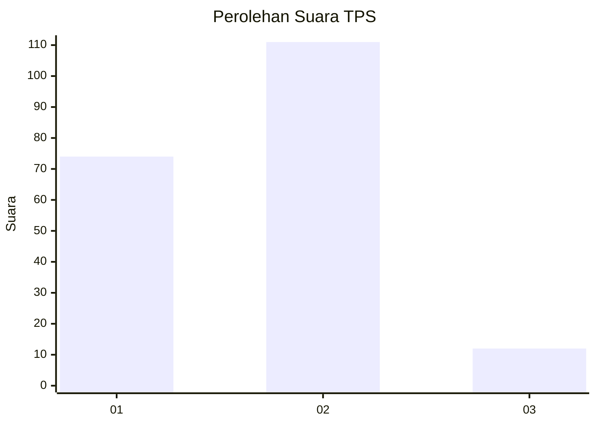
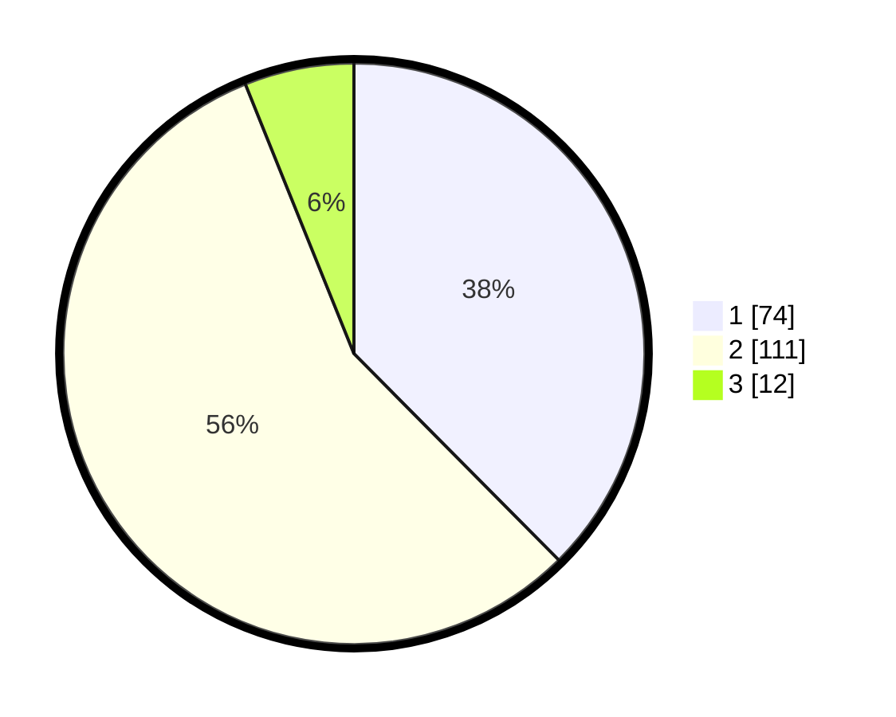

# Hasil

## Grafik

## Tabel

| No. | Nama Paslon    | Suara | Suara (raw) | Persentase |
|:--- |:-------------- | -----:| -----------:| ----------:|
| 1   | ANIES MUHAIMIN | 74    | [74][p-1]   | 37,56      |
| 2   | PRABOWO GIBRAN | 111   | [111][p-2]  | 56,35      |
| 3   | GANJAR MAHFUD  | 12    | [12][p-3]   | 6,09       |

[p-1]: https://github.com/gigit-pemilu/pemilu-2024-35-jawa-timur/blob/main/pilpres/hitung-suara/sub/35-jawa-timur/sub/09-jember/sub/06-tanggul/sub/2003-patemon/sub/008-tps/sub/paslon-1.txt
[p-2]: https://github.com/gigit-pemilu/pemilu-2024-35-jawa-timur/blob/main/pilpres/hitung-suara/sub/35-jawa-timur/sub/09-jember/sub/06-tanggul/sub/2003-patemon/sub/008-tps/sub/paslon-2.txt
[p-3]: https://github.com/gigit-pemilu/pemilu-2024-35-jawa-timur/blob/main/pilpres/hitung-suara/sub/35-jawa-timur/sub/09-jember/sub/06-tanggul/sub/2003-patemon/sub/008-tps/sub/paslon-3.txt

## Foto C Plano

https://sirekap-obj-formc.kpu.go.id/2afd/pemilu/ppwp/35/09/06/20/03/3509062003008-20240215-230435--1c809f3e-0d3f-4eaa-b1b7-bd0e466675a5.jpg

https://sirekap-obj-formc.kpu.go.id/2afd/pemilu/ppwp/35/09/06/20/03/3509062003008-20240215-073412--d4d42d87-2385-4e28-8130-b9784919d6f1.jpg

https://sirekap-obj-formc.kpu.go.id/2afd/pemilu/ppwp/35/09/06/20/03/3509062003008-20240215-064950--30b2a3e4-0973-4ecf-b93c-f7b687904432.jpg

## Metadata

| Key        | Value               |
| ---------- | ------------------- |
| Time Stamp | 2024-02-15 23:29:50 |

