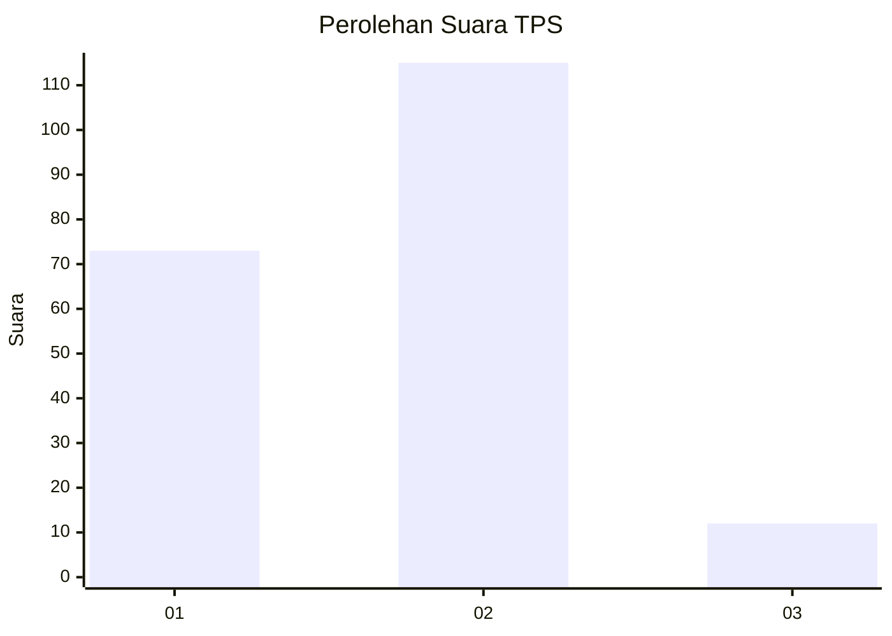
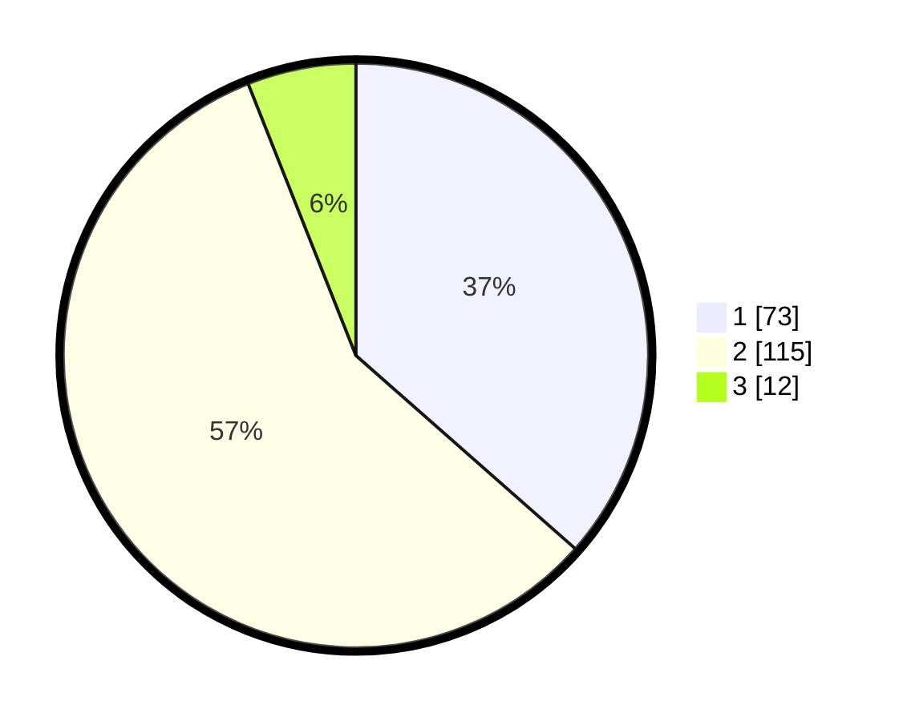

# Hasil

## Grafik

## Tabel

| No. | Nama Paslon    | Suara | Suara (raw) | Persentase |
|:--- |:-------------- | -----:| -----------:| ----------:|
| 1   | ANIES MUHAIMIN | 73    | [73][p-1]   | 36,50      |
| 2   | PRABOWO GIBRAN | 115   | [115][p-2]  | 57,50      |
| 3   | GANJAR MAHFUD  | 12    | [12][p-3]   | 6,00       |

[p-1]: https://github.com/gigit-pemilu/pemilu-2024/blob/main/pilpres/hitung-suara/sub/35-jawa-timur/sub/09-jember/sub/06-tanggul/sub/2003-patemon/sub/014-tps/sub/paslon-1.txt
[p-2]: https://github.com/gigit-pemilu/pemilu-2024/blob/main/pilpres/hitung-suara/sub/35-jawa-timur/sub/09-jember/sub/06-tanggul/sub/2003-patemon/sub/014-tps/sub/paslon-2.txt
[p-3]: https://github.com/gigit-pemilu/pemilu-2024/blob/main/pilpres/hitung-suara/sub/35-jawa-timur/sub/09-jember/sub/06-tanggul/sub/2003-patemon/sub/014-tps/sub/paslon-3.txt

## Foto C Plano

https://sirekap-obj-formc.kpu.go.id/f6af/pemilu/ppwp/35/09/06/20/03/3509062003014-20240215-025134--be40a196-b2a8-4f60-9c2f-ed6ffc3c3495.jpg

https://sirekap-obj-formc.kpu.go.id/f6af/pemilu/ppwp/35/09/06/20/03/3509062003014-20240214-204904--8550a019-4b6e-408e-8049-ada90e00c15d.jpg

https://sirekap-obj-formc.kpu.go.id/f6af/pemilu/ppwp/35/09/06/20/03/3509062003014-20240214-205021--033b443a-e3f3-4be4-bc98-c5f565126991.jpg

## Metadata

| Key        | Value               |
| ---------- | ------------------- |
| Time Stamp | 2024-02-21 18:00:00 |

