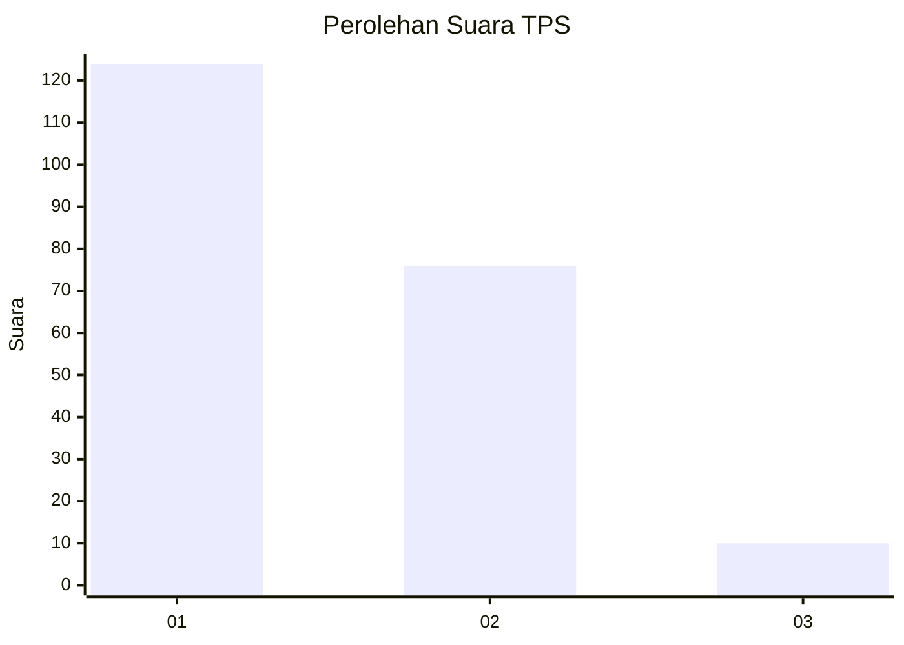
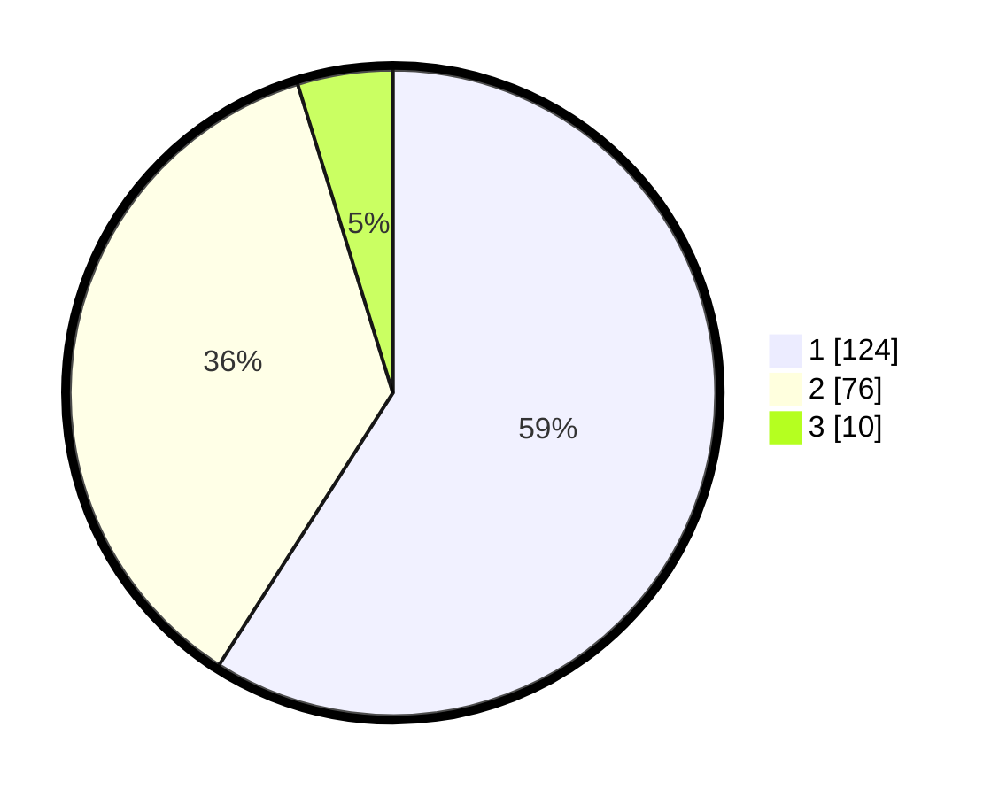

# Hasil

## Grafik

## Tabel

| No. | Nama Paslon    | Suara | Suara (raw) | Persentase |
|:--- |:-------------- | -----:| -----------:| ----------:|
| 1   | ANIES MUHAIMIN | 124   | [124][p-1]  | 59,05      |
| 2   | PRABOWO GIBRAN | 76    | [76][p-2]   | 36,19      |
| 3   | GANJAR MAHFUD  | 10    | [10][p-3]   | 4,76       |

[p-1]: https://github.com/gigit-pemilu/pemilu-2024/blob/main/pilpres/hitung-suara/sub/35-jawa-timur/sub/09-jember/sub/06-tanggul/sub/2003-patemon/sub/016-tps/sub/paslon-1.txt
[p-2]: https://github.com/gigit-pemilu/pemilu-2024/blob/main/pilpres/hitung-suara/sub/35-jawa-timur/sub/09-jember/sub/06-tanggul/sub/2003-patemon/sub/016-tps/sub/paslon-2.txt
[p-3]: https://github.com/gigit-pemilu/pemilu-2024/blob/main/pilpres/hitung-suara/sub/35-jawa-timur/sub/09-jember/sub/06-tanggul/sub/2003-patemon/sub/016-tps/sub/paslon-3.txt

## Foto C Plano

https://sirekap-obj-formc.kpu.go.id/d1cc/pemilu/ppwp/35/09/06/20/03/3509062003016-20240214-225301--fa8235d1-2828-4890-8873-cfef58430b30.jpg

https://sirekap-obj-formc.kpu.go.id/d1cc/pemilu/ppwp/35/09/06/20/03/3509062003016-20240214-225400--4f668931-4fa6-4f53-8c5a-b0e9997754f9.jpg

https://sirekap-obj-formc.kpu.go.id/d1cc/pemilu/ppwp/35/09/06/20/03/3509062003016-20240214-225445--2eb16eeb-c068-4823-ae70-9dee2dc25e9d.jpg

## Metadata

| Key        | Value               |
| ---------- | ------------------- |
| Time Stamp | 2024-02-15 15:30:25 |

