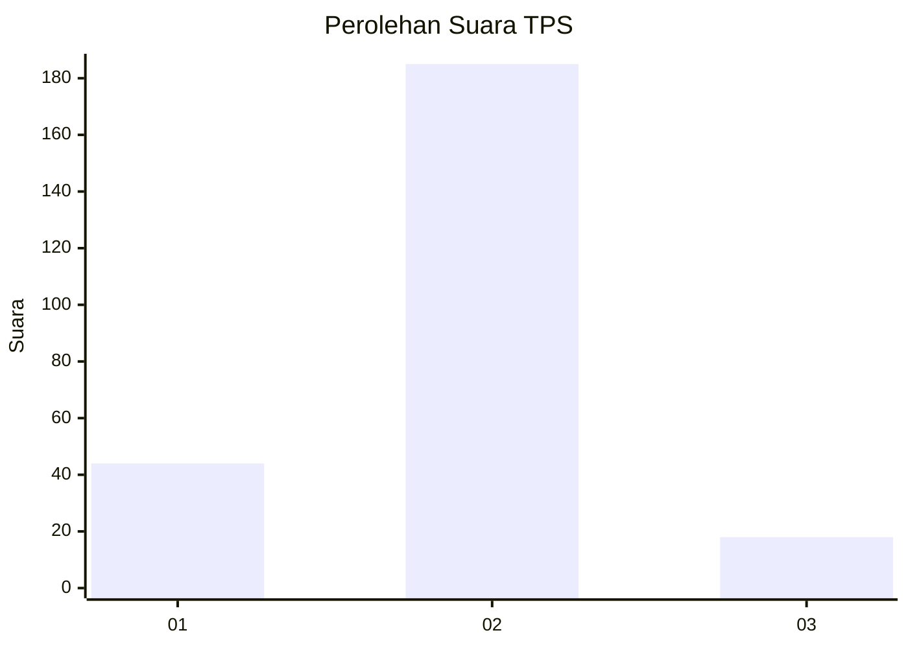
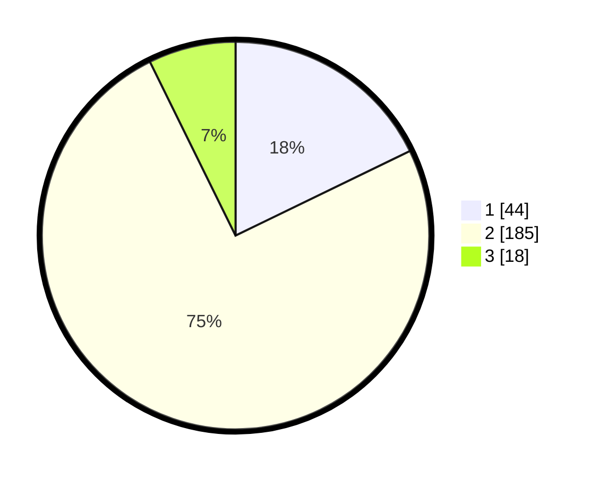

# Hasil

## Grafik

## Tabel

| No. | Nama Paslon    | Suara | Suara (raw) | Persentase |
|:--- |:-------------- | -----:| -----------:| ----------:|
| 1   | ANIES MUHAIMIN | 44    | [44][p-1]   | 17,81      |
| 2   | PRABOWO GIBRAN | 185   | [185][p-2]  | 74,90      |
| 3   | GANJAR MAHFUD  | 18    | [18][p-3]   | 7,29       |

[p-1]: https://github.com/gigit-pemilu/pemilu-2024-35-jawa-timur/blob/main/pilpres/hitung-suara/sub/35-jawa-timur/sub/09-jember/sub/06-tanggul/sub/2003-patemon/sub/028-tps/sub/paslon-1.txt
[p-2]: https://github.com/gigit-pemilu/pemilu-2024-35-jawa-timur/blob/main/pilpres/hitung-suara/sub/35-jawa-timur/sub/09-jember/sub/06-tanggul/sub/2003-patemon/sub/028-tps/sub/paslon-2.txt
[p-3]: https://github.com/gigit-pemilu/pemilu-2024-35-jawa-timur/blob/main/pilpres/hitung-suara/sub/35-jawa-timur/sub/09-jember/sub/06-tanggul/sub/2003-patemon/sub/028-tps/sub/paslon-3.txt

## Foto C Plano

https://sirekap-obj-formc.kpu.go.id/3010/pemilu/ppwp/35/09/06/20/03/3509062003028-20240215-195527--120f80f5-81d1-4a22-a0cd-9d8824c4aa78.jpg

https://sirekap-obj-formc.kpu.go.id/3010/pemilu/ppwp/35/09/06/20/03/3509062003028-20240215-200025--ebbd3c4a-bb7f-4159-9849-0a749d633950.jpg

https://sirekap-obj-formc.kpu.go.id/3010/pemilu/ppwp/35/09/06/20/03/3509062003028-20240215-195134--9783acd0-f44b-4b9c-b457-33fa77adff8b.jpg

## Metadata

| Key        | Value               |
| ---------- | ------------------- |
| Time Stamp | 2024-02-16 12:51:22 |

