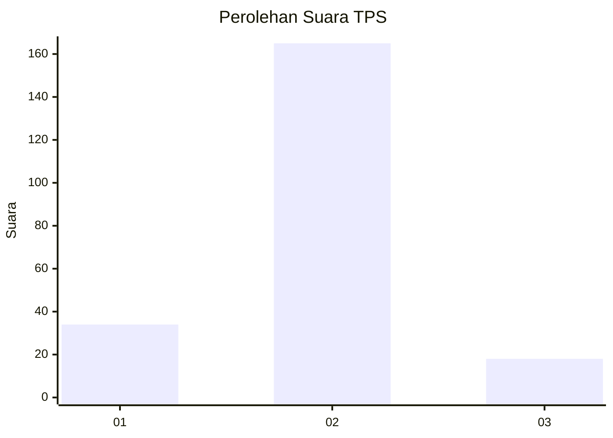
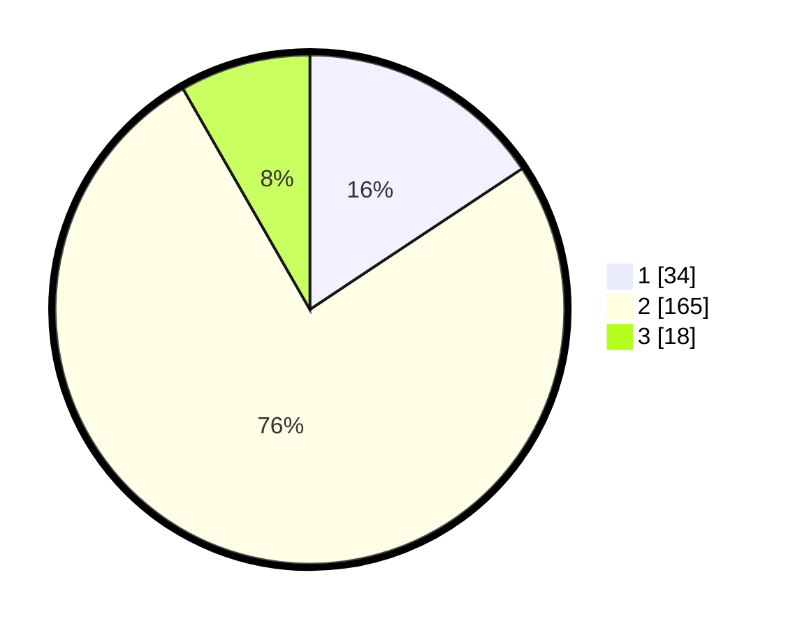

# Hasil

## Grafik

## Tabel

| No. | Nama Paslon    | Suara | Suara (raw) | Persentase |
|:--- |:-------------- | -----:| -----------:| ----------:|
| 1   | ANIES MUHAIMIN | 34    | [34][p-1]   | 15,67      |
| 2   | PRABOWO GIBRAN | 165   | [165][p-2]  | 76,04      |
| 3   | GANJAR MAHFUD  | 18    | [18][p-3]   | 8,29       |

[p-1]: https://github.com/gigit-pemilu/pemilu-2024-35-jawa-timur/blob/main/pilpres/hitung-suara/sub/35-jawa-timur/sub/09-jember/sub/06-tanggul/sub/2003-patemon/sub/029-tps/sub/paslon-1.txt
[p-2]: https://github.com/gigit-pemilu/pemilu-2024-35-jawa-timur/blob/main/pilpres/hitung-suara/sub/35-jawa-timur/sub/09-jember/sub/06-tanggul/sub/2003-patemon/sub/029-tps/sub/paslon-2.txt
[p-3]: https://github.com/gigit-pemilu/pemilu-2024-35-jawa-timur/blob/main/pilpres/hitung-suara/sub/35-jawa-timur/sub/09-jember/sub/06-tanggul/sub/2003-patemon/sub/029-tps/sub/paslon-3.txt

## Foto C Plano

https://sirekap-obj-formc.kpu.go.id/071d/pemilu/ppwp/35/09/06/20/03/3509062003029-20240214-195609--db321593-9056-4f2c-bc45-1f92af7f5b6e.jpg

https://sirekap-obj-formc.kpu.go.id/071d/pemilu/ppwp/35/09/06/20/03/3509062003029-20240214-195632--5135d5a0-1ff9-42a6-b3b0-a28c04eff42d.jpg

https://sirekap-obj-formc.kpu.go.id/071d/pemilu/ppwp/35/09/06/20/03/3509062003029-20240214-195710--d04ba4eb-c023-401d-84fb-a0d0569840d0.jpg

## Metadata

| Key        | Value               |
| ---------- | ------------------- |
| Time Stamp | 2024-02-15 15:30:25 |

