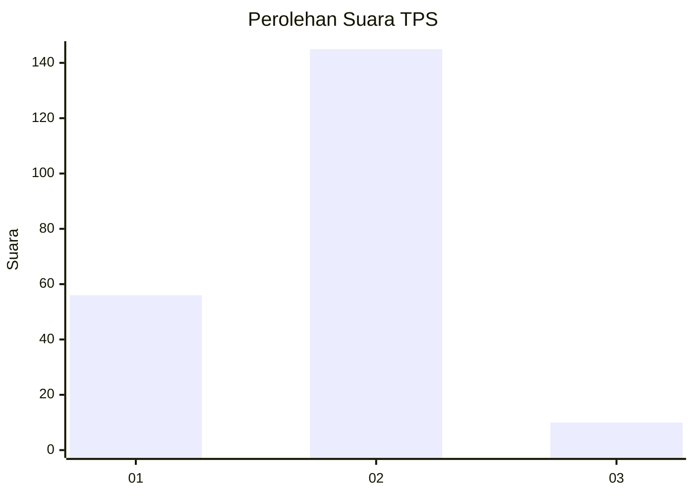
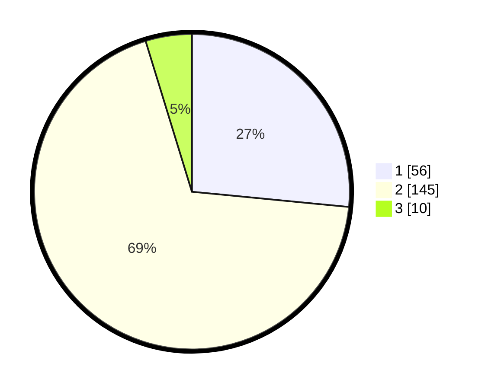

# Hasil

## Grafik

## Tabel

| No. | Nama Paslon    | Suara | Suara (raw) | Persentase |
|:--- |:-------------- | -----:| -----------:| ----------:|
| 1   | ANIES MUHAIMIN | 56    | [56][p-1]   | 26,54      |
| 2   | PRABOWO GIBRAN | 145   | [145][p-2]  | 68,72      |
| 3   | GANJAR MAHFUD  | 10    | [10][p-3]   | 4,74       |

[p-1]: https://github.com/gigit-pemilu/pemilu-2024/blob/main/pilpres/hitung-suara/sub/35-jawa-timur/sub/09-jember/sub/06-tanggul/sub/2004-darungan/sub/004-tps/sub/paslon-1.txt
[p-2]: https://github.com/gigit-pemilu/pemilu-2024/blob/main/pilpres/hitung-suara/sub/35-jawa-timur/sub/09-jember/sub/06-tanggul/sub/2004-darungan/sub/004-tps/sub/paslon-2.txt
[p-3]: https://github.com/gigit-pemilu/pemilu-2024/blob/main/pilpres/hitung-suara/sub/35-jawa-timur/sub/09-jember/sub/06-tanggul/sub/2004-darungan/sub/004-tps/sub/paslon-3.txt

## Foto C Plano

https://sirekap-obj-formc.kpu.go.id/5116/pemilu/ppwp/35/09/06/20/04/3509062004004-20240214-204444--9dbc8843-9e27-48b3-8be2-9bc7785b2cd9.jpg

https://sirekap-obj-formc.kpu.go.id/5116/pemilu/ppwp/35/09/06/20/04/3509062004004-20240214-204530--8dbb26d5-2914-403a-bd84-5f23ff9398e2.jpg

https://sirekap-obj-formc.kpu.go.id/5116/pemilu/ppwp/35/09/06/20/04/3509062004004-20240214-204612--dc9f247e-226f-4562-abba-a3e278715b6e.jpg

## Metadata

| Key        | Value               |
| ---------- | ------------------- |
| Time Stamp | 2024-02-15 15:30:25 |

