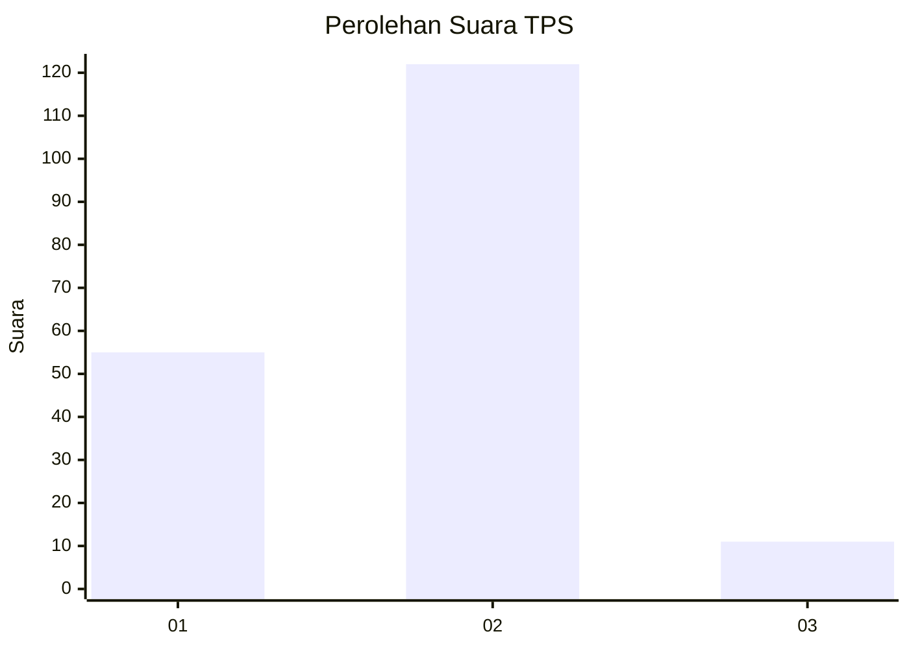
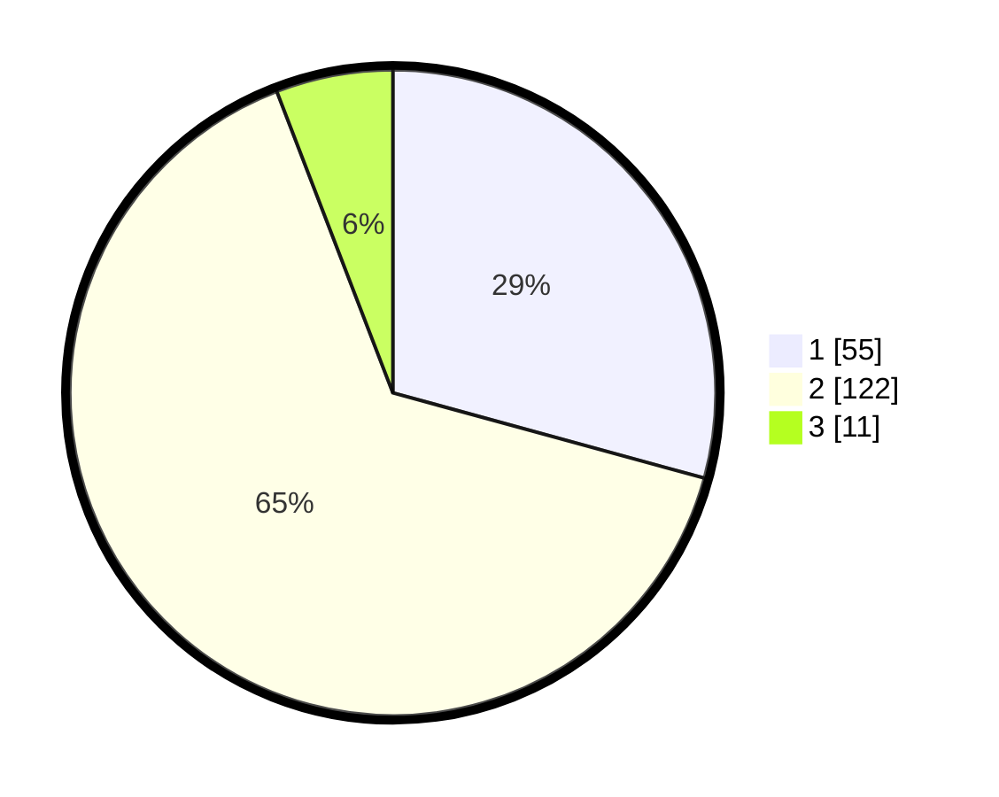

# Hasil

## Grafik

## Tabel

| No. | Nama Paslon    | Suara | Suara (raw) | Persentase |
|:--- |:-------------- | -----:| -----------:| ----------:|
| 1   | ANIES MUHAIMIN | 55    | [55][p-1]   | 29,26      |
| 2   | PRABOWO GIBRAN | 122   | [122][p-2]  | 64,89      |
| 3   | GANJAR MAHFUD  | 11    | [11][p-3]   | 5,85       |

[p-1]: https://github.com/gigit-pemilu/pemilu-2024/blob/main/pilpres/hitung-suara/sub/35-jawa-timur/sub/09-jember/sub/06-tanggul/sub/2004-darungan/sub/025-tps/sub/paslon-1.txt
[p-2]: https://github.com/gigit-pemilu/pemilu-2024/blob/main/pilpres/hitung-suara/sub/35-jawa-timur/sub/09-jember/sub/06-tanggul/sub/2004-darungan/sub/025-tps/sub/paslon-2.txt
[p-3]: https://github.com/gigit-pemilu/pemilu-2024/blob/main/pilpres/hitung-suara/sub/35-jawa-timur/sub/09-jember/sub/06-tanggul/sub/2004-darungan/sub/025-tps/sub/paslon-3.txt

## Foto C Plano

https://sirekap-obj-formc.kpu.go.id/e5e2/pemilu/ppwp/35/09/06/20/04/3509062004025-20240214-221743--602caa1a-4e6d-4d99-b9b5-2371490f5c81.jpg

https://sirekap-obj-formc.kpu.go.id/e5e2/pemilu/ppwp/35/09/06/20/04/3509062004025-20240214-221937--48fc8f6e-169e-4e7c-a379-c5141e4abf31.jpg

https://sirekap-obj-formc.kpu.go.id/e5e2/pemilu/ppwp/35/09/06/20/04/3509062004025-20240214-222211--a99ca854-8ca3-4728-a708-ee05fa441604.jpg

## Metadata

| Key        | Value               |
| ---------- | ------------------- |
| Time Stamp | 2024-02-25 15:00:00 |

