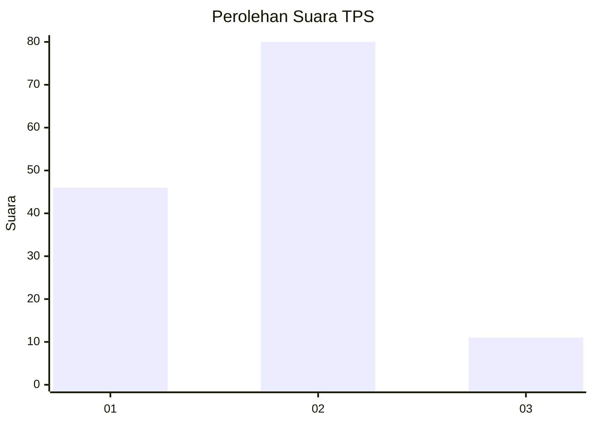
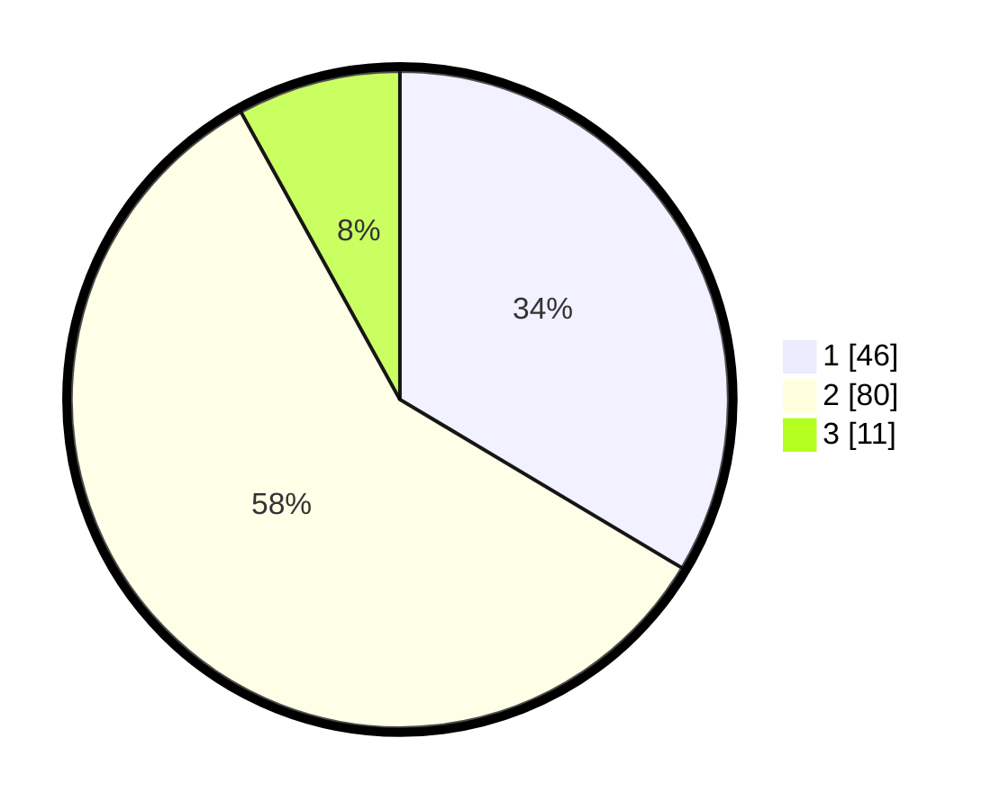

# Hasil

## Grafik

## Tabel

| No. | Nama Paslon    | Suara | Suara (raw) | Persentase |
|:--- |:-------------- | -----:| -----------:| ----------:|
| 1   | ANIES MUHAIMIN | 46    | [46][p-1]   | 33,58      |
| 2   | PRABOWO GIBRAN | 80    | [80][p-2]   | 58,39      |
| 3   | GANJAR MAHFUD  | 11    | [11][p-3]   | 8,03       |

[p-1]: https://github.com/gigit-pemilu/pemilu-2024-35-jawa-timur/blob/main/pilpres/hitung-suara/sub/35-jawa-timur/sub/09-jember/sub/06-tanggul/sub/2004-darungan/sub/028-tps/sub/paslon-1.txt
[p-2]: https://github.com/gigit-pemilu/pemilu-2024-35-jawa-timur/blob/main/pilpres/hitung-suara/sub/35-jawa-timur/sub/09-jember/sub/06-tanggul/sub/2004-darungan/sub/028-tps/sub/paslon-2.txt
[p-3]: https://github.com/gigit-pemilu/pemilu-2024-35-jawa-timur/blob/main/pilpres/hitung-suara/sub/35-jawa-timur/sub/09-jember/sub/06-tanggul/sub/2004-darungan/sub/028-tps/sub/paslon-3.txt

## Foto C Plano

https://sirekap-obj-formc.kpu.go.id/f814/pemilu/ppwp/35/09/06/20/04/3509062004028-20240214-212035--405b8728-d1f5-4332-b3f3-3f22763fc412.jpg

https://sirekap-obj-formc.kpu.go.id/f814/pemilu/ppwp/35/09/06/20/04/3509062004028-20240214-224045--5181c8b4-d584-4189-a28f-135e95bfe83e.jpg

https://sirekap-obj-formc.kpu.go.id/f814/pemilu/ppwp/35/09/06/20/04/3509062004028-20240214-223931--a05a7256-b693-407e-a687-73b5682d2b53.jpg

## Metadata

| Key        | Value               |
| ---------- | ------------------- |
| Time Stamp | 2024-02-16 16:25:10 |

