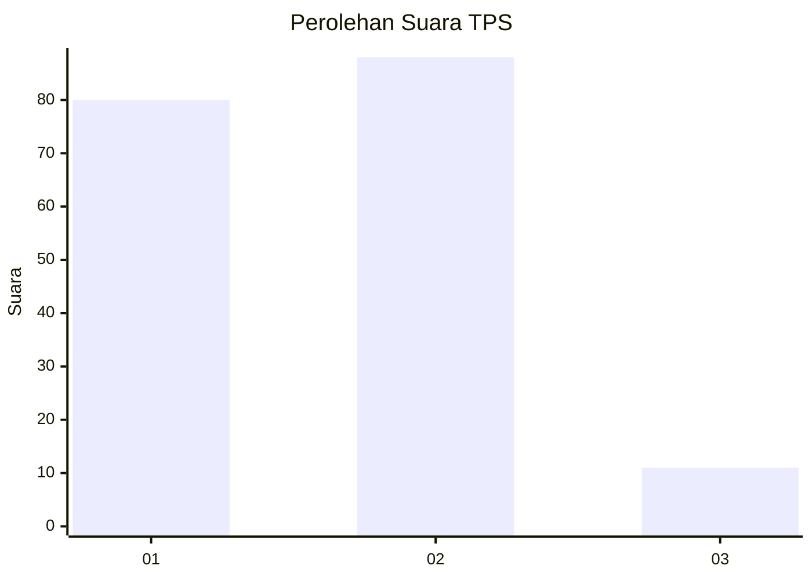
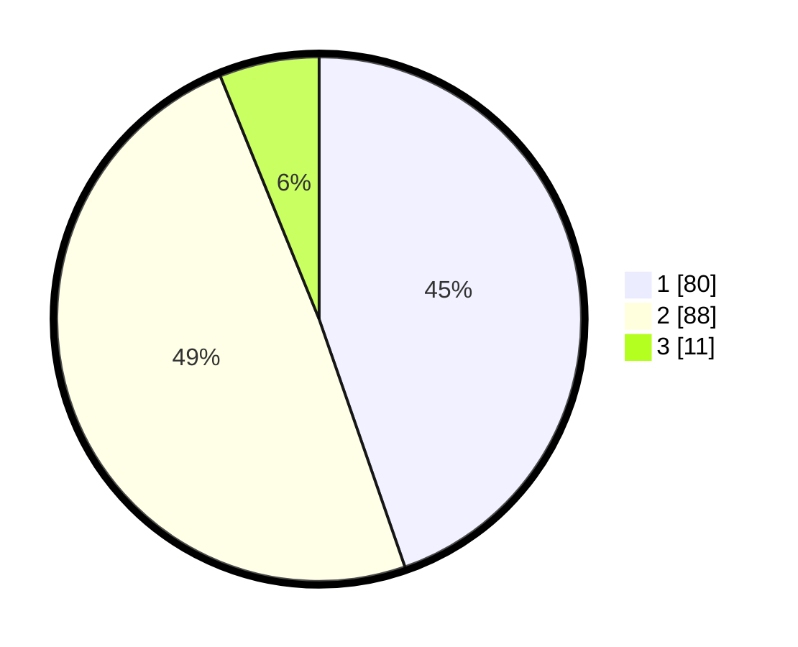

# Hasil

## Grafik

## Tabel

| No. | Nama Paslon    | Suara | Suara (raw) | Persentase |
|:--- |:-------------- | -----:| -----------:| ----------:|
| 1   | ANIES MUHAIMIN | 80    | [80][p-1]   | 44,69      |
| 2   | PRABOWO GIBRAN | 88    | [88][p-2]   | 49,16      |
| 3   | GANJAR MAHFUD  | 11    | [11][p-3]   | 6,15       |

[p-1]: https://github.com/gigit-pemilu/pemilu-2024/blob/main/pilpres/hitung-suara/sub/35-jawa-timur/sub/09-jember/sub/06-tanggul/sub/2004-darungan/sub/037-tps/sub/paslon-1.txt
[p-2]: https://github.com/gigit-pemilu/pemilu-2024/blob/main/pilpres/hitung-suara/sub/35-jawa-timur/sub/09-jember/sub/06-tanggul/sub/2004-darungan/sub/037-tps/sub/paslon-2.txt
[p-3]: https://github.com/gigit-pemilu/pemilu-2024/blob/main/pilpres/hitung-suara/sub/35-jawa-timur/sub/09-jember/sub/06-tanggul/sub/2004-darungan/sub/037-tps/sub/paslon-3.txt

## Foto C Plano

https://sirekap-obj-formc.kpu.go.id/ae4a/pemilu/ppwp/35/09/06/20/04/3509062004037-20240214-141721--a39e911c-aca1-4df4-bd26-f37f923e5b44.jpg

https://sirekap-obj-formc.kpu.go.id/ae4a/pemilu/ppwp/35/09/06/20/04/3509062004037-20240214-141909--5f57ba01-96fc-4aaf-9592-cdcbb1aadbba.jpg

https://sirekap-obj-formc.kpu.go.id/ae4a/pemilu/ppwp/35/09/06/20/04/3509062004037-20240214-141813--89a3fa32-9f3c-42b8-90df-a27af708e7bf.jpg

## Metadata

| Key        | Value               |
| ---------- | ------------------- |
| Time Stamp | 2024-02-15 15:00:29 |

