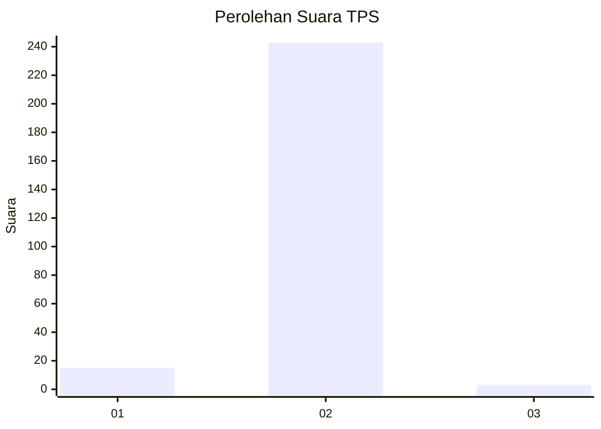
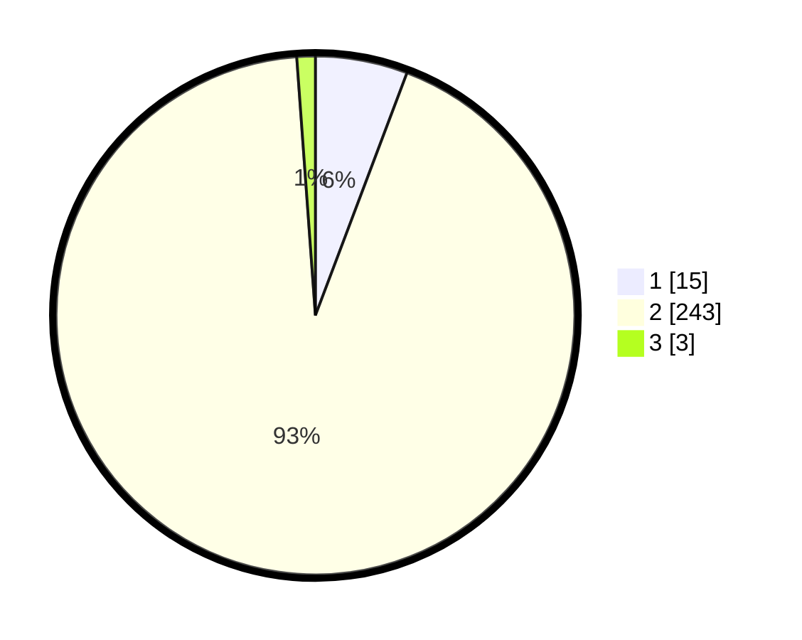

# Hasil

## Grafik

## Tabel

| No. | Nama Paslon    | Suara | Suara (raw) | Persentase |
|:--- |:-------------- | -----:| -----------:| ----------:|
| 1   | ANIES MUHAIMIN | 15    | [15][p-1]   | 5,75       |
| 2   | PRABOWO GIBRAN | 243   | [243][p-2]  | 93,10      |
| 3   | GANJAR MAHFUD  | 3     | [3][p-3]    | 1,15       |

[p-1]: https://github.com/gigit-pemilu/pemilu-2024-35-jawa-timur/blob/main/pilpres/hitung-suara/sub/35-jawa-timur/sub/09-jember/sub/06-tanggul/sub/2004-darungan/sub/040-tps/sub/paslon-1.txt
[p-2]: https://github.com/gigit-pemilu/pemilu-2024-35-jawa-timur/blob/main/pilpres/hitung-suara/sub/35-jawa-timur/sub/09-jember/sub/06-tanggul/sub/2004-darungan/sub/040-tps/sub/paslon-2.txt
[p-3]: https://github.com/gigit-pemilu/pemilu-2024-35-jawa-timur/blob/main/pilpres/hitung-suara/sub/35-jawa-timur/sub/09-jember/sub/06-tanggul/sub/2004-darungan/sub/040-tps/sub/paslon-3.txt

## Foto C Plano

https://sirekap-obj-formc.kpu.go.id/f361/pemilu/ppwp/35/09/06/20/04/3509062004040-20240214-195837--778e5f56-977b-4760-abaf-eeab46811dd9.jpg

https://sirekap-obj-formc.kpu.go.id/f361/pemilu/ppwp/35/09/06/20/04/3509062004040-20240214-201012--9cbfab09-8d43-40fc-8924-e741f69a299d.jpg

https://sirekap-obj-formc.kpu.go.id/f361/pemilu/ppwp/35/09/06/20/04/3509062004040-20240214-200457--e0843046-4f16-43af-badb-f824dfaacc54.jpg

## Metadata

| Key        | Value               |
| ---------- | ------------------- |
| Time Stamp | 2024-02-14 21:46:01 |

